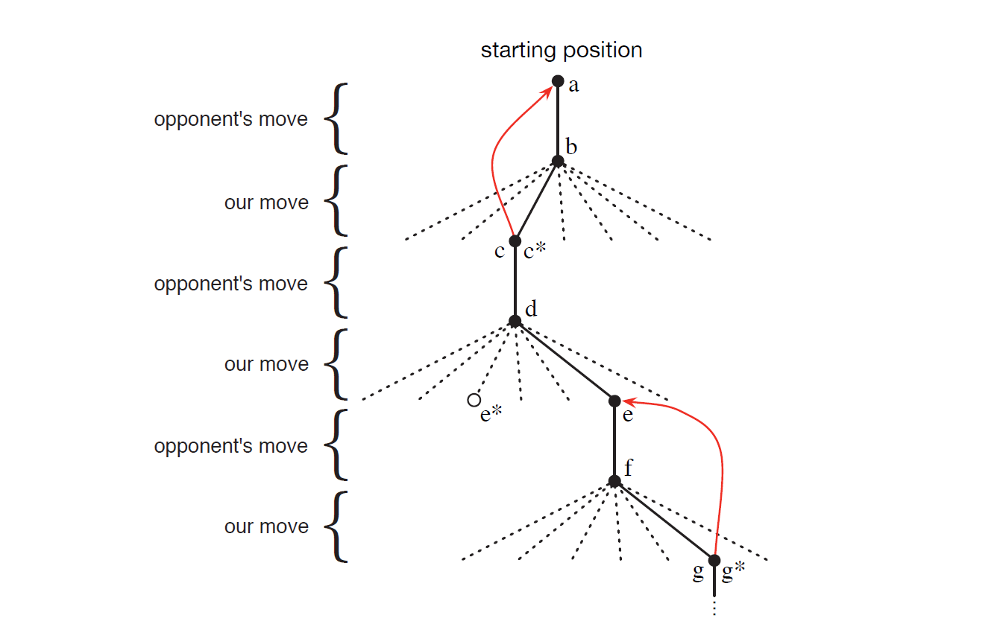

# Chapter 1 Introduction

## 0.0 Preface

Preface（前言）部分是在第一章之前的，主要讲了下该教材出第二版的一些原因，读者看了之后觉得有很多点非常值得看一下，便进行了总结整理，并附上一个Sutton写的非常经典的文章《The Bitter Lesson》的总结。

---

### 第二版（2018）前言

读者总结了前言部分的主要要点如下：

1. 第一版出版于1998年，在出版后的二十年间人工智能取得了巨大的进步，这股浪潮由更强大的计算能力和新理论、新算法共同推动。
2. 书中未给出强化学习的严格形式化定义，也没有将其推广到最一般的形式。整本书依然是导论性质的书，重点是Online Learning Algorithms。
3. 第二版相比于第一版，需要更高程度的数学解释，书中放在灰色框中的数学内容对于那些非数学背景的读者而言是可以跳过的。
4. 第二版对符号进行了优化，方便人们学习理解。Random Variables（随机变量）用大写字母表示，比如St, At, Rt代表时间步t的状态、动作和奖励；而其具体取值则用小写字母表示，比如上述变量对应的具体的值可能是s, a, r.
5. 值函数用小写字母表示，如v pi；表格形估计用大写字母表示，如Qt(s, a)。近似值函数是确定性函数，因此参数也采用小写字母；大写粗体字母则用于矩阵。
6. 第二版减少了上标和下标的过度使用，采用更加简便的p(s', r | s, a)这样的写法。
7. 本书内容推荐用两个学期来学习完成；如果只学习一个学期的话，推荐覆盖前十章。（读者注：难怪我上RL课的时候感觉基本讲到第十章左右就进入期末项目了，原来出处是这里）
8. Sutton（在本系列笔记中Sutton就代表Sutton和Barto，后面不再赘述）感谢了科学家A. Harry Klopf，并表示第二版献给他。Klopf教授提出了脑与人工智能的构想，让两位作者相识；在Klopf的引荐下，还在斯坦福读本科的Sutton加入了新创办的UMass Amherst项目的研究小组。Klopf是让项目获得资助的关键人物。
9. Sutton感谢了阿尔伯塔大学的强化学习与人工智能实验室。
10. Klopf是早期关注机器智能领域的重要人物，提出了一些对人工智能产生重大影响的理论。他认为最大化某种内部目标，无论是具体的还是抽象的，是智能系统的核心，而非单纯的维持系统稳定。换句话说，智能体的目标不仅是保持平衡，还应该能够主动探索环境，根据经验预测未来，并选择行动以最大化其长期回报或内部奖励。这种哲学观点直接启发了后来的强化学习理论：智能体不仅响应环境变化，也通过主动选择行为来优化长期目标；智能体不是模仿固定规则或者维持状态，而是通过试错学习最大化累积奖励。Sutton和Barto直言这种思想正是他们强化学习研究旅程的思想起点。

---

### 第一版（1998）前言

然后是第一版的前言，该部分主要讲述了强化学习研究的由来：

1. 1979年末，两位作者在UMass工作的时候参与了一个早期项目，该项目主要内容是去尝试唤起这样一种观点：由类神经网络的自适应单元组成的网络可能为实现人工自适应智能提供一种有前途的途径。该项目研究了Klopf提出的异态系统理论（Heterostatic Theory of Adaptive Systems），并进行了批判性的探讨。
2. 在之后的二十年里，Sutton一直都没有结束对该思想的研究；这个简单的思想长期以来被视为是理所当然的，却从未在计算角度受到重视，该思想的主要内容是：一个学习系统想要某样东西，他会调整自己的行为，来最大化从环境中获得的某个特殊信号。这就是所谓的Hedonistic（享乐主义）学习系统思想，也就是如今我们所说的强化学习系统。
3. 一开始的时候，Sutton和Barto以为强化学习已经被充分探讨了，结果深入研究后发现根本就没怎么被研究过。大多数研究者只是浅浅地研究了强化学习，然后后来基本都转向了其他方向，比如Pattern Classification（模式分类）、Supervised Learning（监督学习）和Adaptive Control（自适应控制）；或者他们干脆完全放弃了对学习问题地研究。因此，在两位作者刚开始研究的时候，发现如何从环境中获取有益东西的学习问题根本就没有受到足够的关注，这个情况直接导致强化学习这个分支尚未被充分探索，在计算角度也无真正进展。
4. 作者认为，虽然截至第一版时“如何通过交互式学习实现目标”这一问题远未被彻底解决，但是他们对他的理解已经大为加深。TD时序差分学习、动态规划、函数逼近等已经可以整合进一个整体一致地视角中了。
5. 写这本书的目的是提供一本清晰而简明地教材，系统性介绍强化学习地关键思想与算法。本书采用了人工智能和工程的视角进行讲解。
6. 在第一版中也提到了，本书没有对强化学习进行严格的形式化处理，因为作者不追求最高层次的数学抽象，也不使用严格的定理-证明格式。在简洁性与理论普适性之间保持一定的平衡来兼顾不分散读者注意力和帮助数学更强的读者走向更深入的理解。
7. 1998年第一版中，作者便说，为这本书他们已经努力了三十年。（读者注：这种探索科学的精神真的令人感动）
8. 读者注：作者在1998年第一版的感谢的名单中，有一位叫做Wei Zhang的中国人，没有查到该人是谁。如今我们在学习已经火遍全球的强化学习的时候，很难想象在三十到五十年前，已经有很多先驱进行了充分的探索了。有时候我想在阿尔伯塔这样偏僻而远离喧嚣的地方能坐落着一个世界顶级的人工智能研究所，属实令人称奇。这些伟大的科学成就的起点竟然都是如此地“不起眼”，截至1998年Sutton的论文被引用次数也不过一千多次，但是他们却已经付出了三十年的深刻的思考与研究。前两天我看了几个Sutton的采访视频，他依然在深度思考人工智能和强化学习的未来。相比于某些功成名就后的炫技者，他更像一个哲学家：永远在思考“智能究竟是什么”这一根本问题。

---

### The Bitter Lesson

除了上述前言外，我还想分享一下Sutton在2019年写的一篇叫做《The Bitter Lesson》的文章，该文章并不长，但总结了他对于人工智能发展七十年的一些重要思考和看法，我收录了其中一些比较重要的点：

1. 人工智能研究七十年来最大的教训就是：基于通用方法、依赖计算力的方法，最终是最有效的——而且是大幅度更有效。造成这一点的根本原因是摩尔定律，或者更广义地说，是每单位计算成本呈指数下降的长期趋势。然而，大多数人工智能研究都是在一个隐含前提下进行的：即，智能体可以使用的计算资源是恒定的。在这种假设下，融入人类知识似乎是提高性能的唯一途径。但现实是：只要时间略微延长，远超当前计算资源的能力就将出现。因此，虽然研究者们为了在短期内有所突破而倾向于使用自己对领域的知识，但从长远看，真正重要的事情只有一个：能否有效利用不断增长的计算能力。
2. 靠人类知识和靠计算扩展在理论上并非必然对立，但是在实践中却往往如此。一方面，研究者的时间只能投入其一；另一方面，人们会在某种方法上形成心理依附。同时，人类知识路径往往导致算法变得更复杂，从而变得不适合与大规模通用计算方法相结合。
3. 1997年击败世界冠军卡斯帕罗夫的，是一种基于大规模深度搜索的方法。当时的主流计算机棋类研究者们普遍感到沮丧，因为他们长期以来都在努力构建基于人类对棋局理解的系统，但最终胜出的却是一个相对“简单”、依赖特殊硬件和软件优化的搜索型系统。很多研究者们希望融合人类智慧的方法能赢，但是当现实相反时，他们对暴力搜索的大获全胜感到失望。
4. 围棋中也出现了类似的事情。最初研究者们投入大量努力去避开搜索，转而利用人类知识或游戏本身的特殊性质，但这些努力最终都被证明是无关紧要甚至适得其反的。可以说，搜索和学习是现代人工智能中最重要的两大计算扩展技术。就像在国际象棋中一样，围棋研究起初也试图借助人类理解来减少搜索的需求，但直到最终才意识到真正的成功来自于接受并彻底利用搜索与学习。
5. 1970年代，美国国防部组织过一次语音识别竞赛，最终使用更加统计化、计算化的模型战胜了依赖大量人类知识的方法。统计方法的胜出引发了整个自然语言处理领域的长期转变，在接下来的几十年里，统计与计算逐渐成为主导力量。而近年来的深度学习更进一步推动了语音识别的进步，而该方法更加依赖计算，几乎不依赖人类知识。
6. 研究人员常常试图让系统像他们自己一样思考，将自己的知识硬编码进系统，这往往在最后都被证明是有害的。因为随着计算能力的指数级增长，那些依赖人类输入的系统显得低效而过时时，反而浪费了研究者的大量时间。
7. 在计算机视觉领域，现代深度神经网络替代了人类手工设计的抽象表示。卷积和不变性的基本结构的性能远超早期模型。
8. 我们如今仍在重复类似的错误。要识别并对抗这些错误，我们首先要理解他们的诱惑：在系统中构建我们以为“自己是如何思考的方式”看似自然，却在长期上是失败的捷径。（读者注：最近的采访中有人问他如何看待RLHF，他表示不看好，其具体原因没细说，但可以参考这里的这段话。）
9. 痛苦的教训来自于历史观察，总结下来就是：AI研究者总是试图将知识硬编码到系统中，这在短期内确实有效，而且能给研究者带来心理满足；但是长期来看，这种方法会遇到瓶颈，甚至阻碍进步。真正突破性的进展最终总是来自于相反的方向：依赖搜索与学习，扩大计算规模，而非增加知识注入。
10. 这种成功之所以“苦涩”，是因为他击败了人类倾注热情与信念的人本主义路径。
11. 我们应该学到的第一点是：具有普适性的通用方法（可随计算力扩展）是强大的根本。
12. 另一个教训则是：别再幻想“简单地理解大脑”。心智内容本身是极其、不可简化的复杂。我们不应再试图寻找简单的方法来描述心智的内容，比如空间是什么、对象是什么、对称性如何处理等——这些都是外部世界本身的任意复杂性的一部分。我们不应试图将这些复杂性预设为只是内建，而应该构建那些能够自己发现这些复杂性的元方法（Meta Methods）。这些方法的关键在于他们能找到良好的近似，但找到这些近似的过程应由系统自己完成，而不是由人类来提前构造。
13. 我们想要的是：能像我们一样发现的智能体，而不是包含了我们已经“发现”过的知识的系统。因为，把我们发现的东西硬塞进去，反而会妨碍我们理解“发现”的过程是如何可能的。

读者注：前言部分让我大受震撼，可以说作者们把自己几十年的研究思考浓缩在这里了。本来只是想着这个夏天时间很多所以想认真精读一下这本经典教材，没想到上来就是一个大受震撼。最近我自己在开发一个注入了很多财务知识的AI Agent，看完后意识到这个方法并不可行。其实在开发的初期我就发现了很多不美观的地方，所以在机器学习课程最终的期末项目中，我新建了一个纯LLM的layer，然后在下一层才使用我自己构建的工具或者LangChain、OpenManus这种工具系统。我在项目报告中的反思章节提出了我对AI Agent的看法：我认为AI Agent在最终根本不需要任何人为构建的工具链或者PROMPT，所有的任务都可以直接通过LLM自身对任务的理解来完成，我称之为“Tool-Free AI Agent”。如果LLM拥有足够的上下文理解能力、编程能力和记忆能力，那么就不需要复杂的工具链，只需要让LLM自己来写代码然后动态调用接口就能够完成任务了。今天整理这篇文章的时候看了Sutton的The Bitter Lesson，确信了我之前的思考是正确的。AI Agent的未来一定也和之前所有的惨痛教训一样，RLHF、PROMPT ENGINEERING等最终都会被扫进历史的垃圾堆里。我很庆幸自己这次回到学校学习计算机科学，现在每天的学习都处在一种纯享与思考的过程中，不为找工作，不为考试，不为升学。这或许是作为一个成长于中国的应试教育环境，在工作几年后回到学校追求学习本身的纯粹所带来的极致快乐吧。

---

## 1.0 导读

我们在思考“学习的本质”的时候，最先会想到和环境互动来学习，比如婴儿玩耍、挥动手臂等。这种sensorimotor connection(感知-运动练习)能够产生大量关于cause and effect(因果关系)、consequences of actions(行为后果)，以及为了达成目标应该采用什么行动的信息。

这种互动贯彻我们一生，是我们了解环境与自我认知的重要来源。本书探索的是一种计算式的从互动中学习的方法，是一种理想化的学习场景。本书不探讨人类和动物的学习方法，而是从人工智能和工程师的视角来设计。我们设计能够在科学或者经济目标上有效解决学习问题的机器，并通过数学分析或计算实验来评估这些设计的效果。我们所探索的这种方法被称为强化学习，相比于其他机器学习方法，该方法更专注于通过互动进行的目标导向学习。

（读者注：在The Bitter Lesson中Sutton再次强调了这个观点，即计算机科学家没必要过多关注人类经验，而是从计算本身出发，就可以通往智能；并且过于依赖人类经验是有害的。）

---

## 1.1 什么是强化学习？

注意，本章节将从多个角度探讨强化学习的本质，并且作者在序言中已经提到，本书不会对强化学习给出一般形式的定义。

**(1) 强化学习是关于“what to do”的学习**

强化学习（Reinforcement Learning）是关于“学会做什么”（what to do）的学习，也就是将情境映射为动作，以最大化某个数值型的奖励信号（Reward Signal）。其关键点在于，学习者必须通过尝试来发现哪些动作能够带来最多的奖励，而不会被明确告知该采取哪些动作。在一些情形中，一个动作不仅会影响即时奖励，还会影响机械来的情境，从而影响后续所有的奖励，这两个特征：试错搜索（trial-and-error search）和延迟奖励（delayed reward）是强化学习最重要的两个区别性特征。

Reinforcement Learning和许多以ing结尾的主题一样，既是一种问题，也是一类可行的解决方法，同时也是研究这些问题与方法的一个学术领域。但是我们需要区分该术语在“问题本身”与“解决方法”之间的分别。

我们通过动态系统理论（Dynamical Systems Theory）中的思想，形式化（Formalize）地定义强化学习问题，即对不完全已知地马尔可夫决策过程（MDP）进行最优控制（Optimal Control）地问题。这部分在第三章详细展开，其基本思想就是，让agent（学习体）在一段时间内与环境互动以达成某个目标，那么agent必须能够在某种程度上感知环境状态，并且能够基于此采取影响状态的动作。从数学上来讲，就是agent必须有与环境状态相关的目标或目标函数。

MDP旨在以最简形式包含着三个方面：

1. 感知 Sensation
2. 动作 Action
3. 目标 Goal

任何适合解决这类问题的方法，我们都可以认为是一种RL方法。

**(2) 强化学习是第三种机器学习范式**

RL不同于监督学习（Supervised Learning），后者是目前最广泛的一种机器学习方法。监督学习通过一组有标签的训练样本进行，这些样本由某位知识丰富的外部监督者提供。每个样本都代表了一个情境和其对应的标签，也可以理解为情境和其对应的动作。监督学习的目标是外推（Extrapolate）或泛化（Generalize）其响应，以便在训练集中未出现的情境中也能做出正确决策。

但是监督学习不能满足从互动中学习的需求，因为我们很难获得既正确又具代表性的目标行为样本，更难以涵盖agent必须应对的所有情境。

强化学习也不同于无监督学习（Unsupervised Learning），后者通常是指从未标注数据集中寻找隐藏结构的过程。虽然看起来监督学习和无监督学习好像包括了所有的“机器学习”，但其实并非如此。有人把强化学习看作是一种无监督学习，理由是它不依赖于样本，但这种看法是很片面的。强化学习的目标是最大化奖励信号，而不是寻找隐藏结构。虽然在agent的经验中发现结构可能对RL有所帮助，但这本身并不能解决最大化奖励信号这一核心问题。

因此，我们认为强化学习不同于上述两种机器学习范式（Paradigm），而认为强化学习代表着第三种机器学习范式。

**(3) 强化学习面临探索与利用之间的权衡**

强化学习中有一个其它类型的学习中没有的挑战，那就是探索与利用之间的权衡（Trade-off between Exploration and Exploitation）。

为了获得更多奖励，一个强化学习体（Reinforcement Learning Agent，后面提到的agent都是指这个）过去尝试过并且被证明有效的动作（Actions）。但是，仅仅利用是无法完成任务的，agent必须去尝试探索，并逐渐倾向于那些看起来效果更好的。在随机任务（Stochastic Task）中，每个动作都必须尝试多次，来获得对其期望奖励的可靠估计。

探索与利用的困境（Exploration-Exploitation Dilemma）长期以来都是数学家们密集研究的课题，至今仍未解决。这里之所以强调这个问题，是因为在监督/无监督学习的最纯粹形式中，根本就不存在该平衡问题。

**(4)强化学习显示地探讨完整问题**

强化学习与其他方法的显著不同还有一点，那就是强化学习显示地（explicitly）考虑了一个面向目标的agent在不确定环境中进行互动的完整问题（whole problem），而不仅仅是研究一个子问题。

比如说，监督学习不能说明其能力如何最终帮助实现目标；一些研究发展了规划（Planning）理论，但没有探讨实施决策中的角色或者预测模型从何而来。这些研究都是孤立于子问题的，这种局限性是显而易见的。

强化学习从一个完整、交互式、目标导向（complete, interactive, goal-seeking）的agent出发，所有的agent都有明确的目标，能够感知其环境，并能选择动作来影响环境。

当涉及规划时，它必须处理规划和实时动作选择之间的关系，以及环境模型是如何获取和改进的。

Agent不一定是一个完整的机器人，它可以作为更大系统的一部分，比如一个agent负责监控机器人的电池电量，在这种情况下它的环境就是机器人和机器人的环境。

**(5) 回归简单通用原则（Simple General Principles）**

强化学习是人工智能领域中回归简单通用原则（Simple General Principles）趋势的一部分。自1960年代后期开始，许多人工智能研究者认为智能并无统一原则，而是由大量特殊技巧和启发式方法（Heuristics）组成。人们曾认为，只要收集到足够的事实信息，例如百万、十亿条数据，就能制造出智能。那时，基于一般原则（如搜索或学习）的方法被称为弱方法（weak methods），而基于特定知识的方法被成为强方法（strong methods）。这种观点如今已经不常见了。在作者看来，以前对通用原则的研究投入过少，便草率否定了其存在。现代人工智能已重新关注通用原则，尤其是在学习、搜索和决策方面。虽然不清楚这种钟摆能够摆回多远，但强化学习研究显然已经成为推动人工智能回归更简单、更通用原则的重要力量。

---

## 1.2 引例

为了方便大家理解，作者在这里举了几个标志性的强化学习示例及应用场景，作为引例。

1. 一位国际象棋大师落下一步棋。这一决策既受规划的影响，又基于对特定局面与走法的即时直觉判断。
2. 一个自适应控制器在炼油厂的操作中适时调整参数，该控制基于指定的边际成本来权衡产量、成本和质量，而非严格遵循工程师原先设定的目标。
3. 一只小羚羊出生后站起来都很艰难，但是半小时后已经可以以20英里每小时的速度奔跑。
4. 一个移动机器人需要决定是否进入新房间以寻找更多垃圾，亦或是尝试返回电池充电站。它基于电池当前电量以及其过去找到充电器的难易程度做出决策。
5. 一个人在准备早餐，这事看起来平常，但如果仔细观察，这一过程涉及一张条件行为与嵌套子目标网络（goal-subgoal relationships）：走到橱柜、打开柜门、选取麦片盒、伸手拿下来……为了获取碗、勺子、牛奶，每一个行为序列都需要眼睛的信息输入、身体协调以及运动规划。在整个过程中，该人需要不断做出快速判断，例如是否需要把多个物品一起带到餐桌上或分批搬运，每个步骤都由目标引导，如抓勺子或打开冰箱；而这些目标又服务于更大的目标：将早餐准备妥当并摄取营养。当该人在行动时，他还会基于状态信息做出调整，比如是否已经吃饱、是否感到饥饿或偏好的口味。

这些例子都有一个共同特征：他们都涉及一个主动决策的agent与环境之间的交互（interaction），该agent试图在对环境存在不确定性的前提下达成某个目标（goal）。agent的动作可以影响环境未来的状态，例如下一步棋局状态、炼油厂的油位、机器人下一步的充电状态等，进而影响未来可以采取的动作及其结果。做出正确决策需要考虑动作的间接与延迟后果，有时甚至需要前瞻性（foresight）或规划（planning）。

同时，动作的效果无法被完全预测，因此agent必须频繁地感知环境并适时反应。比如，吃早餐的人需要观察牛奶是否太多了来防止溢出。这些例子中，目标是显示的（explicit）：agent可以通过直接感知评估自己距离目标的进展程度，即棋手知道是否赢了，炼油厂控制器知道产量，小羚羊知道是否摔倒了，机器人知道电量是否低，吃早餐的人知道他是否喜欢自己的早餐。

在这些例子中，agent都能利用自己的经验逐渐改善自身的表现。agent一开始面对任务时储备的知识，可能来自以往在相关任务上的经验，也可能是通过设计预先内建的，或者是通过进化形成的。这些因素决定了哪些内容是容易或者有价值学习的，但真正使agent能够适应任务特定需求的，是它与环境的互动，这对于调整行为以发挥任务关键特性至关重要。

---

## 1.3 强化学习的组成要素

本节介绍一下强化学习的一般组成要素。在之前的讨论中，我们已经反复提到了下面这两个要素：

1. agent 智能体
2. environment 环境

除此之外，我们还可以将强化学习系统分解为四个主要子要素：

1. 策略 policy
2. 奖励信号 reward signal
3. 价值函数 value function
4. 环境模型 model of the environment

读者注：关于这些要素的具体职责和作用，在整本书中都会反复涉及，这里就不展开讲了。现在太强调其定义，反而会把思维框住。我觉得可以在整本书学完后，反过来再把这些内容进行总结或一般化叙述，而不是在学习之前就把他们的定义框死。现在只需要记住有这么几个东西，作为谜题出现，就可以了。

---

## 1.4 强化学习的范围和局限性

强化学习高度依赖于状态（state）这一概念：状态既作为策略（policy）与价值函数（value function）的输入，也作为模型的输入与输出。作者强调，本书中基本不会讨论如何构建、改变或学习状态信号，因为本书主要专注于决策问题本身，即本书不关注如何设计状态信号，而关注在已有状态信号的基础上agent应该采取什么动作。

本书中探讨的大多数强化学习方法，都是围绕估计价值函数（value function）展开的，但其实就解决强化学习问题本身而言，不一定非要用到估计价值函数。遗传算法（genetic algorithms）、遗传编程（genetic programming）、模拟退火（simulated annealing）和其他优化方法，从不估计值函数。这些方法通常采用多个静态策略，每个策略独立地与环境进行交互，持续多个周期，然后选择奖励最多的策略，并对其进行变异，生成下一代策略，不断重复这个过程。这些方法一般被称为进化方法（evolutionary methods），因为他们的运行方式类似于生物进化过程：对环境的适应主要通过代际变化来完成。

进化方法在策略空间较小、容易找到高质量策略的情况下可能非常有效。对于agent无法感知环境完整状态的任务，进化方法也有一定优势。但本书聚焦的是learn while interacting with the environment，而这是进化方法所不具备的特性。进化方法忽略个体与环境交互中的细节，也不关注个体一生中经历了哪些状态或选择了哪些动作。

进化方法中有很多类似于强化学习方法的东西，但是本书不做探讨。

## 1.5 井字棋游戏Tic-Tac-Toe

本节将介绍一种非常简化版本的强化学习策略：通过值函数更新解决井字棋游戏


在这个游戏中，我们都知道（如果不知道也很容易就能知道）最优策略：先手一定不会输。在博弈论中，极小极大解法（minimax）假设对手始终按照最优策略行事。如果按照极小极大，玩家永远不会进入一个可能导致失败的状态，所以为了让这个问题更像是现实问题，我们在这里假设对手是一个不完美玩家（imperfect player，就是策略有时会出错，让我们有机会取胜）。

现在，介绍一下强化学习方法的思想。我们用值函数的方法来解决该问题，首先需要建立一个数值表，每个数值对应游戏的某一状态，该数值的具体含义就是从该状态开始我们赢得比赛的概率的最新估计，这种估计称为该状态的值。整个表格就是学习得到的值函数。如果状态A的值高于状态B，那么就说状态A比状态B“好”。

例如：

1. 如果我们是X玩家，那么三个X连在一起的状态下，值为1（已经赢了）
2. 如果棋盘已经满了但是没有三连X，或者说有三连O出现，值为0（代表赢不了）
3. 其他状态初始值为0.5，表示猜测我们有50%的胜率

然后我们和对手进行多次对局，每次落子前，我们都查看一下每个可行的动作对应的到达之后的状态值，并选择值最高的那个动作，也就是，预期胜率最高的走法。大多数时候我们都采用这样的greedy策略，即选择值最大的走。但是有些时候，我们也要随机选择其中一个动作，这种行为称为探索动作，目的是让我们接触到原本不会看到的状态（来有机会发现更高值的走法）。

在游戏中，我们需要不断更新状态的值，使他们更接近真是胜率，具体做法就是：每当一个贪婪动作执行后，我们就把当前状态的值往下一个状态的值靠近一点，如图所示：



这张图中，展示了井字棋游戏和一个强化学习思路的策略进行的游戏过程。图中的a到g这几个点分别代表不同的状态节点，黑线代表实际走子的动作路径（也可以认为是一种状态转移），虚线代表考虑但是没有执行的备选走法，红线则代表执行值更新的方向（这个等会儿具体说明）。

我们从黑点a开始，从a到b表示对手的步骤，然后b处散发出来的多条线代表多个可能，最终实线bc代表最终采取的行动，而其他虚线则表示考虑过但没有选择的其他可能动作。简单来说，先记住黑色实线代表着动作，虚线代表考虑但没有走的动作，\*号代表着后面对应的那一条动作按照当前价值估计来看是最优的。

我接下来用具体的例子来详细说明一下：

（1）状态a

我们假设棋盘如下：

1  2  3
4  5  6
7  8  9

在游戏开始前，游戏棋盘上什么都没有，这就是状态a的情况，代表着一个空棋盘：

```
···
···
···
```

（2）状态a -> 状态b

对方先走了一步，也就是a->b的黑实线，将X落在格子5的中心位置：

```
· · ·
· X ·
· · ·
```

当对方的这个子落下来后，就形成了一个新的棋盘状态，这就是状态b。从状态的角度理解的话，就是这里发生了状态a到状态b的转移，在这个转移过程中，我们不学习，因为是对手走的子。

（3）状态b -> 状态c\*

然后在状态b下，我们评估了所有可落子的情况，也就是除了位置5以外的所有情况。那么换句话说，每一种落子情况都对应了一个新的状态，假设现在有如下这么一个表：

| 落子位置 | 后继状态  | 估计价值 |
| :------- | --------- | -------- |
| 1        | c1        | 0.5      |
| 2        | c2        | 0.6      |
| 3        | c3        | 0.5      |
| 4        | c4        | 0.5      |
| 5        | 不能落子  | 无       |
| 6        | c6        | 0.5      |
| 7        | c7（c\*） | 0.8      |
| 8        | c8        | 0.5      |
| 9        | c9        | 0.5      |

这张假设的表中，对应的价值就是新的状态下表中已经记录的价值。然后我们可以发现位置2对应的后继状态c2的估计价值最高，因此c7就是c\*，然后我们这一步选择greedy策略，就按照价值最高的来，棋盘就变成了下面这样，然后我们的状态也就在转移到了c\*：

```
· · ·
· X ·
O · ·
```

在这里，我们选择了最优策略，这里学习一个新的概念，就是agent在这里做了一次决策，并且选择了最优决策，我们暂且把这种并非对手出子、并且选择最优值函数而进行的greedy操作视为一次真正的决策。

在这次决策后，有一条从c指向a的红色箭头线，这个线代表着值更新。在刚才的过程中，我们经历了状态a到状态c的转移，而状态c是通过greedy策略到达的，我们在这里对a进行一次值的更新，让状态a的估值向状态c的估值靠拢：

$$
V(a) \leftarrow V(a) + \alpha \left[ V(c) - V(a) \right]
$$

这其实是一种TD更新，在后面TD的章节我们会展开来讲。在这里举这个例子是站是一种强化学习的思维方式，也就是通过状态c的新信息来更新状态a的价值估计，换句话说，通过和环境的交互，agent在这里“学到了”东西，这个“学”东西就是这里的值函数更新。

α是 学习率，决定了更新的幅度。放在数学公式中，就是决定了c和a的值的差值对原本的a的影响的幅度。

假设α是0.1，那么我们就可以根据刚才那张表来算出来新的V(a)。在这个过程中，c状态作为一个a状态后面的状态，对a产生了影响，因此这是一种值回传（back up）。

（4）状态c\*到状态d

对手走了一步，假设对手走的如下：

```
X · ·
· X ·
O · ·
```

（5）状态d到状态e

根据图中所示，这是一步探索性的动作，因为没有选择最优值。

在本案例中，这种探索性的动作下不进行值的更新。这其实是一种on-policy（策略内）的学习策略，就是说agent只通过自身正在执行的策略来评估和改善值函数。同时，agent不需要预先知道对手策略或者状态转移概率模型，而是通过对局获得经验，从而不断更新值表，因此这又属于一种model-free（无模型）的策略。在后面的学习中，我们还会学习不同于此的策略或者范式，这里只是作为一种概念展示来说明强化学习的思维方式。

```
X · ·
· X ·
O · O
```

（6）状态e到状态f

```
X · X
· X ·
O · O
```

（7）状态f到状态g\*

```
X · X
· X ·
O O O
```

至此，对局结束。由于这里选择了最优策略，所以对e进行值更新，我们在这里总结一下值更新的公式：

$$
V(S_t) \leftarrow V(S_t) + \alpha \left[ V(S_{t+1}) - V(S_t) \right]
$$

因为它基于两个连续时间点的估计值的差，所以叫做时序差分方法（temporal-difference learning），简称TD。如果步长参数α随着时间适当减少，那么根据这个公式可以看到最终会收敛，那个最终收敛的值就是面对该不完美对手时的最优走法。当我们得到一个最终收敛后的表后，根据表里的值来走，就是在与该对手对弈时的最优策略。

如果对手的策略在缓慢变化，那么就不要让α减小到0，这样agent就能不断适应对方。

我们可以想象，因为agent有一个明确的目标，那么最终agent将学习到一个具有预见性或计划性的策略，这种策略将蕴含着自己行动所带来的延迟效应。简而言之，你可以想象对手假如是一个短视的人，那么agent将学会设下多步陷阱，来对付对手。这也是强化学习的一个显明特征：即便没有使用对手的模型，也没有显示搜索未来状态和动作的可能序列，它仍然能实现计划和前瞻性思考的效果。

我们总结一下这次对局的一些关键特征：

1. 在与环境交互的过程中学习，在该游戏中环境是一个对手玩家
2. 有明确的目标：赢得比赛。
3. 通过回传机制实现延迟回报，从而获得规划和前瞻性
4. 探索vs利用：有时候要尝试不太确定的走法，来寻找更优策略
5. 经验驱动学习，不需要对手的模型。（当然也可以利用模型，后面会讲到）

总之，通过这个例子，作者只是想展示一下强化学习的特点。这个井字棋游戏的状态比较少，所以可以轻松维护所有的状态对应的值。但实际上，强化学习如果和人工神经网络结合，那么对于极大状态的游戏也能很好学习。神经网络为程序提供了从经验中泛化的能力，因此它能在之前从未见过的新状态中选择合适的走法，因为这些新状态与过去网络中见过的类似。

**附加讨论：进化算法**

在上述的讨论中，作者简单提到了进化算法，并说明强化学习和进化算法是不同的。为了对比这两种算法，我让Claude写了一个Q-Learning VS Genetic Algorithm的对比，进行了1000万次对局，结果是进化算法获胜：


对于井字棋游戏，因为状态空间有限，并且是非复杂博弈，因此GA不需要泛化能力就可以快速找到获胜模式。而强化学习面对快速收敛的进化算法，被长期压制，导致RL无法应对。可见强化学习并非无敌，进化算法也并非无用。

值得注意的是，随着神经网络与强化学习的结合，强化学习已具备应对更复杂、高纬状态空间博弈（如五子棋、围棋、星际争霸等）的能力。而这些正是进化算法难以胜任的领域。因此，强化学习主要用来解决复杂的问题，而在简单的环境中，进化算法依然是一种高效且可解释性强的基准方法。

注意，本书主要介绍传统强化学习方法，对神经网络的部分并没有展开（特别是前半本书）讲，但是理解这些传统方法对后续学习深度强化学习（如DQN、PPO、AlphaZero等）至关重要。

---

## 1.6 Summary

强化学习的关键要点总结，因为第一句话翻译上总是找不到一个合适的简便翻译方法，所以我在这里保留英文，供读到这里的朋友自己体会吧：

1. Reinforcement learning is a computational approach to understanding and automating goal-directed learning and decision making.
2. RL和其他计算方法的不同处在于RL直接通过和环境交互进行学习，而无需示范性的监督或完整的环境模型。
3. RL使用马尔可夫决策过程的形式框架来定义agent和环境的交互关系，这种交互以状态、动作和奖励的形式存在。
4. 价值和价值函数是本书中所探讨的大多数强化学习方法的关键所在。作者认为，价值函数对于在策略空间中高校搜索是非常重要的。
5. RL使用价值函数的方法区别于进化算法，后者在策略空间中直接搜索。

## 1.7 强化学习历史简述

强化学习的早期历史主要包括两条各自独立发展的重要线索，后来在现代强化学习中交互融合。下面的历史简述在原文的基础上进行了一些顺序变动和提炼。

**（1） 线索一：最优控制问题**

第一条线索关注最优控制问题，以及通过价值函数和动态规划对该问题进行求解。在很大程度上，这条线索并不涉及学习过程。“最优控制”（optimal control）这一术语出现在20世纪50年代末，用于描述这样一种问题：设计一个控制器，使得某个动态系统在一段时间内的行为被最小化或者最大化。该问题主要由贝尔曼（Richard Bellman）等人在50年代中期发展出来，利用动态系统的状态和价值函数或最优回报函数这两个核心概念，形成了贝尔曼方程（Bellman Equation），而该类问题如今被称为动态规划（Dynamic Programming）。贝尔曼还引入了最优控制问题的离散随即版本，即马尔科夫决策过程（Markov Decision Processes, MDPs）。罗纳德霍华德（Ronald Howard）在60年代提出了用于MDP的策略迭代方法——这些方法都是现代强化学习理论与算法的核心基础。

动态规划如今被认为是解决一般随机最优控制问题唯一可行的方法。其主要缺点是贝尔曼所说的维度的灾难（curse of dimensionality），即随着状态变量数量的增加，计算需求呈指数增长。尽管如此，DP还是比其他通用方法更高效、更广泛，因此自50年代依赖，DP得到了广泛发展，扩展到了partially observable MDPs, many applications, approximation methods, and asynchronous methods。

在1989年Chris Watkins的研究之前，DP一直都没有和学习过程联系在一起，造成这个的原因尚不明确，但Watkins提出的基于MDP的强化学习方法，如今已被广泛采用。自此，这种联系得到了广泛发展。

作者认为，动态规划这样的最优控制方法，也应视为强化学习方法的一部分，因为许多DP算法具有的渐进性和迭代性，都与学习方法类似：逐步通过逼近的方式趋近于正确答案。

**（2） 线索二：试错学习**

第二条线索起源于动物学系的心理学，主要通过试错来学习。该线索贯穿了人工智能早期的一些重要研究，并在80年代初推动了强化学习的复兴。

试错学习的思想可追溯至19世纪50年代Alexander Bain关于“摸索与实验”的描述，而第一个简洁表达这一思想的人是心理学家Edward Thorndike，他提出了“效果律”（Law of Effect）：行为的后果会影响行为的再次发生。该看法描述了强化事件对行为选择的影响。

“强化”（Reinforcement）一词在动物学中的使用，最早出现于1927年巴甫洛夫关于条件反射的英文译本中。巴甫洛夫将强化描述为：由于动物在接受刺激（强化物）后表现出的行为模式被增强，这个刺激与另一个刺激或反应之间存在适当的时间关系。

一些心理学家将强化的概念进一步扩展：不仅包括行为的增强，还包括行为的削弱；不仅包括施加刺激，还可能包括撤除或终止刺激。只有当强化物消失后，行为的增强或削弱仍然持续，才能被认为是强化；如果仅能吸引注意，却不产生持久行为变化的刺激，则不能算作强化物。

1948年，艾伦图灵（Alan Turing）在一份报告中提出了一种“愉悦-痛苦系统”（pleasure-pain system），它本质上遵循了效果律，艾伦在日记中写的话总结起来就是：当系统面对未知情况不知道该怎么做时，它会先随机尝试一些行为；如果尝试后带来了痛苦（负面反馈），系统就会放弃这些尝试；如果带来了愉悦（正面反馈），系统就会记住这些尝试，下次继续使用。

很多巧妙的机电机器曾被制造出来，用来展示试错学习（trial-and-error learning），比如1933年Thomas Ross制造的走迷宫，1951年W.Grey Walter制造的机械乌龟，1952年Claude Shannon制造的能跑迷宫的老鼠机器“Theseus”等。

1954年，Farley和Clark描述了一个基于神经网络的数字仿真器，可以通过试错方式进行学习，不过他们的兴趣随后转向了泛化与模式识别。但这也开启了一种学习类型混淆的趋势，许多研究者以为自己在研究强化学习，其实他们研究的是监督学习。直到今天，一些教材仍然淡化甚至模糊了这两类学习方式之间的差异，比如有些教材会用“试错”来描述那些通过训练样本学习的人工神经网路。这种混淆虽然可以被理解，因为这些网络也使用误差信息来更新连接权重，但却忽略了试错学习的本质：根据评价性反馈来选择行动，而不是依赖明确的正确答案。

1960年代，Minsky的论文《Steps Twoard Artificial Intelligence》中讨论了多个与试错学习相关的重要问题，包括Prediction（预测）、Expectation（期望）以及他所称的Basic Credit-Assignment Problem（复杂强化学习系统中的基本归因分配问题）——该问题指的是如何在众多决策中分配成功的功劳。

尽管试错学习没多少人关注，但是还是有一些例外的局部进展。新西兰的研究者John Andreae开发了一个叫做STeLLA的系统，该系统通过与环境的互动进行试错学习，这个系统包含了一个世界的内部模型，后来又加入了一个内心独白机制，用来处理隐含状态的问题。Andreare后来更加强调从教师处学习，但依然保留了通过试错进行学习的特点。该研究的一个特色是通过所谓的“反向反馈”（leakback）来实现与本书中的回溯更新操作类似的信用分配机制。可惜的是，他的研究并没有被大多数人看到。

影响更广的是Donald Michie的工作，他开发了一个叫做MENACE的系统，用于学习如何玩井字棋游戏。他后来还和Chambers一起开发了一个叫做GLEE的系统，以及一个名为BOXES的控制器，用于训练一个通过铰链杆控制的平衡小车。这个平衡杆任务对后来的研究产生了深远影响。Michie坚持认为：试错和学习是人工智能的核心内容。

1970年代，Widrow、Gupta和Maitra提出了选择性自举适应，并展示了该方法如何应用于blackjack游戏。今天我们在强化学习中使用的术语“critic”就来源于他们的论文。

Learning automata（学习自动机）是简单、内存低的机器，用于在这类问题中提高获得奖励的概率。学习自动机起源于1960年代的苏联科学家M. L. Tsetlin和其同事的工作，并在工程领域被广泛深入发展，引出了随机学习自动机（stochastic learning automata）的研究。

随机学习自动机的思想可以追溯到心理学界William Estes提出的统计学习理论，后来又被经济学研究者采纳，催生出强化学习在经济学领域的一条研究路线。该方向的研究目标之一是研究更像人的人工智能体，而不是传统经济学中理想化的代理人模型。随后这种方法扩展到博弈论中。

1975年John Holland提出了基于选择原则的通用自适应系统理论，并在之后更为完善地提出了他的分类系统（classifier systems），这是真正的强化学习系统，包含联想和价值函数的概念。

紧接着，在人工智能领域重新唤起试错学习线索的人物，即是本书纪念的Harry Klopf。Klopf指出，随着研究者几乎完全专注于监督学习，适应性行为的关键方面正在被忽视。Klopf认为被遗漏的是行为中的享乐动因：即想要从环境中获得某种结果的驱动力，控制环境以达到想要的目标、避开不希望的结果。而这正是试错学习的核心思想。

Klopf的观点深刻影响了Sutton和Barto，也即本书的两位作者，让他们意识到了监督学习和强化学习的区别，并最终促使他们聚焦于强化学习。作者和其他同事早期的大量工作，正是聚焦于证明强化学习与监督学习在本质上确实不同，其他研究则展示了强化学习如何解决人工神经网络学习中的关键问题，尤其是多层神经网络的学习算法。

**（3）线索三：时序差分学习**

第三条线索就是在上文中讲井字棋游戏时所使用的方法，与时序差分方法有关。这个方法和上面的两条早期方法一同在80年代末汇合，形成了本书所介绍的现代强化学习领域。

时序差分学习方法的关键特征是：由同一量在不同时间点的预测误差所驱动。这一看似微小的要点的影响力不如上述两条线索那么大，但却在强化学习中扮演者重要的角色，部分原因是它独特且专属于强化学习。

Arthur Samuel（1959） 在其著名的跳棋程序中首次引入了包含时序差分思想的学习方法，尽管他没有引用 Minsky 或心理学理论，其灵感可能来自 Claude Shannon（1950） 关于使用评估函数进行自我优化的设想。

Klopf（1972） 是第一个明确将试错学习与时序差分思想结合的人。他提出“ 广义强化（generalized reinforcement） ”的概念，认为系统中每个单元都可以将其输入解读为奖励或惩罚，从而进行局部强化学习。

Sutton（1978） 在此基础上进一步发展了这一思想，提出了 由时间上连续预测变化驱动的学习规则 ，并与 Barto 一起提出了 基于时序差分的经典条件反射心理模型 （Sutton 和 Barto, 1981, 1982）。此后，越来越多的心理学模型、甚至部分神经科学模型也都被纳入了这一理论框架。

虽然时序差分学习的发展路径较为隐秘，但它的出现标志着强化学习方法的真正成熟，为之后的算法发展（如 TD(λ)、Q-learning 和 Actor-Critic 方法）奠定了基础。

在1980年代，时序差分学习与试错学习的结合催生了  Actor–Critic 架构 ，并被成功应用于如杆子平衡问题等强化学习任务。Sutton（1988） 提出 TD(λ) 算法，进一步推动了该方法的理论完善。

与此同时，Witten（1977） 的工作被发现是最早公开发表的包含 TD 思想的研究之一。他提出的 TD(0) 方法为后续在 MDP 中的控制提供了基础，横跨了试错学习与最优控制两个方向，成为 TD 学习早期发展的重要里程碑。

Watkins（1989） 提出的 Q-learning 方法，最终将时序差分学习与动态规划思想合流，彻底融合了强化学习的三大主线。这一发展极大推动了整个领域的技术进步。

1990年代，Tesauro 的 TD-Gammon 程序的成功更是将 TD 学习推向主流。

此后，强化学习与神经科学之间的联系日益紧密，研究发现大脑中多巴胺神经元的活动与 TD 学习算法中的预测误差高度吻合。这一发现激发了大量跨学科研究，使时序差分学习不仅成为人工智能的重要工具，也成为理解大脑学习机制的关键模型之一。

**（4）拓展：现代发展（深度强化学习）**

这部分由读者补充完成：

在上述三条线索的合力下，几个最为重要的强化学习算法在90年代被提出并被广泛传播开来：1992年的Q-learning，1996年的SARSA、1999年的REINFORCE。这三个算法都受到了Sutton和Barto早期对TD学习和Actor-Critic架构的研究。

进入21世纪，随着深度学习技术的迅猛发展，强化学习迎来了新的突破。近年来，几项具有里程碑意义的深度强化学习算法相继被提出，进一步拓展了强化学习的应用边界。代表性成果包括： 2013年的 Deep Q-Network（DQN） ，首次在高维感知输入下实现了端到端的策略学习； 2016年的 A3C（Asynchronous Advantage Actor-Critic） ，有效提升了训练效率与收敛速度； 2017年的 PPO（Proximal Policy Optimization） ，在策略优化中兼顾稳定性与计算效率；以及  2018年的 TD3 和 SAC ，分别针对连续动作空间中的估值偏差和探索性问题给出了改进方案。这些算法共同推动强化学习迈入深度智能时代。

在这一阶段，强化学习逐渐形成了 以策略评估与策略改进为核心的统一学习框架 ，并依据策略更新方式的不同，演化出三大主流方法： 基于值函数的方法（如 DQN） 、 基于策略的方法（如 REINFORCE、PPO），以及 Actor-Critic 架构的混合方法（如 A3C、DDPG、SAC）。同时，该阶段也确立了 on-policy 与 off-policy 学习机制的基本区分 ，以及 离散与连续动作空间的处理范式 ，为强化学习算法体系的系统化和可扩展性提供了理论与实践基础。

截至 2025 年，强化学习已广泛渗透至多个研究领域与工业应用场景，包括但不限于自动驾驶、智能制造、量化金融、游戏智能体、机器人控制等。同时，强化学习也与众多相关领域交叉融合，催生出一系列新兴研究方向，如元学习（Meta-RL）、多智能体强化学习（MARL）、迁移与持续学习、模仿学习、基于模型的强化学习（Model-based RL）、世界模型（World Models）、Sim-to-Real 策略迁移等。这些方向不断拓宽强化学习的能力边界，并引领其向更加通用、可解释、高效和安全的智能决策系统迈进。

---

## 附：Exercise

### Exercise 1.1: Self-Play

**问：**假如agent不是和一个随即对手对弈，而是和自己对弈会发生什么？

**答：**不同情况下可能的结果不同，但比较理想的可能是在和自己的对弈过程中通过不断演化策略，最终达到最优策略（在这个游戏中，就是让对手无法获胜的平局策略）。如果对手是个随即对手，那么agent可能会利用对手的错误来取胜；但是在自我对弈中，因为 对手也在不断变强，所以系统学会的可能是一种鲁棒性更高、容错率更低的策略，更接近理论最优解。

（有时间在这里设计一个实验来验证一下）

### Exercise 1.2: Symmetries

**问：**井字棋由于对称性（Symmetries）是一样的，如何修改学习过程以利用这一点？这种修改在哪些方面能改善学习过程？假设对手不利用对称性，在那种情况下，我们还应利用对称性吗？对称等价的局面一定具有相同的值吗？

**答：**由于井字棋旋转或者翻转后状态完全等价，因此可以在更新值函数的时候把一个状态的所有对称形态也一并更新为相同的值。这样将显著减少状态空间规模。

即便对手不利用这一点，我们也可以利用，因为强化学习的目标是最大化自己的期望奖励，而不是模仿对手。

如果对手的行为不对称，那么相同结构的两个局面实际胜率可能不同，因此对称状态的值不一定必须相同。

### Exercise 1.3: Greedy Play

**问：**假设强化学习的玩家采用greedy策略，他是否可能学的比非greedy玩家更好或更差？可能会发生哪些问题？

**答：**只用greedy的话容易陷入局部最优，导致学习停滞。如果一点都不进行探索，那么就无法接触到未知的状态，从而可能永远都无法发现获胜或者更优的路径。并且，如果没有探索，最初值将决定行为选择，而贪婪的行为将是误入歧途，难以修正。

当然，greedy也有好处：可以快速且稳定地收敛。因此在某些受控的环境下（如模仿学习），贪婪策略可以迅速重复优秀策略。

不过一般而言，贪婪策略会学的更差，特别是需要试错探索的复杂环境中。在下一章多臂老虎机种将对这一点展开来讲。

### Exercise 1.4: Learning from Exploration

**问（1）：**

在上述井字棋游戏中，探索性落子并没有被用来更新值函数。那么假设我们对所有落子都进行观测并用来更新值函数，那么用/不用探索性落子的两组概率在概念上有何不同？

**答：**

| 场景           | 概念性解释                               | 概率含义                                     |
| -------------- | ---------------------------------------- | -------------------------------------------- |
| 不从探索中学习 | 仅使用greedy进行值函数更新               | 学习的是最优策略下的胜率估计（理想行为）     |
| 从探索中学习   | 所有动作（包括随机探索）都会影响学习更新 | 学习的是实际行为策略下的胜率估计（包含错误） |

**问（2）：**

假设我们持续进行探索性动作，那么哪一组的概率可能更好？哪一组会带来更多的胜利？

**答：**不学习探索行为追求目标策略值，代表着如果我们总是选择最好的动作的胜率，更接近理想智能体的表现，用于评估应当如何做；而学习探索行为追求的是行为策略值，代表着真实执行者的表现，用于模拟现在这样做的结果。

如果目标是训练出最强策略（如对抗性博弈），不学习探索行为更合适。

如果目标是评估当前策略的实际表现（如策略评估任务），学习探索行为更准确，能反映行为策略的真实效果。

这个问题牵扯出后面行为策略和目标策略的区别，并引出off-policy、策略梯度等关键强化学习概念。

### Exercise 1.5: Other Improvements

**问：**你能想到其他方式来改进强化学习玩家吗？你能想到更好的方式来解决当前提出的井字棋问题吗？

**答：**这是一个开放性问题，可以说贯穿整本书，推荐学习者在每学一个新概念或者新篇章后，都不断思考该问题。比如说，井字棋作为一个小规模的有限博弈，minimax、进化算法等表现也值得探讨，用来对比和强化学习的区别。
