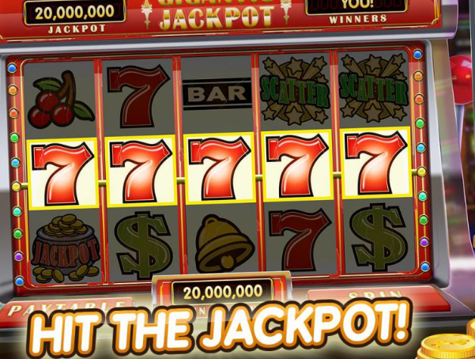

# Chapter 2 多臂老虎机

注：图片来源于网络，如果该图片有版权，请联系我删除。本页内容皆为公开免费的笔记，不用于盈利。

## 2.0 导读

从第二章多臂老虎机开始到第八章Planning and Learning with Tabular Methods，作者将这部分统一归纳为本书的“第一部分：Tabular Solution Methods”，也就是“表格解法”。

在上一章，我们已经梳理了强化学习的发展脉络，以及表格解法对现代强化学习的兴起的重要性。表格解法是几乎所有强化学习核心思想的最简形式：在状态空间和动作空间足够小的情况下，近似值函数可以被表示为数组，或者称作表格（tables）。在这种情况下，这些方法往往能够找到精确解（exact solutions），即最优值函数和最优策略。

第九章开始，将介绍另一种只能找到近似解的情况。正如上一章节历史综述中所提到的，现代强化学习的发展开始于表格解法，但在现实中大规模应用则是结合人工神经网络后，强化学习表现出了惊人的产出。

在Part I，我们将分别学习：

| 章节 | 内容                         | 重要概念                  |
| ---- | ---------------------------- | ------------------------- |
| 2    | 赌博机问题                   | ε-greedy                 |
| 3    | 马尔可夫决策过程             | 贝尔曼方程，价值函数      |
| 4    | 动态规划                     | 环境模型                  |
| 5    | 蒙特卡洛方法                 | 基于经验的估计            |
| 6    | 时序差分学习                 | Bootstrapping（自举更新） |
| 7    | 蒙特卡洛与时序差分的结合     | TD(λ) 多步更新           |
| 8    | 时序差分与模型学习方法的结合 | Dyna架构                  |

在本章我们主要学习强化学习中一个比较简单但却非常重要的概念：对于探索和利用的权衡（trade-off between exploitation and exploration）。强化学习和其他类型的学习方法最重要的区别之一，就是RL使用的训练信息是对所采取的动作进行评价（evaluates），而非通过给出正确动作来指示（instructs）。那么，显而易见的，如果环境智能评价agent做的动作好不好，而无法让agent知道什么动作是正确的，那么agent就必须去主动探索，因为如果agent不去探索的话可能就永远无法知道是否还有更好的动作存在了。其根本原因就是agent能得到信息总是处于一种局部可见的状态，是不完整的，因此必须不断通过试错来了解哪些动作的奖励高，进而逐步找到最优策略。因为环境无法给予指示，因而主动探索是找到最优策略的唯一途径。

举例来说，假设你正在玩超级马里奥，指示型反馈会根据训练数据直接告诉你：在这个画面上，应该往右跳。你照着做就行了，因为有明确的指示。这是监督学习的重要特征。在这个情况下，无论你做什么，系统都不会对你的动作进行评价，只会告诉你：在这个状态下，正确动作时往右走。

而在强化学习中，你控制马里奥，按了一个动作，系统将告诉你：你现在得了200分。系统不会告诉你：满分是多少。因此，你只能不断地玩，不断地玩，来看自己的分数能不能继续提高。在这种情况下，你的动作是系统关注的，系统知道怎么去评价，但是无法告诉你正确答案。

## 2.1 K臂老虎机问题

在本章中，我们将用一个具体的例子，来说明评价系统是如何运作的。该例子是一个简化版本的强化学习问题，它不具备联结性（associativity）。联结性的意思就是动作选择要与当前情境或者状态相联系，比如说，当agent在迷宫中探索时，在迷宫不同的位置的时候显然会进行不同的动作。比如在左边是墙壁的时候，显然不能继续向左走了；在右边是墙壁的时候，显然也不能向右走了。这个时候，向哪边走（动作）受到所处位置（状态）的影响，他们不能分开探讨，这种情况就是联结性的情况，也是所有现实问题显然具备的特征。

为了让问题简化，我们先来讨论非联结性（nonassociative）的例子。现在想象这样一个场景：你的面前有一个老虎机：


这个老虎机上面有一个拉杆，你可以拉一下拉杆，然后屏幕上就会转动：



如果转动后停止时屏幕正中心的图表全都是相同的，那么你就中奖了！

读者在拉斯维加斯就玩过这个机器，花了十美元，中了二十美元，然后和朋友买了星巴克。读者个人不喜欢赌博，以前最多的赌博就是买十块钱的刮刮乐，还经常能中20块钱。

我们回到主题上来，现在假设你是一个赌狗，想用自己的知识来解决一下这个问题，你首先会想什么呢？没错，我想每个人都会先环视一圈，看看不同的老虎机，然后决定用哪个老虎机来吐钱，因为在老虎机游戏上这可能是你唯一能做的决策了。那么假设你的面前现在有k个老虎机，你可以选择任何一个去拉，你的目标是找到收益最大的那个老虎机。这就是k臂老虎机问题：


我们来系统性地看一下这个问题：你的目标其实就是在一定时间段内最大化期望地累计奖励，比如说在1000次动作（在强化学习中，我们把1000次动作称为1000个时间步 time steps）中获得的总奖励最大。

那么，假设每个动作a都有一个期望奖励（expected reward）或平均奖励，我们称这个期望奖励就是这个动作的价值（value）。

我们用At代表第t步所选择的动作，Rt代表所获得的奖励，那么某个动作a的“真实”价值就可以记作：

$$
q_*(a) \doteq \mathbb{E}[R_t \mid A_t = a]
$$

这个公式的意思是：在选择动作a的时候，所期望得到的奖励。对于类似读者这种可能没怎么学过数学的人，说明一下该公式的每个元素含义如下：

* a，代表动作，也就是实际选择的那个动作
* At，代表在时间步t采取的动作，At=a就表示给定当前采取的动作是a
* Rt，代表在时间步t收到的奖励
* |，条件符号，Rt | At=a的意思就是在选择动作a的情况下得到的奖励
* $\mathbb{E}[ X | Y]$，条件期望，在Y的条件下，X的期望值
* $\doteq$，定义符号，代表上面是个定义而不是等式
* $q_*$，这里的星号\*代表最优，q代表期望得到的奖励，$q_*(a)$代表选择动作a的时候所期望得到的奖励

复习一下期望值（expected value）：期望指的是试验中每次可能的结果乘以其结果概率的总和。这里要注意，我们这里提到的$q_*(a)$指的是真实值，下一节继续说明如何得到该值。

## 2.2 动作价值方法 Action-value Methods

我们无法一上来就得到真实值，而只能通过多次试验来得到估计值。一种非常直观地估计方法就是简答地采取该动作过去所获得奖励的平均值，也即样本平均法（sample-average method）：

$$
Q_t(a) \doteq 
\frac{\text{在 } t \text{ 之前采取 } a \text{ 时获得的奖励之和}}
     {\text{在 } t \text{ 之前采取动作 } a \text{ 的次数}}
= 
\frac{\sum_{i=1}^{t-1} R_i \cdot \mathbb{1}_{A_i = a}}
     {\sum_{i=1}^{t-1} \mathbb{1}_{A_i = a}}
$$

其中：

* $\mathbb{1}_{\text{predicate}}$，指示函数，当条件为真时取值为1，否则为0。
* Qt(a)，动作价值函数

如果该动作从未被选择过，那么分母就为0，所以这个时候需要定义一下该特殊情况地Qt(a)，一般取值为0。根据大数定律，当分母趋近于无穷大的时候，$Q_t(a)$会趋近于真实值$q_*(a)$。

现在，在任何一个时刻，当你面对k个老虎机的时候，你都可以通过上述样本平均法来计算出每一个动作对应的估计值。在这些值中，你可以采取两种动作：

* 贪婪动作（greedy action）：选择值最高的动作。因为利用了值的特征，所以我们把贪婪动作叫做利用（exploiting）。
* 非贪婪动作（non-greedy action）：选择值不是最高的动作，一般是随机选择动作。因为没有利用值，所以我们把这种叫做探索（exploring）。

在这个任务中，因为估计值是通过采样计算得来的，所以它只反映了已经发生过的情况的结果，因而是片面的。如果不想遗漏更优可能，那么探索就是必须的。一开始探索的奖励可能会比较低，但一旦能找到更好的动作，就可以反复利用它，从而增加长期收益。由于不能同时探索和利用，所以在探索和利用之间存在一个复杂的权衡，这也是强化学习的一个核心要点。

在权衡中，我们一般考虑：

* 当前估计值的精确程度
* 各个动作的不确定性
* 剩余的时间步数量

在本书中，我们的关注焦点不在探索vs利用的权衡上，因而只考虑简单的平衡策略。当我们基于这些值来进行动作选择的时候，我们就称这类方法为动作价值方法（action-value methods）。一般来说，完整的动作价值函数还要包含状态，即$Q_t(s,a)$，但是老虎机问题中不存在状态，所以这里只探讨简化的动作价值函数。

现在，我们可以定一下动作选择规则，假设只选择估计价值最高的动作，即贪婪动作，我们可以记作：

$$
A_t \doteq \arg\max_a Q_t(a)
$$

其中$\arg\max_a$表示使得Q_t(a)最大的动作a。

但这显然不行。显然，我们需要考虑探索进去。一种常见的做法是大部分时间做贪婪选择，偶尔以小概率ε（epsilon）随机选择任一动作。我们把这种方法称为ε贪婪方法（ε-greedy methods）。

当步数趋近于无穷时，每个动作最终都会被尝试无数次，因此每个a的估计值都能收敛到真实值，而最终最优动作的选择概率也会趋近于1-ε，即几乎总是能选择最优动作。不过，这种渐进性质（asymptotic gurantees）并不能完全反映该方法在优先步数下的实际效果。

## 2.3 多臂老虎机模拟测试

下面我们来设计一个模拟实验。课本中给出了一个十臂测试平台（The 10-armed Testbed）来评估并对比greedy和ε-greedy。

下面将书中的测试复现一下，实验要点如下：

* k=10，设置10个老虎机（或者说10臂老虎机）进行模拟测验
* 预先设定好10个老虎机的真实奖励$q_*(a)$，在下面我会详细说怎么设置；这个奖励是隐藏的，是agent看不到的
* 每次动作选择的时候，在真实奖励的基础上，会进行一个随机的噪音干扰

上述testbed设置好后，就相当于模拟好了一个强化学习的环境，然后我们就可以用强化学习的算法去让agent在这个环境中学习，最后进行评估。在这个例子中，我们将初步学习到如何设置一个简单的模拟环境、测试、以及最终的评估。

首先，在实验开始前，先说明一下testbed的设置。k=10很好理解，就是10个老虎机或者说10臂老虎机。

预先设置的真实奖励用标准正态分布生成：

$$
q_*(a) \sim \mathcal{N}(0, 1)
$$

这个的意思是，每个动作的“好坏”（平均奖励）都是从平均为0、波动为1的分布中随机出来的。

对于每个动作，在最终实际执行的时候，得到的最终奖励会受到噪音的影响，我们可以用类似的方式设置实际奖励Rt为：

$$
R_t \sim \mathcal{N}(q_*(a), 1)
$$

简单来说，就是先按照标准正态分布（中心均值为0，方差为1）生成10个真实奖励值；然后对每个动作，再以该动作的真实奖励为中心均值，并以方差为1，进行实际奖励发放。

我们可以在python中设置该分布：

```python
import numpy as np
import matplotlib.pyplot as plt

# 设置随机种子
np.random.seed(42)

# 模拟一个 10 臂赌博机
k = 10

# 为每个动作生成真实平均奖励 q_*(a)
q_star = np.random.normal(loc=0.0, scale=1.0, size=k)

# 生成每个动作的实际获得的奖励样本
rewards = []  # 最终是一个长度为10的列表，每个元素是该动作的1000次奖励
for i in range(k):
    q = q_star[i]  # 第i个动作的真实平均值
    reward_samples = np.random.normal(loc=q, scale=1.0, size=1000)  # 模拟拉1000次
    rewards.append(reward_samples)

# 创建小提琴图来展示奖励分布
plt.figure(figsize=(12, 6))
plt.violinplot(rewards, showmeans=True, showextrema=False)
plt.axhline(0, color='gray', linestyle='--')
plt.xticks(np.arange(1, k + 1))  # 标出动作编号
plt.xlabel("Action")
plt.ylabel("Reward Distribution")
plt.title("Reward Distributions for 10-Armed Bandit Actions (Using For Loop)")
plt.grid(True)
plt.tight_layout()
plt.show()

```

因为设置了随机种子，所以其实就是用了一组总是能固定不变的伪随机数。之所以用正态分布，是因为奖励集中在某个值附近（比如平均值），但偶尔有一些波动（好运气/坏运气），并且在数学上好处理。对每个动作进行1000次实际奖励方法取样，可以得到结果如下：


这个图叫做“小提琴图”，可以很直观地显示出该testbed设置方法下最终的真实q值的分布。在接下来的实际测试中，agent是无法观测到这些东西的，只能通过实际得到的奖励，不断调整自己的Q值估计，最终当Q值收敛的时候，我们就能看到agent是否找到了正确的答案。

现在知道了环境怎么给奖励，我们就可以开始实验了。假设agent一开始对10个动作的估计Q值都是0，那么在第一回合的时候，无论agent选择的ε是多少（我们在这里的讨论中，将纯greedy视为ε为0的情况），显然面对10个Q值一样的状态，agent都只能随机从中选择一个。当Q值一样的时候随机选一个是一般的处理方法。

无论agent随机选了哪一个动作，这个时候环境会给予agent一个奖励（即上述我们设置的带有噪音的那个奖励），在这里我们可以简单地通过样本平均更新法来更新该动作a对应的Q值：


$$
Q_{n+1}(a) = \frac{R_1 + R_2 + \cdots + R_n}{n}
$$


## Exercises

### Exercise 2.1

问：在练习ε-greedy动作选择中，假设有两个动作，且ε=0.5，那么选择贪婪动作的概率是多少？

答：如果epsilon=0.5，那么很显然有0.5的概率进行探索，并由1-0.5=0.5的概率选择贪婪动作。但是要注意，在随机探索的时候，也有可能选中贪婪动作，所以如果题目包含了这种情况，我们就需要
