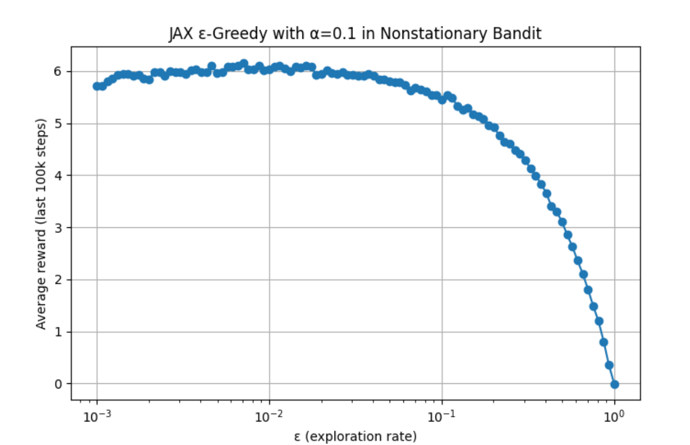

# Chapter 2 多臂老虎机

---

## 2.0 导读

从第二章多臂老虎机开始到第八章Planning and Learning with Tabular Methods，作者将这部分统一归纳为本书的“第一部分：Tabular Solution Methods”，也就是“表格解法”。

在上一章，我们已经梳理了强化学习的发展脉络，以及表格解法对现代强化学习的兴起的重要性。表格解法是几乎所有强化学习核心思想的最简形式：在状态空间和动作空间足够小的情况下，近似值函数可以被表示为数组，或者称作表格（tables）。在这种情况下，这些方法往往能够找到精确解（exact solutions），即最优值函数和最优策略。

第九章开始，将介绍另一种只能找到近似解的情况。正如上一章节历史综述中所提到的，现代强化学习的发展开始于表格解法，但在现实中大规模应用则是结合人工神经网络后，强化学习表现出了惊人的产出。

在Part I，我们将分别学习：

| 章节 | 内容                         | 重要概念                  |
| ---- | ---------------------------- | ------------------------- |
| 2    | 赌博机问题                   | ε-greedy                 |
| 3    | 马尔可夫决策过程             | 贝尔曼方程，价值函数      |
| 4    | 动态规划                     | 环境模型                  |
| 5    | 蒙特卡洛方法                 | 基于经验的估计            |
| 6    | 时序差分学习                 | Bootstrapping（自举更新） |
| 7    | 蒙特卡洛与时序差分的结合     | TD(λ) 多步更新           |
| 8    | 时序差分与模型学习方法的结合 | Dyna架构                  |

在本章我们主要学习强化学习中一个比较简单但却非常重要的概念：对于探索和利用的权衡（trade-off between exploitation and exploration）。强化学习和其他类型的学习方法最重要的区别之一，就是RL使用的训练信息是对所采取的动作进行评价（evaluates），而非通过给出正确动作来指示（instructs）。那么，显而易见的，如果环境智能评价agent做的动作好不好，而无法让agent知道什么动作是正确的，那么agent就必须去主动探索，因为如果agent不去探索的话可能就永远无法知道是否还有更好的动作存在了。其根本原因就是agent能得到信息总是处于一种局部可见的状态，是不完整的，因此必须不断通过试错来了解哪些动作的奖励高，进而逐步找到最优策略。因为环境无法给予指示，因而主动探索是找到最优策略的唯一途径。

举例来说，假设你正在玩超级马里奥，指示型反馈会根据训练数据直接告诉你：在这个画面上，应该往右跳。你照着做就行了，因为有明确的指示。这是监督学习的重要特征。在这个情况下，无论你做什么，系统都不会对你的动作进行评价，只会告诉你：在这个状态下，正确动作时往右走。

而在强化学习中，你控制马里奥，按了一个动作，系统将告诉你：你现在得了200分。系统不会告诉你：满分是多少。因此，你只能不断地玩，不断地玩，来看自己的分数能不能继续提高。在这种情况下，你的动作是系统关注的，系统知道怎么去评价，但是无法告诉你正确答案。

---

## 2.1 K臂老虎机问题

在本章中，我们将用一个具体的例子，来说明评价系统是如何运作的。该例子是一个简化版本的强化学习问题，它不具备**联结性（associativity）**。联结性的意思就是动作选择要与当前情境或者状态相联系，比如说，当agent在迷宫中探索时，在迷宫不同的位置的时候显然会进行不同的动作。比如在左边是墙壁的时候，显然不能继续向左走了；在右边是墙壁的时候，显然也不能向右走了。这个时候，**向哪边走（动作）**受到**所处位置（状态）**的影响，他们不能分开探讨，这种情况就是联结性的情况，也是所有现实问题显然具备的特征。

为了让问题简化，我们先来讨论**非联结性（nonassociative）**的例子。现在想象这样一个场景：你的面前有一个老虎机：

{style="display:block; margin:auto; width:400px;"}

这个老虎机上面有一个拉杆，你可以拉一下拉杆，然后屏幕上就会转动：

{style="display:block; margin:auto; width:400px;"}

如果转动后停止时屏幕正中心的图表全都是相同的，那么你就中奖了！

读者在拉斯维加斯就玩过这个机器，花了十美元，中了二十美元，然后和朋友买了星巴克。读者个人不喜欢赌博，以前最多的赌博就是买十块钱的刮刮乐，还经常能中20块钱。

我们回到主题上来，现在假设你是一个赌狗，想用自己的知识来解决一下这个问题，你首先会想什么呢？没错，我想每个人都会先环视一圈，看看不同的老虎机，然后决定用哪个老虎机来吐钱，因为在老虎机游戏上这可能是你唯一能做的决策了。那么假设你的面前现在有k个老虎机，你可以选择任何一个去拉，你的目标是找到收益最大的那个老虎机。这就是k臂老虎机问题：

{style="display:block; margin:auto; width:400px;"}

我们来系统性地看一下这个问题：你的目标其实就是在一定时间段内最大化期望地累计奖励，比如说在1000次动作（在强化学习中，我们把1000次动作称为1000个时间步 time steps）中获得的总奖励最大。

那么，假设每个动作a都有一个**期望奖励（expected reward）或平均奖励**，我们称这个期望奖励就是这个动作的**价值（value）**。

我们用At代表第t步所选择的动作，Rt代表所获得的奖励，那么某个动作a的“真实”价值就可以记作：

$$
q_*(a) \doteq \mathbb{E}[R_t \mid A_t = a]
$$

这个公式的意思是：在选择动作a的时候，所期望得到的奖励。对于类似读者这种可能没怎么学过数学的人，说明一下该公式的每个元素含义如下：

* a，代表动作，也就是实际选择的那个动作
* At，代表在时间步t采取的动作，At=a就表示给定当前采取的动作是a
* Rt，代表在时间步t收到的奖励
* |，条件符号，Rt | At=a的意思就是在选择动作a的情况下得到的奖励
* $\mathbb{E}[ X | Y]$，条件期望，在Y的条件下，X的期望值
* $\doteq$，定义符号，代表上面是个定义而不是等式
* $q_*$，这里的星号\*代表最优，q代表期望得到的奖励，$q_*(a)$代表选择动作a的时候所期望得到的奖励

复习一下期望值（expected value）：期望指的是试验中每次可能的结果乘以其结果概率的总和。这里要注意，我们这里提到的$q_*(a)$指的是真实值，下一节继续说明如何得到该值。

---

## 2.2 动作价值方法

我们无法一上来就得到真实值，而只能通过多次试验来得到估计值。一种非常直观地估计方法就是简答地采取该动作过去所获得奖励的平均值，也即**样本平均法（sample-average method）**：

$$
Q_t(a) \doteq 
\frac{\text{在 } t \text{ 之前采取 } a \text{ 时获得的奖励之和}}
     {\text{在 } t \text{ 之前采取动作 } a \text{ 的次数}}
= 
\frac{\sum_{i=1}^{t-1} R_i \cdot \mathbb{1}_{A_i = a}}
     {\sum_{i=1}^{t-1} \mathbb{1}_{A_i = a}}
$$

其中：

* $\mathbb{1}_{\text{predicate}}$，指示函数，当条件为真时取值为1，否则为0。
* Qt(a)，动作价值函数

如果该动作从未被选择过，那么分母就为0，所以这个时候需要定义一下该特殊情况地Qt(a)，一般取值为0。根据大数定律，当分母趋近于无穷大的时候，$Q_t(a)$会趋近于真实值$q_*(a)$。

现在，在任何一个时刻，当你面对k个老虎机的时候，你都可以通过上述样本平均法来计算出每一个动作对应的估计值。在这些值中，你可以采取两种动作：

* **贪婪动作（greedy action）**：选择值最高的动作。因为利用了值的特征，所以我们把贪婪动作叫做利用（exploiting）。
* **非贪婪动作（non-greedy action）**：选择值不是最高的动作，一般是随机选择动作。因为没有利用值，所以我们把这种叫做探索（exploring）。

在这个任务中，因为估计值是通过采样计算得来的，所以它只反映了已经发生过的情况的结果，因而是片面的。如果不想遗漏更优可能，那么探索就是必须的。一开始探索的奖励可能会比较低，但一旦能找到更好的动作，就可以反复利用它，从而增加长期收益。由于不能同时探索和利用，所以在探索和利用之间存在一个复杂的权衡，这也是强化学习的一个核心要点。

在权衡中，我们一般考虑：

* 当前估计值的精确程度
* 各个动作的不确定性
* 剩余的时间步数量

在本书中，我们的关注焦点不在探索vs利用的权衡上，因而只考虑简单的平衡策略。**当我们基于这些值来进行动作选择的时候，我们就称这类方法为动作价值方法（action-value methods）。**一般来说，完整的动作价值函数还要包含状态，即$Q_t(s,a)$，但是老虎机问题中不存在状态，所以这里只探讨简化的动作价值函数。

现在，我们可以定一下动作选择规则，假设只选择估计价值最高的动作，即贪婪动作，我们可以记作：

$$
A_t \doteq \arg\max_a Q_t(a)
$$

其中$\arg\max_a$表示使得Q_t(a)最大的动作a。

但这显然不行。显然，我们需要考虑探索进去。一种常见的做法是大部分时间做贪婪选择，偶尔以小概率ε（epsilon）随机选择任一动作。我们把这种方法称为ε贪婪方法（ε-greedy methods）。

当步数趋近于无穷时，每个动作最终都会被尝试无数次，因此每个a的估计值都能收敛到真实值，而最终最优动作的选择概率也会趋近于1-ε，即几乎总是能选择最优动作。不过，这种渐进性质（asymptotic gurantees）并不能完全反映该方法在优先步数下的实际效果。

---

## 2.3 多臂老虎机模拟测试

下面我们来设计一个模拟实验。课本中给出了一个十臂测试平台（The 10-armed Testbed）来评估并对比greedy和ε-greedy。

下面将书中的测试复现一下，实验要点如下：

* k=10，设置10个老虎机（或者说10臂老虎机）进行模拟测验
* 预先设定好10个老虎机的真实奖励$q_*(a)$，在下面我会详细说怎么设置；这个奖励是隐藏的，是agent看不到的
* 每次动作选择的时候，在真实奖励的基础上，会进行一个随机的噪音干扰

上述testbed设置好后，就相当于模拟好了一个强化学习的环境，然后我们就可以用强化学习的算法去让agent在这个环境中学习，最后进行评估。在这个例子中，我们将初步学习到如何设置一个简单的模拟环境、测试、以及最终的评估。

首先，在实验开始前，先说明一下testbed的设置。k=10很好理解，就是10个老虎机或者说10臂老虎机。

预先设置的真实奖励用标准正态分布生成：

$$
q_*(a) \sim \mathcal{N}(0, 1)
$$

这个的意思是，每个动作的“好坏”（平均奖励）都是从平均为0、波动为1的分布中随机出来的。

对于每个动作，在最终实际执行的时候，得到的最终奖励会受到噪音的影响，我们可以用类似的方式设置实际奖励Rt为：

$$
R_t \sim \mathcal{N}(q_*(a), 1)
$$

简单来说，就是先按照标准正态分布（中心均值为0，方差为1）生成10个真实奖励值；然后对每个动作，再以该动作的真实奖励为中心均值，并以方差为1，进行实际奖励发放。

我们可以在python中设置该分布：

```python
import numpy as np
import matplotlib.pyplot as plt

# 设置随机种子
np.random.seed(42)

# 模拟一个 10 臂赌博机
k = 10

# 为每个动作生成真实平均奖励 q_*(a)
q_star = np.random.normal(loc=0.0, scale=1.0, size=k)

# 生成每个动作的实际获得的奖励样本
rewards = []  # 最终是一个长度为10的列表，每个元素是该动作的1000次奖励
for i in range(k):
    q = q_star[i]  # 第i个动作的真实平均值
    reward_samples = np.random.normal(loc=q, scale=1.0, size=1000)  # 模拟拉1000次
    rewards.append(reward_samples)

# 创建小提琴图来展示奖励分布
plt.figure(figsize=(12, 6))
plt.violinplot(rewards, showmeans=True, showextrema=False)
plt.axhline(0, color='gray', linestyle='--')
plt.xticks(np.arange(1, k + 1))  # 标出动作编号
plt.xlabel("Action")
plt.ylabel("Reward Distribution")
plt.title("Reward Distributions for 10-Armed Bandit Actions (Using For Loop)")
plt.grid(True)
plt.tight_layout()
plt.show()

```

因为设置了随机种子，所以其实就是用了一组总是能固定不变的伪随机数。之所以用正态分布，是因为奖励集中在某个值附近（比如平均值），但偶尔有一些波动（好运气/坏运气），并且在数学上好处理。对每个动作进行1000次实际奖励方法取样，可以得到结果如下：

{style="display:block; margin:auto; width:800px"}

这个图叫做“小提琴图”，可以很直观地显示出该testbed设置方法下最终的真实q值的分布。**在接下来的实际测试中，agent是无法观测到这些东西的，只能通过实际得到的奖励，不断调整自己的Q值估计，最终当Q值收敛的时候，我们就能看到agent是否找到了正确的答案。**

现在知道了环境怎么给奖励，我们就可以开始实验了。假设agent一开始对10个动作的估计Q值都是0，那么在第一回合的时候，无论agent选择的ε是多少（我们在这里的讨论中，将纯greedy视为ε为0的情况），显然面对10个Q值一样的状态，agent都只能随机从中选择一个。当Q值一样的时候随机选一个是一般的处理方法。

无论agent随机选了哪一个动作，这个时候环境会给予agent一个奖励（即上述我们设置的带有噪音的那个奖励），在这里我们可以简单地通过样本平均更新法来更新该动作a对应的Q值，Q(n+1)就是在看了前n次的奖励后估计的动作价值：

$$
Q_{n+1}(a) = \frac{R_1 + R_2 + \cdots + R_n}{n}
$$

该方法在实际实验及编程中并不实用，因为太占内存了。很显然，按照编程的思想，我们总是会设置一个循环，然后在循环内通过不断更新值的方式去更新一个变量（比如非常常见的for i in... i+=1），同理，Q表更新也可以用同样的方式完成：

$$
\begin{aligned}
Q_{n+1} &= \frac{1}{n} \sum_{i=1}^{n} R_i \\
        &= \frac{1}{n} \left( R_n + \sum_{i=1}^{n-1} R_i \right) \\
        &= \frac{1}{n} \left( R_n + (n - 1) Q_n \right) \\
        &= Q_n + \frac{1}{n} (R_n - Q_n)
\end{aligned}
$$

这个公式在n=1时也成立，此时Q2 = R1对任意Q1成立。

那么我们接下来就可以设置一个测试环境，对比一下不同ε之下的不同策略中，agent在找到最高奖励的bandit的表现是如何的。

根据上述公式和我们对奖励的设置，边读边写，可以写出整个程序的草稿框架如下：

```text
伪代码：多臂老虎机测试

def reward（agent选择了老虎机a）：
  设置该函数来按照上面我们已经讨论过的规则，将对应老虎机的奖励返还给agent
  k = 10，代表10个老虎机
  按照标准正态分布设置十个老虎机的真实奖励q*
  然后根据导入的参数老虎机k（代表agent选择的对应的老虎机）返回一个带噪音的Rt
  Rt(a) = 正态分布（以q*为中心，方差为1）
  return Rt(a)

def agent：
  agent就是强化学习智能体，该智能体将和环境交互
  agent初始维护一个值全为0，长度为k=10的Q表
  Q = [0] * 10
  然后agent在每次的选择中，将根据Q表中的最大值来决定选择哪个动作at：
  （1）在Q表中找到最大的值，返回其对应的index，即选择动作；如果有多个最大值，则随机选择一个
  （2）调用reward（a），获得对应的奖励
  （3）根据实际的反馈，更新Q值，这里按照样本平均更新法来更新

def main：
  接着我们进行2000次试验，在每次试验中进行1000个时间步的运行：
    agent和环境交互，以ε的概率随机选择，以1-ε的概率按照agent中定义的方式选择
    选择后更新Q值
  试验结束后绘制图表，展现1000个时间步在2000次试验中的平均奖励，以及选择最优动作的百分比（理想状况下ε策略将按照1-ε的概率选择最优动作）
```

这种写法显然不够优雅，只是无脑的把我们刚才学到的奖励的概念和agent的概念复述了一遍。我们可以提炼一下要点用面向对象的方法来设计一下，整个过程中其实就老虎机本身（环境）和agent两个对象，所以伪代码可以优化为：

```text
class 老虎机：
    def init()：
        初始化k=10
	按照标准正态分布生成上述k个动作的真实平均奖励q*

    def 实际奖励(选择的动作a)：
	reward = 以动作a的真实平均奖励q*为中心，方差为1的正态分布中的值
	return reward

class Agent：
    def init(epsilon)：
	初始化epsilon
	初始化Q表（按照k的值设置对应数量的初始值，这里设置为0）

    def 动作选择()：
	生成一个随机数
	if 该随机数小于epsilon：
	    进行ε-greedy选择一个随机动作
	    return 动作a
	else：
	    进行greedy，选择一个值最大的动作，如果都一样则从中随机选择一个
	    return 动作a

    def 更新Q表(动作a，实际奖励q)：
	根据动作a和实际奖励q，更新Q(a)

def main():
    agent = Agent(epsilon=0/0.01/0.1)
    老虎机 = 老虎机()
    进行1000次循环：
	动作a = agent.动作选择()
	奖励q = 老虎机.实际奖励()
	agent.更新Q表(动作a, 奖励q)

if self = _init_:
    新建三个Q表，用来存放2000次试验下不同epsilon值的平均值
    遍历三种epsilon值：
        进行2000次试验：
	    main()


```

现在看起来像那么回事了，我们继续把一些细节写好，在后续的笔记种，我将省略上述过程，直接展示最终写好细节的伪代码。这里之所以赘述，是为了方便那些不怎么会编程的人学习（如今学习AI的人里不怎么会写代码的人越来越多了，这也正常，因为很多人主要研究数学！但强化学习非常适合应用，特别是和机器人结合在一起，所以会有比较多的编程！但这里读者觉得，在学习强化学习过程中，学会写伪代码就可以了，因为强化学习的代码一般不会太长，最重要的是策略和环境设置，具体的代码实现可以直接让ChatGPT写就行了！）

在写整个程序的伪代码的时候，最关键的就是**面向对象的设计**，如果你还没有学过面向对象的概念，可以找个python/java的网络教程快速看一下，大概一个下午就能把主要的特点如对象、继承、重写等理解学会了。一般来说，读者认为能把下面我展示的这个水平的伪代码写出来，对于强化学习编程来说就没有问题了：

```python
# 多臂老虎机测试伪代码
class 老虎机:
    def __init__():
        k = 10  # 动作数
        # 按照标准正态分布生成 k 个动作的真实平均奖励 q*
        q_star = [从 N(0, 1) 中采样得到的长度为 k 的列表]
        # 记录当前环境下的最优动作索引
        best_action = argmax(q_star)

    def 实际奖励(选择的动作 a):
        # 根据动作 a 的真实平均值 q_star[a]，从 N(q_star[a], 1) 中采样
        reward = 从 N(q_star[a], 1) 中采样得到的标量
        return reward


class Agent:
    def __init__(epsilon):
        # 探索概率 ε
        self.epsilon = epsilon
        # 初始化 k 个动作的估计值 Q[a] = 0
        self.Q = 长度为 k、全零的列表
        # 初始化每个动作被选择的计数 N[a] = 0
        self.N = 长度为 k、全零的列表

    def 动作选择():
        随机数 = 从 [0, 1) 均匀采样
        if 随机数 < epsilon:
            # 以 ε 的概率随机探索
            a = 在 0 到 k-1 之间随机选一个动作索引
            return a
        else:
            # 以 1 - ε 的概率进行贪心选择
            max_Q = max(self.Q)
            # 找出所有 Q[a] == max_Q 的索引列表
            candidates = [所有满足 Q[a] == max_Q 的索引]
            # 如果有多个相同的最大值，从中随机选择一个
            a = 在 candidates 列表中随机选一个索引
            return a

    def 更新Q表(动作 a, 实际奖励 r):
        # 计数加一
        N[a] += 1
        # 样本平均法更新：Q[a] ← Q[a] + (1 / N[a]) * (r - Q[a])
        Q[a] = Q[a] + (r - Q[a]) / N[a]


def main():
    # k = 10，steps = 1000
    # 在 main 中只跑一次环境交互（一个试验/一次序列）
    agent = Agent(epsilon=0 或 0.01 或 0.1)
    env = 老虎机()
    # 用于记录单次试验中每个时间步 t 的奖励和最优动作命中情况
    rewards_list = 长度为 1000、初始值全零的列表
    optimal_action_flags = 长度为 1000、初始值全零的列表

    for t in range(1000):  # 进行 1000 个时间步
        a = agent.动作选择()
        r = env.实际奖励(a)
        agent.更新Q表(a, r)

        rewards_list[t] = r
        if a == env.best_action:
            optimal_action_flags[t] = 1

    return rewards_list, optimal_action_flags


if self = _init_:
    k = 10
    steps = 1000
    runs = 2000
    epsilons = [0, 0.01, 0.1]

    # 用于累计所有 runs 次试验中，每个 ε 对应的 1000 个时间步的总奖励
    总奖励 = 一个字典，键为 ε，值为长度为 1000 的全零列表
    # 用于累计最优动作命中次数
    总最优命中 = 一个字典，键为 ε，值为长度为 1000 的全零列表

    # 遍历三种 ε
    for ε in epsilons:
        for run in range(runs):
            # 每个 run 都重新执行一次 main，得到该次序列的 rewards 和 optimal flags
            rewards_list, optimal_flags = main()
            # 累加到对应 ε 的“总奖励”和“总最优命中”中
            for t in range(steps):
                总奖励[ε][t] += rewards_list[t]
                总最优命中[ε][t] += optimal_flags[t]

    # 计算平均值：每个ε下，每个时间步的平均奖励 和 最优动作命中率（%）
    平均奖励 = 一个字典，键为 ε，值为长度为 1000 的列表
    最优命中率 = 一个字典，键为 ε，值为长度为 1000 的列表

    for ε in epsilons:
        for t in range(steps):
            平均奖励[ε][t] = 总奖励[ε][t] / runs
            # 将命中次数转换为百分比
            最优命中率[ε][t] = (总最优命中[ε][t] / runs) * 100

    # 最后可以将 平均奖励 和 最优命中率 用于绘图或表格展示
    # 此处省略具体绘图代码，可以直接告诉ChatGPT用 matplotlib 画就行了

```

按照上述伪代码，直接发给ChatGPT，让它写好，然后在python环境中运行即可，具体的代码在本小节笔记最后的代码附录中或者我的github中都能找到，无特殊情况直接在附录中找就行了，因为github repo中不仅有笔记文件和代码文件，还有一些其他比如让这个笔记百科显示出来的文件等，稍微乱一点。

具体代码见**附录 Code 2.1**。

运行后可以得到如下结果：

{style="display:block; margin:auto; width:800px;"}

这张图展示了2000次试验中，1000个时间步内三种ε策略的平均奖励。这张**平均奖励随时间变化图**是几乎所有RL任务都要出的一张图，它能最直观地显示agent的学习趋势。

{style="display:block; margin:auto; width:800px;"}

这张图则是**最优动作选择率图**，用来分析探索vs利用。

从上面两张图可以很直观地看出来，三种策略中明显ε=0.1的效果是最好的。我们根据这两张图来深入分析一下，可以发现：

1. 纯greedy策略很快便进行了收敛，陷入了局部最优
2. ε=0.1的情况收敛到了1.5左右，这已经接近理论最优值1.54，这一点在数学上可以证明，参见附录中的Math 2.1。
3. ε=0.1的最优动作选择率并没有收敛到理论上最优的91%（随机探索中有10%的概率选中最优，所以理论值是90%+10%*10%），这是非常有意思的一点。可能性是多维度的，因为图中展示的是2000次试验的平均结果，所以有可能在一些trial中agent一直都没能找到最好的那个老虎机。具体的原因读者也没有继续深究下去，感兴趣的朋友如果深究出了一个非常具体的原因，或者能找到一个能收敛到理论最优值的ε，麻烦告诉读者，十分感谢！

本节的练习题参考附录中的Exercise 2.2, Exercise 2.3。

---

## 2.4 增量实现

在上一节，我们已经介绍Q值的一个比较巧妙的更新公式：

$$
\begin{aligned}
Q_{n+1} = Q_n + \frac{1}{n} (R_n - Q_n)
\end{aligned}
$$

这个公式在书中这里才提出来，但是上一章为了完成代码和练习我们已经使用了，这种公式叫做增量公式。**增量实现（Incremental Implementation）**在本书中将多次出现，它的一般形式为：

$$
\text{NewEstimate} \leftarrow \text{OldEstimate} + \text{StepSize} \cdot (\text{Target} - \text{OldEstimate})
$$

其中：

- $\text{Target} - \text{OldEstimate}$ 表示当前估计的“误差”(error)
- $\text{StepSize}$ 表示步长（在此例中是 $\frac{1}{n}$）

**这种思想的核心在于一步一步走，而不是一下子跳到终点（目标值）。**为什么这么做呢？因为我们不知道真实的目标值，只能通过观测得到一个大概率带有噪音的目标值，比如奖励可能是随机的、状态转移不确定、数据不完美等等，所以**我们不能直接把估计值直接设定为目标值，而是要慢慢靠近她。这种渐进式学习可以比较灵活地适应环境变化，也不会受到单个异常值地剧烈影响。**

在这里，书中对上一节我们自己写的老虎机算法进行了一个总结，这里的Q（a）就是Q值，N（a）是动作a被选择的次数。如果在上一小节认真写了代码，这个应该看起来会非常直观明了，因此就不赘述了：

{style="display:block; margin:auto; width:800px;"}

---

## 2.5 跟踪一个非平稳问题

现在考虑这么一种情况：假如环境在缓慢地变化，那么我们就不得不考虑如何适应这种变化。用2.4的公式，显然不妥，因为无论是一开始的还是最近的，他们的值都会被平等地算进公式里去。

在RL中，其实更多的问题是**非平稳（nonstationary）** 的。在这种情况下，我们应该想办法对最近的奖励赋予更大的权重。这里介绍一个非常常见的方法，即使用**固定步长参数（step-size parameter)**，即将2.4的公式：

$$
\begin{aligned}
Q_{n+1} = Q_n + \frac{1}{n} (R_n - Q_n)
\end{aligned}
$$

改为：

$$
Q_{n+1} \doteq Q_n + \alpha \left[ R_n - Q_n \right]
$$

**这里的α叫做固定步长参数，是一个0到1的常数。** 显然易见，Q(n+1)就变成了对过去奖励和初始估计Q1的加权平均，并且通过数学公式推导：

$$
\begin{aligned}
Q_{n+1} &= Q_n + \alpha \left[ R_n - Q_n \right] \\
       &= \alpha R_n + (1 - \alpha) Q_n \\
       &= \alpha R_n + (1 - \alpha) \left[ \alpha R_{n-1} + (1 - \alpha) Q_{n-1} \right] \\
       &= \alpha R_n + (1 - \alpha)\alpha R_{n-1} + (1 - \alpha)^2 Q_{n-1} \\
       &= \alpha R_n + (1 - \alpha)\alpha R_{n-1} + (1 - \alpha)^2\alpha R_{n-2} + \cdots \\
       &\quad + (1 - \alpha)^{n-1} \alpha R_1 + (1 - \alpha)^n Q_1 \\
       &= (1 - \alpha)^n Q_1 + \sum_{i=1}^{n} \alpha (1 - \alpha)^{n - i} R_i
\end{aligned}
$$

可以看出，一开始（t=1）的奖励的权重将会随着时间的推移越来越小，并且一开始的奖励的权重是呈指数级衰减的（指数为1-α），因此这种方法也叫做指**数加权平均（exponential recency-weighted average）**。

根据随机逼近理论，若想让收敛必然发生，必须满足以下两个条件：

$$
\underbrace{\sum_{n=1}^{\infty} \alpha_n(a) = \infty}_{\text{步长足够大以克服初始条件或随机波动}} 
\quad \text{和} \quad 
\underbrace{\sum_{n=1}^{\infty} \alpha_n^2(a) < \infty}_{\text{步长最终变小以确保收敛}}
$$

那么可以看到，对于样本平均法（$\alpha_n(a) = \frac{1}{n}$）是满足的；但是对于固定步长的方法则不满足第二个条件，也即意味着Q值会永远随着最新奖励不断变化。虽然无法收敛，但是因为强化学习中非平稳问题占主流，所以该方法是一般被采用的。

这里需要注意的一点是（在Exercise2.7中问到了关于接下来要讲的这一点），**样本平均法是无偏的（unbiased），而常数步长法是有偏的（biased）。**在统计学中，如果一个估计值的期望等于它所估计的真实值，我们就说这个估计是无偏的（unbiased）。 即，假设$X$是我们要估计的真实值（比如某个动作的期望奖励），$\hat{X}$是我们的估计值（比如Qn），如果满足：$\mathbb{E}[\hat{X}] = X$，那么我们就说这个估计是无偏的。****在这里之所以讨论这一点，是因为如果方法无偏，那么在足够多的学习之后，估计值就会平均地等于真实值。** 无偏适合静态环境，比如老虎机问题；而有偏适合非静态环境，可以快速适应新的变化（因为新的奖励会获得更高的权重）。

小结：通过本节学习，我们到目前为止掌握了如下两种Q值更新公式：

$$
\underbrace{
Q_n = (1 - \alpha)^n Q_0 + \sum_{i=1}^{n} \alpha (1 - \alpha)^{n - i} R_i
}_{\text{公式1：常数步长法}}
\qquad \text{和} \qquad
\underbrace{
Q_n = \frac{1}{n} \sum_{i=1}^{n} R_i
}_{\text{公式2：样本平均法}}
$$

本节练习见 Exercise 2.4 和 Exercise 2.5。

---

## 2.6 乐观初始值

本节讲一下**乐观初始值（Optimistic Initial Values）**的概念。

在上一节中，我们讲到固定步长法是有偏的，在强化学习中，这种偏差并不是问题，有时甚至还非常有帮助。唯一的缺点就是，用户需要思考初始值该如何设置，因为固定步长法的初始值Q1项始终无法消除。在Code 2.1和Code 2.2这两个实验中，我们把初始值都设置为0。如果我们把这两个实验的初始值设为5，会发生什么呢？

很显然，所有的奖励都不会达到5，因此当agent进行动作选择并更新Q值后，那些没被选择的显然会成为数值更高的动作。因此，这种设计方法可以保证所有的动作都被访问。这种方法就叫做乐观初始值方法。

我们只需要把Code 2.1的代码稍微修改一下，就能得到如下对比实验的结果（运行代码参见Code 2.3 乐观初始值：

{style="display:block; margin:auto; width:600px;"}

可以看出，乐观初始值方法即使使用了epsilon=0的greedy策略，并在一开始表现较差，但在200步左右便超过了初始值为0的ε-greedy策略，收敛到了更好的水平。

但是，如果任务发生变化（比如非平稳环境中），我们就可能需要重新探索。时间的起点只出现一次，我们不应该过分关注它。尽管如此，这种巧妙的设置方法在许多实际应用中依然十分有效。本节的目的就是记住有这样一种特殊技巧。

Exercise 2.6和Exercise2.7参见附录Exercise部分。

---

## 2.7 上置信界动作选择

在ε-greedy中，我们无法一视同仁地对待所有非greedy选项，充分探索。那么，如果非greedy动作中有成为最优动作的潜力，而我们把那些潜力更高的动作进行探索，则能提高探索-利用之间权衡的效率，也即进行更有策略的探索（而非盲目的探索）。

本节介绍一种叫做**上置信界（Upper-Confidence-Bounce，简称UCB）动作选择**方法，可以**更有策略地探索，自适应地降低探索频率**。我们可以参考下面这个公式：

$$
A_t \doteq \arg\max_a \left[ Q_t(a) + \underbrace{c \sqrt{\frac{\ln t}{N_t(a)}}}_{\text{探索补偿}} \right]
$$

其中t是时间步，Nt(a)表示到时间t为止动作a被选择的次数，c>0是控制探索程度的参数。Q(a)代表动作a当前的估值，即代表利用；右半边代表探索补偿项，用于估计当前这个动作“可能被低估”的程度，也就是不确定性的上界，这也是“上置信界”这个名字的由来。

这里注意，如果Nt(a)=0，则表明一个动作从未被选择过，那么作为分母的该动作就会导致该项公式无限大，所以在这种情况下认为该动作是最大化的动作；如此一来，所有未被探索过的动作都会被强制探索。在实验中，可以让Nt(a)=0的动作先被执行，从而避免除以0的错误。

UCB动作选择的思想是，如果动作a被选择的次数增加，其不确定性就会减少；反之，如果动作a没有被选择，那么分母不增的情况下，分子$\ln t$反而会增加，从而作为整体的不确定性就增加了。同时，系数c代表置信度的水平。

随着时间的增加，那些估值低但是又被频繁选择的动作，他们的权重会随着时间的推移而减小。直观来讲，UCB筛选动作的思维方式如下：

| 动作情况                    | UCB值    | UCB策略    |
| --------------------------- | -------- | ---------- |
| 估值高+探索项低             | 大       | 常选       |
| 估值低+被频繁选择（确认差） | 小       | 慢慢淘汰   |
| 估值低+很少被选（不确定）   | 可能变大 | 有机会就选 |

我们可以做一个简单的实验，实验代码见Code 2.4 UCB：

{style="display:block; margin:auto; width:600px;"}

可以看到，在10臂老虎机测试中，UCB的表现比ε-greedy更好。但是书中也提出，UCB方法更难推广到老虎机之外的一般强化学习问题中，其主要难点包括：

* UCB难以处理非平稳问题
* UCB难以处理大状态空间

因此UCB的实际应用情况较小，其可以被认为是针对老虎机问题的一个优化解。

本小节的Exercise2.8见Exercise附录部分的解答。

---

## 2.8 梯度赌博机算法

在上一节中，我们介绍了 **UCB（上置信界）方法** ，它通过结合当前动作的价值估计和不确定性（通常用时间步与动作选择次数的对数比值来衡量）来进行动作选择。该方法每次选择一个具有最大潜力上限的 **确定性动作** ，从而在探索和利用之间实现权衡。

在本节中，我们将介绍另一种同样考虑不同动作的潜力，但是却采用了另外一种不同的策略方法 ： **梯度赌博机算法（Gradient Bandit Algorithms）****。与UCB方法不同的是，它不计算动作值函数，而是通过学习每个动作的偏好值，并基于这些偏好生成一个概率分布进行采样，从而进行 随机策略选择 **。这一方法不仅具备更大的 **普适性** （如可扩展到策略学习、连续动作空间等），还可以通过适当设计（如使用固定步长和基准线） **适应非平稳环境** 。

这种方法在强化学习中叫做**基于策略的方法（policy-based method）**，而之前小节中学习的估算动作价值的方法叫做**基于值的方法（value-based method）**。本节介绍的就是一种最简单的基于策略的方法，或者说一种最简单的策略梯度方法。

下面我们来看一下这个方法。首先，我们考虑为每个动作$a$学习一个数值偏好（preference），记作$H_t(a) \in \mathbb{R}$。偏好值越大，该动作被选择的频率就越高。请注意，这种偏好本身并没有任何关于奖励的含义。重要的是动作之间的相对偏好。

也就是说，该方法不需要直接估计值，而是学习对每个动作的偏好，然后按照一个概率策略来选择动作。比如说，假设所有动作的偏好是1000，那么他们之间就不存在相对的偏好差异了，因而在本方法下，也就对动作概率没有影响了。动作的选择概率由一个**软最大分布（soft-max distribution，例如Gibbs或Boltzmann分布）** 决定，如下所示：

$$
\Pr\{A_t = a\} \doteq \frac{e^{H_t(a)}}{\sum_{b=1}^{k} e^{H_t(b)}} \doteq \pi_t(a),
$$

其中$\pi_t(a)$表示在时刻t选择动作a的概率。初始时，所有动作的偏好都是一样的，因此每个动作被选择的概率就是相同的。

*注：这里书中插了一个关于数学证明的Exercise 2.9，详见Exercise附录部分。*

对于soft-max动作偏好，有一种**基于随机梯度上升（stochastic gradient ascent）的自然学习算法（natural learning algorithm）**。在每一步中，在选择了动作At并接收到奖励Rt后，动作偏好会按照以下方式更新：

$$
\begin{aligned}
H_{t+1}(A_t) &\doteq H_t(A_t) + \alpha (R_t - \bar{R}_t)(1 - \pi_t(A_t)), \text{and} \\
H_{t+1}(a) &\doteq H_t(a) - \alpha (R_t - \bar{R}_t) \pi_t(a), \quad \text{for all } a \ne A_t,
\end{aligned}
$$

其中：

* $\alpha>0$是步长参数（step-size parameter）
* $\bar{R}_t \in \mathbb{R}$表示在时间t时的奖励平均值，不包括当前奖励（即$\bar{R}_1 \doteq R_1$）；$\bar{R}_t$作为基准线（baseline），用来衡量当前奖励，如果$R_t$高于基准线，则将来选择该动作的概率增加，否则降低。
* $H_t(a)$表示在时间步t，动作a的偏好值（preference），在前文中已经讲过了

对于没接触过该类型公式的人而言，这个概念可能会比较晦涩难懂，下面举一个例子来说明：

**【例】** 假设我们有3个老虎机，记为A、B、C，他们的真实奖励分布如下（在该问题中，假设取样时依然有一个方差为1的正态的偏差）：

* A: 1.0
* B: 1.5（最好）
* C: 0.5

当然，对于agent，这个真实奖励是看不到的。现在，agent采用梯度赌博机算法：

* 初始偏好值：$H_1(A) = H_1(B) = H_1(C) = 0$
* 学习率：$\alpha = 0.1$
* 奖励基准线：用平均奖励$\bar{R}_t$来估计，初始设为0

第一步，计算策略概率（soft-max）。因为偏好全部为0，因此：

$$
\pi_1(A) = \pi_1(B) = \pi_1(C) = \frac{e^0}{e^0 + e^0 + e^0} = \frac{1}{3}
$$

第二步，根据概率，随机选择一个动作；因为三个策略的概率都是1/3，所以这里假设我们随机选中了A。

第三步，执行动作，获得奖励，假设经过噪音最终的奖励是1.2，即R1=1.2，那么最终平均奖励$\bar{R}_1 = 1.2$，在此基础上我们就可以更新公式：

$$
\begin{aligned}
H_{t+1}(A_t) &\doteq H_t(A_t) + \alpha (R_t - \bar{R}_t)(1 - \pi_t(A_t)), \text{and} \\
H_{t+1}(a) &\doteq H_t(a) - \alpha (R_t - \bar{R}_t) \pi_t(a), \quad \text{for all } a \ne A_t,
\end{aligned}
$$

将 \( t = 1 \) 的数据代入：

- 选中的动作是 \( A_1 = A \)，此时：

$$
R_1 - \bar{R}_1 = 0, \quad 
\pi_1(A) = \frac{1}{3}, \quad 
\pi_1(B) = \pi_1(C) = \frac{1}{3}, \quad 
\alpha = 0.1
$$

- 因此：

$$
H_2(A) = H_1(A) + 0.1 \times 0 \times \left(1 - \frac{1}{3} \right) = 0 + 0 = 0,
$$

$$
H_2(B) = H_1(B) - 0.1 \times 0 \times \frac{1}{3} = 0 - 0 = 0,
$$
  
$$
H_2(C) = H_1(C) - 0.1 \times 0 \times \frac{1}{3} = 0 - 0 = 0.
$$

- 所以在时间步 t=1 后，三条偏好依然都为 0：

  $$
  H_2(A) = 0, \quad H_2(B) = 0, \quad H_2(C) = 0
  $$

上述三步就算是timestep=1的情况下的计算步骤。后续保持重复这三个步骤就可以，我们可以把这个方法写成伪代码，并按照之前小节的设置把k设为10：

```python
Class Bandit:
    def __init__:
        k = 10
        q_star = [从 N(0,1) 中采样 for i in range(k)]

    def reward(action a):
        return 从 N(q_star[a], 1) 中采样

Class Agent:
    def __init__(k, alpha):
        H = [0] * k
        baseline = 0
        t = 0

    def action():
        计算 softmax 软最大概率 π
        根据 π 抽选动作 a
        return a

    def update():
        t += 1
        更新 baseline
        advantage = R_t - baseline
        计算 π(a)
        根据 π(a) 更新 H
        a = action()
        R = reward(a)
        对 H 进行更新

def main():
    2000次试验:
        1000个timestep:
            a = agent.action()
            R = bandit.reward(a)
            agent.update(a, R)

```

把上述伪代码翻译成python代码，具体代码参见**Code 2.5 梯度老虎机**。实验结果如下所示：

{style="display:block; margin:auto; width:600px;"}

{style="display:block; margin:auto; width:600px;"}

从实验结果中能看出来，有baseline的梯度老虎机的表现优于无baseline的情况。

注：这里书中插了关于梯度老虎机算法的数学深入讲解，介绍了该算法的本质就是对期望奖励进行随机梯度上升。详见**Math 2.5 作为随机梯度上升的梯度赌博机算法**。

---

## 2.9 关联搜索（情境赌博机）

本节探讨关联搜索（Associative Search），或说情境赌博机（ Contextual Bandits）。在之前的小节中，我们探讨的都是非关联任务，即不需要将不同情境与不同动作关联起来。比如说，agent要么在任务是平稳的状态下寻找最佳动作，要么就是在非平稳的状态下尝试追踪随着时间变化的最佳动作。

然而，对于更加一般的强化学习任务，情况往往不止一种，从而在学习目标中将包含情境：在特定情境中，能够选出最佳动作的策略。

举例来说，假设有3台除了颜色（比如红绿蓝三台）外，臂数都是10个的老虎机，他们分别有着不同的真实奖励分布。如果不考虑颜色，只考虑k臂老虎机本身，那么agent将无法通过学习得到正确的策略，因而必须将情境（老虎机的颜色）加入到学习目标中。然后在学习过程中，当遇到的是红色的时候，agent只能继续从红色老虎机的臂中选择，然后获得红色老虎机的动作值函数。这个时候值函数将包括情境，一般记为$Q(s,a)$，其中s代表state（状态），也就是我们这里讨论的情境。

*本节练习：书中的Exercise 2.10，详见附录。*

---

## 2.10 第二章总结

在本章中，我们介绍了几种平衡探索与利用的简单方法，我们对核心公式进行一个汇总复习：

**（1）epsilon-greedy方法**

- 选择最优动作的概率：

  $$
  P(a = a^*) = 1 - \varepsilon
  $$
- 随机选择动作的概率：

  $$
  P(a) = \frac{\varepsilon}{k}, \quad \text{对于 } a \ne a^*
  $$

**（2）乐观初始值法**

- 初始化时设置：

  $$
  Q_1(a) = Q_{\text{high}}, \quad \text{使得所有动作看起来很优}
  $$

**（3）UCB（Upper Confidence Bound）方法**

- 动作选择规则：

  $$
  A_t = \arg\max_a \left[ Q_t(a) + c \cdot \sqrt{\frac{\ln t}{N_t(a)}} \right]
  $$

  - $Q_t(a)$：动作 $a$ 的当前平均奖励
  - $N_t(a)$：动作 $a$ 被选择的次数
  - $c$：控制探索程度的超参数

**（4）梯度方法（Gradient Bandit）**

- 使用 softmax 分布选择动作：

  $$
  P(a) = \frac{e^{H_t(a)}}{\sum_b e^{H_t(b)}}
  $$

  - $H_t(a)$：动作偏好
  - 偏好值更新（使用基准 $\bar{R}_t$）：

$$
H_{t+1}(a) = H_t(a) + \alpha (R_t - \bar{R}_t) (\mathbb{1}_{a=A_t} - P(a))
$$

书中给出了上述四种方法在多臂老虎机问题中的表现：


读者在这里懒得复现了，分别的代码都在Code附录中了，感兴趣的同学可以自己尝试写在一个文件中然后绘图对比。从书中给出的这张图能看出来，这四种方法UCB的表现是最好的。图中包含了参数变化，统一用k=10作为测试环境，所以对比是比较公平的。这种对比图叫做**参数研究图（parameter study），可以对比不同算法在不同参数下的平均表现。**

同时，我们在评价一个方法时，不能只看他在最佳参数值的时候的表现，还要看他对参数变化的敏感程度。上述四种方法在该问题中都对参数不太敏感，表现稳定。**参数不敏感的算法更鲁棒（robust），更适合实际应用，因为现实中调参很难。**

尽管这四种方法已经足够好来解决k臂老虎机问题，但是我们仍未找到完全满意的解决方案来平衡探索与利用。还有一个被广泛研究的探索-利用平衡方法叫做Gittins指数（Gittins Index），这是一种贝叶斯方法（Beyesian Methods）。尽管贝叶斯方法的计算过程通常较为复杂，但是对于某些特殊分布（称为共轭先验 conjugate priors）计算会变得简单。一种可行的方法是使用后验采样法（posterior sampling）或Thompson采样法，实验发现，这种方法的表现接近甚至优于本章介绍的所有方法。

在贝叶斯的设定中，甚至可以计算探索-利用的最优平衡方案：你可以为每个可能动作计算其获得即时奖励的概率，以及未来所有后验分布变化的概率；这些不断变化的分布形成了问题的信息状态（information state）。但是在实践中，这个树的增长速度极快，需要通过近似方法进行高效逼近，这相当于把老虎机问题转化为完整强化学习问题。这个话题超出了本书的范围，如果后续有机会的话在完成本书的精读后读者可能会继续探讨这些额外的话题。（挖坑ing）

*本节练习：书中的Exercise 2.11，详见附录。*

---

## 附：Exercise

### Exercise 2.1 计算贪婪动作选择概率

**问：** 在练习ε-greedy动作选择中，假设有两个动作，且ε=0.5，那么选择贪婪动作的概率是多少？

**答：** 如果epsilon=0.5，那么很显然有0.5的概率进行探索，并由1-0.5=0.5的概率选择贪婪动作。但是要注意，在随机探索的时候，也有可能选中贪婪动作，所以贪婪概率的总概率一般计算为：

$$
\text{贪婪动作的概率} = (1 - \varepsilon) + \frac{\varepsilon}{k} = (1 - 0.5) + \frac{0.5}{2} = 0.5 + 0.25 = 0.75
$$

---

### Exercise 2.2 判断ε动作

**问：**

考虑一个k=4的多臂老虎机问题，考虑使用以下策略：

* 采用ε-greedy策略
* 使用样本平均法（sample-average）来估计动作
* 所有动作的初始动作值估计为$Q_1(a)=0$，对所有a都成立

假设在前几步中，采取的动作和获得的奖励分别为：

| Timestep | Action    | Reward     |
| -------- | --------- | ---------- |
| $t=1$  | $A_1=1$ | $R_1=-1$ |
| $t=2$  | $A_2=2$ | $R_2=1$  |
| $t=3$  | $A_3=2$ | $R_3=-2$ |
| $t=4$  | $A_4=2$ | $R_4=2$  |
| $t=5$  | $A_5=3$ | $R_5=0$  |

那么请问，在哪些时间步中可以确定发生了ε情况，而哪些时间步则是可能呢？

**答：**

| Timestep | 是否发生了ε | 原因                                                                 |
| -------- | ------------ | -------------------------------------------------------------------- |
| 1        | 有可能       | 第一步Q表都是0，这个时候ε与否并无区别                               |
| 2        | 有可能       | 此时最优值有4个选择，所以这步也都有可能                              |
| 3        | 有可能       | 这一步乍一眼看一定是greedy，但其实也有可能是ε的情况下随机到最优值的 |
| 4        | 一定         | 此时a2已经不是最优值了，选到的话一定是ε                             |
| 5        | 一定         | 此时a3的Q为0，但是a2的Q经过三次选择已经更新为0.33，大于a3            |

---

### Exercise 2.3 不同ε策略的定量期望

{style="display:block; margin:auto; width:800px;"}

**问：** 对于图中所示的对比实验中，哪一种方法在长期的表现最好？他会好多少？您能用定量的方式表达吗？

**答：** 这道题有点意思，要求从数学角度分析。虽然图中明显ε=0.1的情况表现最好，但是从数学角度来看的话，如果进行无限时间步，即$t \to \infty$，那么样本平均估计在有探索的情况下将收敛到各个动作的真实值，即：

$$
Q_t(a) \to q_*(a)
$$

令动作中真实价值最大的那个老虎机臂为$a^* = \arg\max_a q^*(a)$，记他的真实价值为$q^*_{\max} \;=\; q^*(a^*) \;=\; \max_{1 \le a \le 10} q^*(a)$，那么在ε策略中，每一步：

* 以1-ε的概率选择$a^*$
* 以ε的概率在10个老虎机臂里随机选一个，选到$a^*$的概率是ε/10

因此当$t\to\infty$时，且 $Q_t$ 已经非常精确时，选择最优臂$a^*$的概率是：

$$
P_\infty(\text{选到最优臂 } a^*) 
= (1 - \varepsilon) + 
\underbrace{\frac{\varepsilon}{10}}_{\text{在“探索”时随机取到 } a^*} 
= 1 - \varepsilon + \frac{\varepsilon}{10}.
$$

换句话说：

$$
P_\infty(\text{optimal}) = 1 - \varepsilon + \frac{\varepsilon}{10}.
$$

同理，选到非最优臂的概率合计为：

$$
\sum_{a \ne a^*} P(\text{选到臂 } a) 
= 9 \times \frac{\varepsilon}{10} 
= \frac{9\varepsilon}{10}.
$$

因此，我们可以得到在epsilon为特定值的情况下，理论上长期的平均奖励：

$$
R_\infty = 
\underbrace{\left(1 - \varepsilon + \frac{\varepsilon}{10}\right)}_{P(\text{选到最优 } a^*)}
q^*_{\text{max}} 
+ \sum_{a \ne a^*} \left(\frac{\varepsilon}{10}\right) q^*(a).
$$

经过数学变换，得到可求解的长期平均奖励（这部分变化的过程参见**附录部分的Math 2.2**）：

$$
\mathbb{E}[R_\infty] 
= (1 - \varepsilon) \underbrace{\mathbb{E}[M_{10}]}_{\approx 1.54} 
+ \frac{\varepsilon}{10} \underbrace{\mathbb{E}\left[\sum_{a=1}^{10} q^*(a)\right]}_{= 0} 
= (1 - \varepsilon) \times 1.54.
$$

因此，我们可以得到理论上（定量方式）的长期（极限状态）选择最优臂的概率，和长期（极限状态）时的平均奖励：

| epsilon | $P_\infty$ | $\mathbb{E}[R_\infty]$ |
| ------- | ------------ | ------------------------ |
| 0       | 不适用*      | 不适用*                  |
| 0.01    | 0.991        | (1-0.1)*1.54             |
| 0.1     | 0.91         | (1-0.01)*1.54            |

*greedy情况下一开始可能会卡在次优臂上，理论上理想化的极限是100%

---

### Exercise 2.4 可变的步长参数表示

**问：** 如果步长参数$\alpha_n$不是常数，那么估计值$Q_n$是先前接收到的奖励得加权平均，不过其加权方式不同于公式2.5节中给出的形式。那么，在更一般的情况下，也就是步长可变的情况下，每一个先前奖励得权重是多少？请用一系列步长参数来表达这些权重，作为对2.5节中的公式的一般化。

**答：** 先回顾一下题目中所说的2.5节中的公式：$Q_n = (1 - \alpha)^n Q_0 + \sum_{i=1}^n \alpha (1 - \alpha)^{n - i} R_i$，这个公式表示Qn实际上是一个带有衰减的指数加权平均数。

如果步长$\alpha_n$不是常数，估计值Qn仍然是所有过去奖励Ri的加权平均，但是每个奖励的权重由不同的步长序列决定：

$$
Q_{n+1} = \left( \prod_{j=1}^{n} (1 - \alpha_j) \right) Q_0 + \sum_{i=1}^{n} \alpha_i \left( \prod_{j=i+1}^{n} (1 - \alpha_j) \right) R_i
$$

其中第i次奖励Ri的权重是：

$$
w_i = \alpha_i \prod_{j=i+1}^{n} (1 - \alpha_j)
$$

这说明了每个奖励的权重不仅依赖于它被引入时的步长$\alpha_i$，还受之后所有步长的“衰减作用”影响。

注：关于该公式的推导及说明，参见附录中的 **Math 2.3 广义指数递减加权平均**

---

### Exercise 2.5 非平稳实验

**编程题：** 设计一个实验，以演示样本平均方法在非平稳问题上所遇到的困难，具体要求如下：

1. 多臂老虎机的k依然为10
2. 令所有动作的真实价值$q_*(a)$一开始都相等
3. 在每一步都对他们施加独立的随机游走（例如，每一步给每个$q_*(a)$都加上一个服从均值0、标准差0.01的正态分布增量。
4. 使用两种不同的动作价值方法：样本平均法（incremental sample-average）和固定步长法（constant-step-size, alpha=0.1）
5. 对这两种方法，在同样的非平稳环境下，分别进行一次较长的仿真运行，如10000步。设定epsilon=0.1来进行ε-greedy。
6. 绘制平均奖励曲线（随着时间步推进，算法所获得的平均回报如何变化）和最优动作选择百分比曲线（随着时间步推进，算法选择最有动作的频率如何变化）。

**答：**

根据上述要求，可以写出伪代码如下：

```python
class 老虎机:
	def __init__():
		k = 10
		真实奖励q* = 长度为k的list，包含10个一样的值，可以都设置为0

	def 获得奖励(动作a):
		实际奖励 = 在以动作a的真实奖励为均值，方差为1的正态分布中采样
		对所有真实奖励q*永久性累加随机游走的扰动（均值为0、标准差为0.01）
		return 实际奖励

class Agent:
    def __init__():
		epsilon = 0.1
		Q数组，长度为10，初始化为0；存放每个动作当前的估计值
		N数组，长度为10，初始化为0；记录每个动作被选过的次数，用于样本平均法和统计使用

	def 动作选择():
		按照epsilon选择最优/随机动作

	def 更新Q值(更新方法, 动作a):
		N[动作a] += 1
		if 更新方法 = 样本平均法:
			按照样本平均法进行动作a的Q值更新
		else:
			按照固定步长法进行动作a的Q值更新，固定步长alpha=0.1

def main():
	分别模拟样本平均法和固定步长法：
		模拟2000次试验：
			在每次试验中进行100000个时间步:
				让Agent根据Q值选择动作
				获得奖励()
				更新Q值()
	完成后分别绘制平均奖励曲线和最优动作选择百分比曲线
	注：绘制曲线需要的额外变量并没有写在上述伪代码中
```

将上述伪代码发送给ChatGPT，生成python代码（参见附录的Code 2.2 非平稳环境实验），结果如下：

{style="display:block; margin:auto; width:800px;"}

{style="display:block; margin:auto; width:800px;"}

从实验结果来看，固定步长法在非平稳环境中表现更好。

---

### Exercise 2.6 乐观初始值图像中的问题

**问：** 在2.6小节乐观初始值的实验中（Code 2.3 乐观初始值），为什么在结果中，可以看到在乐观方法的曲线早期出现了波动和尖峰现象？换句话说，是什么因素可能导致这种方法在特定的早期步骤上平均表现得特别好或者特别差？

**答：** 在乐观初始值方法中，所有动作的初始估计值都被设得非常高（例如 +5），而实际的奖励值是从均值为 0 的正态分布中采样的。因此，无论选择哪个动作，第一次获得的奖励几乎总是低于初始估计，导致 Q 值立即下降。

这种“失望”的反馈使得智能体迅速放弃当前动作，去尝试其他动作。这就相当于在早期阶段，虽然没有显式的 ε，但行为上几乎是完全探索性的，每个动作都被轮番尝试。

为什么会出现震荡和尖峰：

* 一旦某个动作偶然获得了一个高于平均的奖励，它的 Q 值会下降得更慢，甚至暂时升高，使得该动作被反复选择几次。
* 但之后又因为真实奖励低于估计值，Q 再次下降，智能体又开始探索其他动作。
* 这个过程中会出现“某动作突然被偏爱几步后又被放弃”的行为，导致平均奖励在这些点上产生尖峰和波动。

此外，由于不同试验中的真实奖励是随机生成的（2000 次试验中每次都不同），这些波动在前几十步中 不会完全被平均掉 ，从而在图 2.3 中表现为早期曲线上的尖峰。

---

### Exercise 2.7 设计一个避免初始偏差的常数步长系数

**问：**

在本章的大多数内容中，我们使用样本平均值来估计动作价值，因为样本平均不会像常数步长那样产生初始偏差。然而，样本平均并不是一个完全令人满意的解决方案，因为它们在非平稳问题中可能表现较差。

有没有可能在保留常数步长在非平稳问题上的优势的同时，避免其初始偏差呢？一种方式是使用如下的步长：

$$
\beta_n \doteq \frac{\alpha}{\bar{o}_n} \tag{1}
$$

来处理某个特定动作的第 n次奖励，其中 $\alpha > 0$是一个常规的常数步长，而 $\bar{o}_n$ 是一个从 0 开始的“1的踪迹（trace of one）”，定义为：

$$
\bar{o}_n \doteq \bar{o}_{n-1} + \alpha (1 - \bar{o}_{n-1}), \quad n > 0, \quad \bar{o}_0 \doteq 0 \tag{2}
$$

请证明：使用这种方法得到的Qn是一个无初始偏差的指数加权平均值

**答：**

由递推式可得：

$$
\bar{o}_n = 1 - (1 - \alpha)^n, \quad \beta_n = \frac{\alpha}{\bar{o}_n} = \frac{\alpha}{1 - (1 - \alpha)^n}
$$

故$\beta_1 = \alpha / \alpha = 1$，第一步更新 ( Q_1 = R_1 )，完全抹去 ( Q_0 )（无初始偏差）。将$Q_n = Q_{n-1} + \beta_n (R_n - Q_{n-1})$递归展开，得：

$$
Q_n = \underbrace{(1 - \beta_n) \cdots (1 - \beta_1)}_{=0} Q_0 + \sum_{i=1}^{n} \left[ \beta_i \prod_{k=i+1}^{n} (1 - \beta_k) \right] R_i
$$

令系数为：

$$
w_i^{(n)} = \beta_i \prod_{k = i+1}^{n} (1 - \beta_k).
$$

可以观察到，

$$
\frac{w_{i+1}}{w_i} = \frac{\beta_{i+1}}{\beta_i (1 - \beta_{i+1})} = \frac{1}{1 - \alpha} > 1
$$

由于$\alpha$是一个事先给定且满足$0<\alpha<1$的常数步长，因此上式成立。而如果上式成立，则说明对于固定的n，$w_i^{(n)}$随着i按照几何比率递增，换句话说往过去看按$(1-\alpha)$的比率衰减，即$w_i^{(n)}$是典型的“指数衰减且归一化”权重。因此 ( Q_n ) 正是一个无初始偏差的指数加权平均值。

本题的详细说明见Math 2.4 无偏常数步长更新的指数加权平均系数设计。

---

### Exercise 2.8 UCB峰值

**问：** 在书中的Figure2.4中（如下图所示），UCB在第11步时出现了一个明显的峰值，请解释为什么会出现这个峰值，以及为什么这个峰值后又迅速下降了？提示：如果令c=1，那么这个峰值不会那么明显。

{style="display:block; margin:auto; width:600px;"}

**答：** 因为k=10，根据UCB公式，前10步相当于把所有的动作先尝试了一遍。在第11步，因为所有动作都被尝试了一遍，他们现在的UCB值的Nt(a)都为1，此时所有臂的探索补偿都是相同的，都是$c \sqrt{\frac{\ln(11)}{1}}$。因此，第11步一定会选择在初次抽样中侥幸较高的臂，但是该臂一旦被选择，他的Nt(a)就会增加，从而导致探索补偿降低，因此这里的奖励会出现短暂的下降。一直到整体探索补偿都大于其他臂的UCB值得时候，它才会被再次重新选择并被持续选择。

值得注意的是，随着t得不断增长，可以认为Nt(a)=O(t)，因此当t增大的时候，探索补偿最终会逐渐趋近于0。换句话说，当t很大的时候，这个探索补偿项将几乎不起作用，从而导致UCB策略变成一个近似greedy的策略。

至于c=1时峰值变小，是因为c相当于探索补偿的系数，因此如果把c减少，就是将补偿整体减少。

---

### Exercise 2.9 数学证明题

**证：** soft-max分布在只有两个动作的情况下，等价于常用于统计和神经网络中的logistic函数或sigmoid函数。

**答：** 设两个动作分别为0和1，那么：

$$
\mathbb{P}(A_t = 1) = \frac{e^{H_t(1)}}{e^{H_t(1)} + e^{H_t(0)}} = \frac{1}{1 + e^{-x}},
$$

其中$x = H_t(1) - H_t(0)$表示相对于动作0的动作1的偏好程度。

---

### Exercise 2.10 情境老虎机任务

**问：**

假设你面临一个双臂赌博机任务，其真实动作价值会在每个时间步之间随机变化。具体地，假设在任意时间步下，动作 1 和动作 2 的真实价值要么以概率 0.5 分别是 10 和 20（称为情形 A），要么以概率 0.5 分别是 90 和 80（称为情形 B）。

1. 如果你在任何时刻都无法分辨当前处于哪种情形，那么你能够获得的最优期望奖励是多少？你应当怎样选择动作才能达到这个期望？
2. 现在假设在每个时间步，你都被告知自己正处于情形 A 还是情形 B（虽然你依然不知道对应动作的真实价值具体是多少）。这是一个关联搜索任务。在这种情况下，你能够获得的最优期望奖励是多少？你应当怎样选择动作才能达到它？

**答：**

假设题目描述的就是一个常规的平稳问题。

对于第一问，如果无法分辨情况，那么可以计算两个动作的期望，会发现动作1和动作2的总期望价值都是50。那么无论选择什么策略，其最优期望都是一样的，那么只选1、只选2、每步各50%的概率选都是最优的。

对于第二问，可以设置Q(s,a)来记录上述四种情况：

| 动作1和动作2的真实价值 | 动作1     | 动作2     |
| ---------------------- | --------- | --------- |
| 情形A：0.5的概率是     | Q(A,1)=10 | Q(A,2)=20 |
| 情形B：0.5的概率是     | Q(B,1)=90 | Q(B,2)=80 |

在这种情况下，很容易计算出最优奖励期望是$0.5 \times 20 + 0.5 \times 90 = 55$。在不知道真实价值的情况下，按照上述Q(s,a)的设置，在观测的时候增加一个对情形的观测，记录的时候注意对号入座就行了，其他的和之前学习的内容没什么分别。

---

### Exercise 2.11 非平稳状态下的参数研究图

**编程题：**请针对**Exercise 2.5 非平稳实验**中描述的非平稳情形，绘制一张**参数研究图**。要求如下：

* 要包括使用常数步长（constant-step-size）的  **ε-greedy 算法** ，其中 $α = 0.1$。
* 每个实验运行 200,000步。
* 对于每个算法和参数设置，其性能评估指标应为**最近 100,000 步中的平均奖励 。**答：**

详细代码参见Code 2.6，读者用ChatGPT写了一个GPU加速的版本，不然普通版本看了下要10个小时才能运行完。结果如下:

{style="display:block; margin:auto; width:600px;"}

如果把采样点增加到100个，可以得到：

{style="display:block; margin:auto; width:600px;"}

---

## 附：Math

### Math 2.1 证明多臂老虎机实验理论最优期望奖励

可以通过数学证明，多臂老虎机问题最终的最优理论值是1.54。

（注：这个证明是读者在看书的时候顺手查的资料边学边推的，如果有问题麻烦联系一下我，以防误导别人）

在我们的设置中，10个真实奖励符合标准正态分布，我们要找的最终值其实就是这10个独立的符合标准正态分布的随机变量的最大值的期望。由于实际奖励是围绕真实奖励以一个标准正态分布抖动的，所以噪声的均值为0，长期来看，其对应的平均奖励在无限长的长期下必然收敛到其真实值。

所以，最优理论值就是查找10个标准正态随机变量中最大值的期望。

对于k个独立分布的标准正态随机变量：

$$
X_1, X_2, \ldots, X_k \sim \mathcal{N}(0, 1)
$$

他们的最大值Mk为：

$$
M_k = \max\{X_1, X_2, \ldots, X_k\}
$$

在统计学中，$\{ X_{(1)}, X_{(2)}, \ldots, X_{(k)} \}$被称作这组样本的顺序统计量（Order Statistics），其中$X_{(1)} \le X_{(2)} \le \cdots \le X_{(k)}$，那么$X_{(k)} = M_k = \max\{X_1, \ldots, X_k\}$。

按照顺序统计量中最大值的分布与期望公式，首先求得累积分布函数CDF：

$$
F_{M_k}(x) = \Pr\{M_k \le x\} = \left[ \Phi(x) \right]^k, \quad \text{其中} \; \Phi(x) = \Pr\{X_i \le x\}
$$

然后对上式求导得到概率密度函数PDF：

$$
f_{M_k}(x) = \frac{d}{dx} F_{M_k}(x) = k \, \Phi(x)^{k-1} \, \phi(x), \quad \text{其中} \; \phi(x) = \frac{1}{\sqrt{2\pi}} e^{-x^2/2}
$$

得到最终所求的最大值的期望：

$$
\mathbb{E}[M_k] = \int_{-\infty}^{+\infty} x \, f_{M_k}(x) \, dx = \int_{-\infty}^{+\infty} k x \, \Phi(x)^{k-1} \, \phi(x) \, dx
$$

根据上面的公式，将k=10代入，得到：

$$
\mathbb{E}[M_{10}] = \int_{-\infty}^{+\infty} 10x \, \Phi(x)^9 \, \phi(x) \, dx \approx 1.54.
$$

即当k=10的时候，10个老虎机中最大值的数学期望是：

$$
\mathbb{E}\left[ \max_{1 \le i \le 10} q_i^* \right] \approx 1.54.
$$

---

### Math 2.2 推导多臂老虎机可求解的理论平均最优奖励

下面给出Exercize 2.3中的一个没有详细展开说明的推导过程。

在Exercize 2.3中，经过简单的推导，我们可以得到动作总数为10，最优臂为$a^*$的长期平均奖励：

$$
R_\infty = 
\underbrace{\left(1 - \varepsilon + \frac{\varepsilon}{10}\right)}_{P(\text{选到最优臂 } a^*)}
q^*_{\text{max}} 
+ \sum_{a \ne a^*} \left(\frac{\varepsilon}{10}\right) q^*(a) \tag{1}
$$

观察（1）中左半部分的系数，我们将它拆开，得到：

$$
\left(1 - \varepsilon + \frac{\varepsilon}{10}\right) q^*_{\text{max}}
= (1 - \varepsilon) q^*_{\text{max}} + \frac{\varepsilon}{10} q^*_{\text{max}}.
$$

将其代回（1），得到（2）：

$$
R_\infty =
\underbrace{(1 - \varepsilon)\, q^*_{\text{max}}}_{\text{(A)}}
+ \underbrace{\frac{\varepsilon}{10}\, q^*_{\text{max}}}_{\text{(B)}}
+ \underbrace{\sum_{a \ne a^*} \left(\frac{\varepsilon}{10}\right) q^*(a)}_{\text{(C)}}
\tag{2}
$$

其中：

* A是贪婪阶段直接选到最优臂那部分的期望
* B是探索阶段恰好选到最优臂的那部分的期望
* C是探索阶段选到任何一个非最优臂的期望

接着对（2）中的（B）和（C）进行合并，得到探索阶段所有10根臂的。这里需要用一点 技巧，首先写出“所有10根臂地价值之和”的分解：

$$
\sum_{a=1}^{10} q^*(a) 
= \underbrace{q^*(a^*)}_{=\, q^*_{\text{max}}} 
+ \sum_{a \ne a^*} q^*(a) \tag{I}
$$

然后在（I）两边同时乘以ε/10：

$$
\frac{\varepsilon}{10} \sum_{a=1}^{10} q^*(a)
= \frac{\varepsilon}{10} q^*_{\text{max}} + \frac{\varepsilon}{10} \sum_{a \ne a^*} q^*(a)
\tag{II}
$$

（II）等价于：

$$
\underbrace{\frac{\varepsilon}{10} q^*_{\text{max}}}_{\text{(B)}}
+ \underbrace{\frac{\varepsilon}{10} \sum_{a \ne a^*} q^*(a)}_{\text{(C)}}
= \frac{\varepsilon}{10} \sum_{a=1}^{10} q^*(a)
\tag{\text{III}}
$$

将（III）代回到（2）中，得到（3）：

$$
\begin{aligned}
R_\infty 
= (1 - \varepsilon)\, q^*_{\text{max}} + \frac{\varepsilon}{10} \sum_{a=1}^{10} q^*(a)
\end{aligned}
\tag{3}
$$

在式（3）中，左半部分的$q^*_{\text{max}}$就是在Math 2.1中求出来的$\mathbb{E}\left[ \max_{1 \le i \le 10} q_i^* \right]$，当k=10的时候：

$$
\mathbb{E}[M_{10}] 
= \mathbb{E} \left[ \max_{1 \le i \le 10} \mathcal{N}(0, 1) \right] 
\approx 1.5389.
$$

而右半部分，对于10个以标准正态独立且同分布（i.i.d., independent and identically distributed）进行设置的情况，他们的和的期望是0，即：

$$
对于 q^*(a) \sim \mathcal{N}(\mu = 0,\, \sigma^2 = 1)，
$$

$$
\mathbb{E} \left[ \sum_{a=1}^{10} q^*(a) \right]
= \sum_{a=1}^{10} \mathbb{E}[q^*(a)]
= \sum_{a=1}^{10} 0 = 0.
$$

因此，对于整个（3）式，在k=10并且以标准正态分布的环境下，其相当于：

$$
\mathbb{E}[R_\infty] 
= (1 - \varepsilon)\, \underbrace{\mathbb{E}[M_{10}]}_{\approx 1.54} 
+ \frac{\varepsilon}{10} \underbrace{\mathbb{E} \left[ \sum_{a=1}^{10} q^*(a) \right]}_{=\, 0} 
= (1 - \varepsilon) \times 1.54.
$$

---

### Math 2.3 广义指数递减加权平均

首先，我们从基本更新公式出发：

$$
Q_{n+1} = Q_n + \alpha_n (R_n - Q_n)
$$

将其整理为“线性加权”形式：

$$
Q_{n+1} = (1 - \alpha_n) Q_n + \alpha_n R_n \tag{1}
$$

这个形式可以告诉我们，当前估计Qn会被保留一部分（比例是$1-\alpha_n$）；新的奖励Rn会以$\alpha_n$的权重加进去。我们同样可以写出Qn的线性加权形式：

$$
Q_n = (1 - \alpha_{n-1}) Q_{n-1} + \alpha_{n-1} R_{n-1} \tag{2}
$$

将（2）式的Qn代入到（1）中，可以得到：

$$
Q_{n+1} = (1 - \alpha_n) \left[ (1 - \alpha_{n-1}) Q_{n-1} + \alpha_{n-1} R_{n-1} \right] + \alpha_n R_n
$$

重复这个展开过程，可以得到一个不断“套娃”的结构：

$$
Q_{n+1} =
(1 - \alpha_n)(1 - \alpha_{n-1}) \cdots (1 - \alpha_1) Q_0
+ \sum_{i=1}^{n} \left[
  \alpha_i \cdot \prod_{j=i+1}^{n} (1 - \alpha_j)
\right] R_i
+ \alpha_n R_n
$$

接着我们可以发现，当i=n的时候，求和项中对应的那一项为：

$$
\alpha_n \times 
\underbrace{
  \prod_{j = n+1}^{n} (1 - \alpha_j)
}_{\text{空乘积}} 
\times R_n
$$

在数学上，当乘法的起点比终点大的时候，我们就叫作空乘积（empty product），并有约定该值为1：

$$
\text{空乘积}\prod_{j = n+1}^{n} (\cdot) = 1 \ \text{，也即} \prod_{j = n+1}^{n} (1-\alpha_j) = 1
$$

因此当$i=n$的时候，最后项$\alpha_nR_n$实际上就是上面求和中的i=n项，所以我们可以把这个具备重复性的模式表示为：

$$
Q_{n+1} =
\underbrace{
\left( \prod_{j=1}^{n} (1 - \alpha_j) \right) Q_0
}_{\text{初始值 } Q_0 \text{ 的残余影响}} +
\underbrace{
\sum_{i=1}^{n} \alpha_i \left( \prod_{j=i+1}^{n} (1 - \alpha_j) \right) R_i
}_{\text{历史奖励的加权和}}
$$

$$
\text{其中} \ w_i = \alpha_i \prod_{j=i+1}^{n} (1 - \alpha_j) \
\text{是奖励 } R_i \text{ 在最终估计中的真实权重}
$$

简单来说，就是：

$$
Q_{n+1} = 
\boxed{
\text{初始估计影响} + \sum_{i=1}^{n} \text{每个奖励的“引入权重} \times \text{保留系数”}
}
$$

---

### Math 2.4 无偏常数步长更新的指数加权平均系数设计

**1. 设计思路：如何构造无偏的常数步长更新系数**

在常见的常数步长更新中，我们往往直接用

$$
Q_{n} \;=\; Q_{n-1} + \alpha\bigl(R_{n} - Q_{n-1}\bigr), 
\quad 0<\alpha<1,
$$

却会遗留对最初 $Q_0$ 的“初始偏差”——因为这时展开后

$$
Q_n 
= (1-\alpha)^n\,Q_0 
\;+\;\sum_{i=1}^n \alpha\,(1-\alpha)^{\,n-i}\,R_i,
$$

其中 $(1-\alpha)^n Q_0$ 永远不会完全消失。若希望同时做到：

- 从第 1 步开始就不再依赖 $Q_0$ （无初始偏差），
- 后续对新数据依然快速响应（近似常数步长 $\alpha$ 的效果），

就需要让第 1 步使用步长 1 （彻底抹掉 $Q_0$），而在第 $n>1$ 步又“渐渐回到”常数 $\alpha$。

**1.1 构造辅助序列 $\bar o_n$**

我们先定义一个辅助变量序列 $\{\bar o_n\}$，用于动态“归一化”常数 $\alpha$ ：

- 令

  $$
  \bar o_0 = 0;
  $$
- 对 $n \ge 1$ ，递推

  $$
  \bar o_n \;=\; \bar o_{n-1} + \alpha\,\bigl(1 - \bar o_{n-1}\bigr).
  $$

  简言之，$\bar o_n$ 从 0 开始，每一步都“向 1 靠近一小步”，速率由 $\alpha$ 决定。

**1.2 定义动态步长 $\beta_n$**

基于 $\bar o_n$，我们令第 $n$ 次更新所用的步长为

$$
\beta_n \;=\; \frac{\alpha}{\,\bar o_n\,},\quad n \ge 1.
$$

此时有：

- 第 1 步：$\bar o_1 = \alpha$，于是

  $$
  \beta_1 = \frac{\alpha}{\alpha} = 1.
  $$

  在第 1 步使用 $\beta_1=1$ ，就能令

  $$
  Q_1 = Q_0 + 1\cdot\bigl(R_1 - Q_0\bigr) = R_1,
  $$

  从而**完全抹去**最初的 $Q_0$，保证“无初始偏差”。
- 第 $n>1$ 步：$\bar o_n \to 1$，因此

  $$
  \beta_n = \frac{\alpha}{\,\bar o_n\,}
  \;\approx\; \alpha\quad(\text{当 }n\text{ 足够大时})\,.
  $$

  后续各次更新所用的步长 $\beta_n$ 会快速从 1 降到接近 $\alpha$，亦即恢复常数步长的效果，从而对新数据依然快速响应。

综上，**设计结果**：

- 第 1 步 $\beta_1=1$ → 立即抹掉 $Q_0$ → 无初始偏差；
- 第 $n>1$ 步 $\beta_n=\alpha/\bar o_n$ → 随着 $\bar o_n\to1$ 迅速趋于 $\alpha$ → 保留常数步长的优点。

**2. 详细证明：该系数无初始偏差且构成指数加权平均**

下面在已知 $\bar o_n$、$\beta_n$ 定义的基础上，逐步证明所需性质。证明无初始偏差可以抹去人为初始值的影响；证明归一性可以说明这些权重构成一个真正的加权平均，即历史奖励的影响既按指数衰减又总权重为1，不会被认为放大或缩小。

**2.1 求解 $\bar o_n$ 的闭式表达**

先证明递推

$$
\bar o_0 = 0,\quad
\bar o_n = \bar o_{n-1} + \alpha\bigl(1 - \bar o_{n-1}\bigr)
$$

等价于

$$
\bar o_n = 1 - (1-\alpha)^n,\quad n\ge0.
$$

*验证（数学归纳法）：*

- $n=0$ 时，$1 - (1-\alpha)^0 = 0 = \bar o_0$.
- 假设对某 $n-1\ge0$ 已成立：$\bar o_{n-1} = 1 - (1-\alpha)^{\,n-1}$.
- 则：

$$
\begin{aligned}
\bar{o}_n 
&= \bar{o}_{n-1} + \alpha \left(1 - \bar{o}_{n-1}\right) \\[4pt]
&= \left[1 - (1 - \alpha)^{n-1}\right]
\,+\, \alpha \left[1 - \left(1 - (1 - \alpha)^{n-1}\right)\right] \\[4pt]
&= 1 - (1 - \alpha)^{n-1} + \alpha (1 - \alpha)^{n-1} \\[4pt]
&= 1 - (1 - \alpha)^n
\end{aligned}
$$

归纳完成。

因此

$$
\bar o_n = 1 - (1-\alpha)^n,\quad
\beta_n = \frac{\alpha}{\,\bar o_n\,}
= \frac{\alpha}{\,1 - (1-\alpha)^n\,}.
$$

特别地，$n=1$ 时，$\beta_1 = \alpha/\alpha = 1$。

**2.2 第 1 步抹去 $Q_0$：验证无初始偏差**

更新公式为

$$
Q_n = Q_{n-1} + \beta_n\,\bigl(R_n - Q_{n-1}\bigr),
\quad n\ge1,\quad Q_0\text{ 任意}.
$$

- 第 1 步：$\beta_1=1$，则

  $$
  Q_1 = Q_0 + 1\,(R_1 - Q_0) = R_1,
  $$

  完全去除对 $Q_0$ 的依赖。
- 递归展开：对任意 $n\ge1$，应用更新式可得

$$
\begin{aligned}
Q_n 
&= (1-\beta_n)\,Q_{n-1} + \beta_n\,R_n \\[4pt]
&= (1-\beta_n)\left[(1-\beta_{n-1})\,Q_{n-2} + \beta_{n-1}\,R_{n-1}\right]
   + \beta_n\,R_n \\[4pt]
&\;\;\vdots \\[2pt]
&= \underbrace{(1-\beta_n)\,(1-\beta_{n-1})\cdots(1-\beta_1)}_{C_0^{(n)}}\,Q_0
   + \sum_{i=1}^n \left[\beta_i \prod_{j=i+1}^n (1-\beta_j)\right] R_i.
\end{aligned}
$$

  由于 $\beta_1=1\implies(1-\beta_1)=0$，因此 $C_0^{(n)}=0$，从此 $Q_n$ 不含 $Q_0$。令

$$
w_i^{(n)} = \beta_i \prod_{j=i+1}^n (1-\beta_j),
$$

  则

$$
\boxed{Q_n = \sum_{i=1}^n w_i^{(n)}\,R_i.}
$$

  这说明“无任何初始偏差”。

**2.3 推导指数衰减与归一化**

1. **计算 $1-\beta_j$：**

   $$
   \beta_j = \frac{\alpha}{\,1 - (1-\alpha)^j\,}
   \;\implies\;
   1 - \beta_j 
   = \frac{(1-\alpha)\,\bigl[\,1 - (1-\alpha)^{\,j-1}\bigr]}{\,1 - (1-\alpha)^j\,}.
   $$
2. **连乘并约掉中间因子：**

   $$
   \prod_{j=i+1}^n (1 - \beta_j)
   = \prod_{j=i+1}^n 
     \frac{(1-\alpha)\,[\,1 - (1-\alpha)^{\,j-1}\,]}{\,1 - (1-\alpha)^j\,}
   = \frac{(1-\alpha)^{\,n - i}}{\,1 - (1-\alpha)^n\,}.
   $$
3. **得出 $w_i^{(n)}$ 的简化形式：**

   $$
   w_i^{(n)} 
   = \beta_i \prod_{j=i+1}^n (1 - \beta_j)
   = \frac{\alpha}{\,1 - (1-\alpha)^i\,}
     \;\times\;\frac{(1-\alpha)^{\,n - i}}{\,1 - (1-\alpha)^n\,}
   = \frac{\alpha\,(1-\alpha)^{\,n - i}}{\,1 - (1-\alpha)^n\,}.
   $$
4. **验证归一化：**

   $$
   \sum_{i=1}^n w_i^{(n)}
   = \sum_{i=1}^n \frac{\alpha\,(1-\alpha)^{\,n - i}}{\,1 - (1-\alpha)^n\,}
   = \frac{1}{\,1 - (1-\alpha)^n\,}
     \sum_{i=1}^n \alpha\,(1-\alpha)^{\,n - i}
   = 1.
   $$

因此

$$
Q_n 
= \sum_{i=1}^n \frac{\alpha\,(1-\alpha)^{\,n - i}}{\,1 - (1-\alpha)^n\,}\;R_i
$$

既是**指数衰减**、又**归一化**的加权平均。

**总结：**
以上证明了所设计的 $\beta_n=\alpha/\bar o_n$ 既确保 **无初始偏差**（$\beta_1=1$ 抹去 $Q_0$），又得到

$$
Q_n = \sum_{i=1}^n w_i^{(n)}\,R_i,
\quad
w_i^{(n)} = \frac{\alpha\,(1-\alpha)^{\,n - i}}{\,1 - (1-\alpha)^n\,},
$$

从而 $Q_n$ 是一个**无初始偏差的指数加权平均值**。

这个“无偏常数步长+指数加权”的设计技巧在强化学习中是一个非常经典的方案，一方面它抹掉了初始值（即在算法设计中初始人为给定的Q0）而让第一步的值直接等于R1，这样可以让观测估计值直接来自于真实数据而非人工设定；另一方面又保留了对新信息迅速更新的常数步长优点。

---

### Math 2.5 作为随机梯度上升的梯度赌博机算法

我们可以通过将梯度赌博机算法理解为对梯度上升的随机近似（stochastic approximation to gradient ascent），从而获得更深层次的见解。

在精确的梯度上升（exact gradient ascent）中，每个动作偏好 $H_t(a)$ 都会按照该偏好对性能的增益大小成比例地进行增量更新：

$$
H_{t+1}(a) \;\dot{=}\; H_t(a) \;+\; \alpha\,\frac{\partial\,\mathbb{E}[R_t]}{\partial\,H_t(a)}, 
\quad\text{（3）}
$$

其中这里所衡量的“性能”就是期望奖励：

$$
\mathbb{E}[R_t] \;=\; \sum_{x} \pi_t(x)\,q_*(x).
$$

- 其中 $\pi_t(x)$ 是在时刻 $t$ 选取动作 $x$ 的概率；
- $q_*(x)$ 是动作 $x$ 的真实平均回报（但在实际问题中我们并不知道 $q_*(x)$）。

而增量对性能的影响程度则是对该“性能度量”关于动作偏好 $H_t(a)$ 的偏导数。
当然，在我们的多臂赌博机情形下，我们无法精确地执行这一“精确梯度上升”，因为我们并不知道任何一个动作的 $q_*(x)$。
不过实际上，我们算法中的更新式在期望意义下是等价于上式（3）的，从而使得该算法成为一种随机梯度上升（stochastic gradient ascent）。
完成这一证明所需的运算只需要初等微积分，但步骤会比较繁琐。下文先从 Soft‐max 偏导的证明开始，再回到随机更新推导。

**一、计算 $\displaystyle \frac{\partial\,\pi_t(x)}{\partial\,H_t(a)}$**

先考虑 Soft‐max 策略

$$
\pi_t(x)
= \frac{e^{H_t(x)}}{\sum_{y=1}^{k} e^{H_t(y)}},
\quad\text{（1）}
$$

记分子 $f(x)=e^{H_t(x)}$，分母 $g=\sum_{y=1}^k e^{H_t(y)}$。我们要计算

$$
\frac{\partial\,\pi_t(x)}{\partial\,H_t(a)}
= \frac{\partial}{\partial\,H_t(a)}\Biggl[\frac{f(x)}{g}\Biggr].
$$

1. **应用商法则（quotient rule）**

$$
\frac{\partial}{\partial\,H_t(a)}\Bigl[\tfrac{f(x)}{g}\Bigr]
= \frac{\displaystyle \frac{\partial\,f(x)}{\partial\,H_t(a)}\,g \;-\; f(x)\,\frac{\partial\,g}{\partial\,H_t(a)}}{\,g^2\,}.
$$

2. **计算 $\displaystyle \frac{\partial\,f(x)}{\partial\,H_t(a)}$**

$$
f(x) = e^{H_t(x)}
\;\Longrightarrow\;
\frac{\partial\,f(x)}{\partial\,H_t(a)}
= \frac{\partial}{\partial H_t(a)}\,e^{H_t(x)}
= e^{H_t(x)} \,\mathbb{1}_{\,a = x}
= f(x)\,\mathbb{1}_{\,a = x}.
$$

3. **计算 $\displaystyle \frac{\partial\,g}{\partial\,H_t(a)}$**

$$
g = \sum_{y=1}^k e^{H_t(y)}
\;\Longrightarrow\;
\frac{\partial\,g}{\partial\,H_t(a)}
= \sum_{y=1}^k \frac{\partial}{\partial H_t(a)}\,e^{H_t(y)}
= \sum_{y=1}^k e^{H_t(y)}\,\mathbb{1}_{\,a = y}
= e^{H_t(a)}.
$$

4. **将以上结果代入商法则**分子的两项分别是

$$
\frac{\partial\,f(x)}{\partial H_t(a)}\,g
= \bigl[f(x)\,\mathbb{1}_{\,a = x}\bigr]\;\Bigl(\sum_{y=1}^k e^{H_t(y)}\Bigr),
$$

$$
f(x)\,\frac{\partial\,g}{\partial H_t(a)}
= f(x)\,\bigl[e^{H_t(a)}\bigr].
$$

   因此

$$
\frac{\partial\,\pi_t(x)}{\partial\,H_t(a)}
= \frac{\,f(x)\,\mathbb{1}_{\,a = x}\,\sum_{y} e^{H_t(y)}
\;-\; f(x)\,e^{H_t(a)}\,}{\Bigl(\sum_{y=1}^k e^{H_t(y)}\Bigr)^2}.
$$

5. **分子提取公因式并化简**
   将分子拆为两部分：

$$
= \frac{\,e^{H_t(x)}\,\sum_y e^{H_t(y)}\,}{\,(\sum_y e^{H_t(y)})^2\,}\,\mathbb{1}_{\,a = x}
\;-\; \frac{\,e^{H_t(x)}\,e^{H_t(a)}\,}{\,(\sum_y e^{H_t(y)})^2\,}.
$$

   注意到

$$
\frac{e^{H_t(x)}}{\sum_y e^{H_t(y)}} = \pi_t(x),
\quad
\frac{e^{H_t(a)}}{\sum_y e^{H_t(y)}} = \pi_t(a).
$$

   因此

$$
\frac{\,e^{H_t(x)}\,\sum_y e^{H_t(y)}\,}{\,(\sum_y e^{H_t(y)})^2\,}
= \pi_t(x),
\quad
\frac{\,e^{H_t(x)}\,e^{H_t(a)}\,}{\,(\sum_y e^{H_t(y)})^2\,}
= \pi_t(x)\,\pi_t(a).
$$

   最终得到

$$
\frac{\partial\,\pi_t(x)}{\partial\,H_t(a)}
= \pi_t(x)\,\mathbb{1}_{\,a = x}
\;-\; \pi_t(x)\,\pi_t(a)
= \pi_t(x)\,\bigl(\mathbb{1}_{\,a = x} - \pi_t(a)\bigr).
$$

至此，完整地证明了公式（1）中 Soft‐max 策略的偏导结果：

$$
\frac{\partial\,\pi_t(x)}{\partial\,H_t(a)}
= \pi_t(x)\,\bigl(\mathbb{1}_{\,a = x} - \pi_t(a)\bigr).
$$

**二、精确性能梯度的推导**

首先，写出关于某一动作偏好 $H_t(a)$ 的性能梯度：

$$
\frac{\partial\,\mathbb{E}[R_t]}{\partial\,H_t(a)}
\;=\;\frac{\partial}{\partial H_t(a)}\Bigl[\sum_{x}\,\pi_t(x)\,q_*(x)\Bigr].
$$

由于 $q_*(x)$ 与 $H_t(a)$ 无关，所以可以交换求和和偏导，将偏导作用到 $\pi_t(x)$ 上：

$$
\frac{\partial\,\mathbb{E}[R_t]}{\partial\,H_t(a)}
\;=\;\sum_{x} \;q_*(x)\,\frac{\partial\,\pi_t(x)}{\partial\,H_t(a)}.
$$

接下来，引入一个基准线（baseline） $B_t$。只要该基准线是一个与动作 $x$ 无关的标量，添加或减去它都不会改变上述梯度，因为

$$
\sum_{x} \,\frac{\partial\,\pi_t(x)}{\partial\,H_t(a)} \;=\; 0,
$$

这是因为 $\sum_x \pi_t(x) = 1$ 恒成立，对 $H_t(a)$ 求偏导时，各 $\pi_t(x)$ 的增量正负抵消，和为零。

于是可以在原式中任意减去 $B_t$ 而不改变结果：

$$
\frac{\partial\,\mathbb{E}[R_t]}{\partial\,H_t(a)}
\;=\;\sum_{x} \bigl[q_*(x) - B_t\bigr]\;\frac{\partial\,\pi_t(x)}{\partial\,H_t(a)}.
$$

这里 $B_t$ 称为基准线（baseline），只要它不依赖动作 $x$，都不会影响梯度的总和。

**三、将梯度写成期望形式**

为了把上式变成期望的形式，将每一项乘以 $\displaystyle \frac{\pi_t(x)}{\pi_t(x)}$，从而可以写成对随机变量 $A_t$ 的一次期望：

$$
\frac{\partial\,\mathbb{E}[R_t]}{\partial\,H_t(a)}
\;=\;\sum_{x}\,\pi_t(x)\,\bigl[q_*(x) - B_t\bigr]\;\frac{\tfrac{\partial\,\pi_t(x)}{\partial\,H_t(a)}}{\pi_t(x)}.
$$

这样一来，右边便是一个关于“在时刻 $t$ 选中动作 $x$ 的随机变量 $A_t$”的期望：

$$
\frac{\partial\,\mathbb{E}[R_t]}{\partial\,H_t(a)}
\;=\;\mathbb{E}\Bigl[\,(q_*(A_t) - B_t)\,\frac{\partial\,\pi_t(A_t)}{\partial\,H_t(a)} \;/\;\pi_t(A_t)\Bigr].
$$

在抽样时我们所获得的即时奖励 $R_t$ 是从“动作 $x$ 的真实分布”中采样得到的，因此可以将 $q_*(A_t)$ 用 $R_t$ 的无偏估计替换，并把 $B_t$ 用累计平均奖励 $\bar{R}_t$ 近似（其实任何不依赖 $A_t$ 的标量都可）。于是得到：

$$
\frac{\partial\,\mathbb{E}[R_t]}{\partial\,H_t(a)}
\;=\;\mathbb{E}\Bigl[\,(R_t - \bar{R}_t)\,\frac{\partial\,\pi_t(A_t)}{\partial\,H_t(a)} \;/\;\pi_t(A_t)\Bigr].
$$

此时，“性能梯度”就写成了一个期望的形式，即“某次样本对梯度的贡献”的期望值。

**四、随机梯度上升的样本更新**

回想我们原本的目标：要把性能梯度（公式（3）中的 $\displaystyle \frac{\partial\,\mathbb{E}[R_t]}{\partial\,H_t(a)}$）写成一个每一步都能采样的表达式，然后在每个时间步用该样本对偏好作增量更新。按照上一步的推导，若我们用一个随机样本去近似上式期望，就得到：

$$
H_{t+1}(a)
\;=\; H_t(a)\;+\;\alpha\,\bigl(R_t - \bar{R}_t\bigr)\;\frac{\partial\,\pi_t(A_t)}{\partial\,H_t(a)}\;/\;\pi_t(A_t),
\quad \text{对所有 }a.
$$

再结合以下在**一**中已证明的结论：

$$
\frac{\partial\,\pi_t(x)}{\partial\,H_t(a)}
\;=\;\pi_t(x)\,\bigl(\mathbb{1}_{\,a=x} - \pi_t(a)\bigr),
$$

即可得到熟悉的梯度赌博机更新公式（即公式（2））：

$$
H_{t+1}(a)
= H_t(a)
+ \alpha\,(R_t - \bar{R}_t)\,\bigl(\mathbb{1}_{\,a = A_t} - \pi_t(a)\bigr),
\quad \text{对所有 }a,
\tag{2}
$$

其中 $\mathbb{1}_{\,a = A_t}$ 为指示符：若 $a$ 等于当时选中的动作 $A_t$，则为 1，否则为 0。至此，我们在随机梯度上升的框架下推导出了“梯度赌博机算法”的更新式。

至此，我们已经展示了：梯度赌博机算法在期望意义下的更新等同于对“期望奖励”进行梯度上升，因而它是一种随机梯度上升的实例，具有良好的收敛性质。

需要注意的是，在上述推导中，对“基准线（$B_t$）”的唯一要求只是它不依赖于所选动作。例如，即便将 $B_t$ 设为 0，或者设为某个常数 1000，也不会改变“期望更新”的形式，因为 $\displaystyle \sum_x \frac{\partial\,\pi_t(x)}{\partial\,H_t(a)} = 0$。基准线的选取不影响期望更新，但会影响更新的方差，进而影响收敛速度（如图 2.5 所示）。通常我们将基准线选为当前时刻之前所有奖励的累计平均，这在实践中既简单又性能良好。

---

## 附：Code

### Code 2.1 多臂老虎机实验

```python
import numpy as np
import matplotlib.pyplot as plt
from tqdm import tqdm

# ----------------------------
# 类：多臂老虎机环境（BanditEnv）
# ----------------------------
class BanditEnv:
    def __init__(self, k=10):
        self.k = k
        # 按照标准正态分布生成 k 个动作的真实平均奖励 q*
        self.q_star = np.random.normal(0, 1, k)
        # 记录当前环境下的最优动作索引
        self.best_action = np.argmax(self.q_star)

    def get_reward(self, action):
        """
        根据动作 a 的真实平均值 self.q_star[action]，从 N(q_star[action], 1) 中采样
        并返回该次的奖励
        """
        return np.random.normal(self.q_star[action], 1)


# ----------------------------
# 类：ε-Greedy 智能体（EpsilonGreedyAgent）
# ----------------------------
class EpsilonGreedyAgent:
    def __init__(self, k, epsilon):
        # 探索概率 ε
        self.epsilon = epsilon
        self.k = k
        # 初始化 k 个动作的估计值 Q[a] = 0
        self.Q = np.zeros(k)
        # 初始化每个动作被选择的计数 N[a] = 0
        self.N = np.zeros(k)

    def select_action(self):
        """
        ε-greedy 策略：
        - 以 ε 的概率随机探索动作；
        - 否则以 1−ε 的概率进行贪心选择（选择当前 Q[a] 最大的动作，若有并列则随机选一个）。
        """
        if np.random.rand() < self.epsilon:
            return np.random.randint(0, self.k)
        else:
            max_Q = np.max(self.Q)
            candidates = np.where(self.Q == max_Q)[0]
            return np.random.choice(candidates)

    def update(self, action, reward):
        """
        样本平均法更新 Q 值：
            N[a] += 1
            Q[a] ← Q[a] + (1 / N[a]) * (reward − Q[a])
        """
        self.N[action] += 1
        self.Q[action] += (reward - self.Q[action]) / self.N[action]


# ----------------------------
# 函数：run_one_episode
#   执行一次（单 trial）→ 固定 k, steps, ε
# ----------------------------
def run_one_episode(k, steps, epsilon):
    """
    对应于单次试验（1000 步）：
    - 先初始化 环境（BanditEnv） 和 智能体（EpsilonGreedyAgent）；
    - 每个时间步 t：
        1. agent.select_action() 选择动作 a
        2. reward = env.get_reward(a)
        3. agent.update(a, reward)
        4. 记录 rewards[t] 和 是否选到最优动作 optimal_actions[t]
    返回：
      rewards:           长度为 steps 的奖励序列
      optimal_actions:   长度为 steps 的二值序列（1 表示该步选到最优动作）
    """
    env = BanditEnv(k)
    agent = EpsilonGreedyAgent(k, epsilon)
    rewards = np.zeros(steps)
    optimal_actions = np.zeros(steps)

    for t in range(steps):
        a = agent.select_action()
        r = env.get_reward(a)
        agent.update(a, r)

        rewards[t] = r
        if a == env.best_action:
            optimal_actions[t] = 1

    return rewards, optimal_actions


# ----------------------------
# 函数：run_experiment
#   对不同 ε 值，进行多次 runs（例如 2000 次）试验，统计平均
#   同时在 runs 循环中使用 tqdm 显示进度
# ----------------------------
def run_experiment(k=10, steps=1000, runs=2000, epsilons=[0, 0.01, 0.1]):
    """
    输出：
      avg_rewards:      形状为 (len(epsilons), steps) 的数组，每行对应某个 ε 的“每步平均奖励”
      optimal_rates:    形状为 (len(epsilons), steps) 的数组，每行对应某个 ε 的“每步最优动作命中率（%）”
    """
    avg_rewards = np.zeros((len(epsilons), steps))
    optimal_rates = np.zeros((len(epsilons), steps))

    for idx, epsilon in enumerate(epsilons):
        # tqdm 显示当前 ε 下的 runs 次试验进度
        for _ in tqdm(range(runs), desc=f"ε = {epsilon}"):
            rewards, optimal_actions = run_one_episode(k, steps, epsilon)
            avg_rewards[idx] += rewards
            optimal_rates[idx] += optimal_actions

        # 对 runs 次试验结果求平均
        avg_rewards[idx] /= runs
        # 由命中次数转换为百分比
        optimal_rates[idx] = (optimal_rates[idx] / runs) * 100

    return avg_rewards, optimal_rates


# ----------------------------
# 主程序入口
# ----------------------------
if __name__ == "__main__":
    # 参数设定
    k = 10
    steps = 1000
    runs = 2000
    epsilons = [0, 0.01, 0.1]

    # 运行实验，显示进度条
    avg_rewards, optimal_rates = run_experiment(k, steps, runs, epsilons)

    # 可视化：不同 ε 下的平均奖励曲线
    plt.figure(figsize=(12, 5))
    for idx, epsilon in enumerate(epsilons):
        plt.plot(avg_rewards[idx], label=f"ε = {epsilon}")
    plt.xlabel("Time Step")
    plt.ylabel("Average Reward")
    plt.legend()
    plt.title("Average Reward over Time for Different ε Values")
    plt.grid(True)
    plt.show()

    # 可视化：不同 ε 下的最优动作选择率（百分比）曲线
    plt.figure(figsize=(12, 5))
    for idx, epsilon in enumerate(epsilons):
        plt.plot(optimal_rates[idx], label=f"ε = {epsilon}")
    plt.xlabel("Time Step")
    plt.ylabel("Optimal Action Percentage (%)")
    plt.legend()
    plt.title("Percentage of Optimal Action over Time for Different ε Values")
    plt.grid(True)
    plt.show()

```

---

### Code 2.2 非平稳实验

```python
import numpy as np
import matplotlib.pyplot as plt
from tqdm import tqdm  # Import tqdm for progress bars

class NonstationaryBandit:
    def __init__(self, k=10, q_init=0.0, random_walk_std=0.01):
        self.k = k
        self.q_true = np.ones(k) * q_init
        self.random_walk_std = random_walk_std

    def get_reward(self, action):
        # Sample reward from N(q_true[action], 1)
        reward = np.random.normal(loc=self.q_true[action], scale=1.0)
        # Apply random walk to q_true for all actions
        self.q_true += np.random.normal(loc=0.0, scale=self.random_walk_std, size=self.k)
        return reward

    def optimal_action(self):
        return np.argmax(self.q_true)

class Agent:
    def __init__(self, k=10, epsilon=0.1, alpha=None):
        self.k = k
        self.epsilon = epsilon
        self.alpha = alpha  # None for sample-average, otherwise fixed-step size
        self.Q = np.zeros(k)
        self.N = np.zeros(k, dtype=int)

    def select_action(self):
        if np.random.rand() < self.epsilon:
            return np.random.randint(self.k)
        else:
            max_val = np.max(self.Q)
            candidates = np.where(self.Q == max_val)[0]
            return np.random.choice(candidates)

    def update(self, action, reward):
        self.N[action] += 1
        if self.alpha is None:
            n = self.N[action]
            self.Q[action] += (1.0 / n) * (reward - self.Q[action])
        else:
            self.Q[action] += self.alpha * (reward - self.Q[action])

def run_experiment(n_runs=2000, n_steps=10000, epsilon=0.1, alpha=None):
    avg_rewards = np.zeros(n_steps)
    optimal_action_counts = np.zeros(n_steps)

    # Use tqdm to display progress over runs
    for _ in tqdm(range(n_runs), desc=f'Running {"Sample-Average" if alpha is None else "Constant-Step α="+str(alpha)}'):
        env = NonstationaryBandit()
        agent = Agent(epsilon=epsilon, alpha=alpha)

        for t in range(n_steps):
            action = agent.select_action()
            reward = env.get_reward(action)
            agent.update(action, reward)

            avg_rewards[t] += reward
            if action == env.optimal_action():
                optimal_action_counts[t] += 1

    avg_rewards /= n_runs
    optimal_action_percents = (optimal_action_counts / n_runs) * 100.0
    return avg_rewards, optimal_action_percents

# Parameters
n_runs = 2000
n_steps = 10000  # Reduced from 100000 for reasonable output
epsilon = 0.1

# Run and plot for Sample-Average method
avg_rewards_sample, opt_percents_sample = run_experiment(
    n_runs=n_runs, n_steps=n_steps, epsilon=epsilon, alpha=None
)

# Run and plot for Constant-Step method (alpha = 0.1)
avg_rewards_const, opt_percents_const = run_experiment(
    n_runs=n_runs, n_steps=n_steps, epsilon=epsilon, alpha=0.1
)

# Plot average rewards
plt.figure(figsize=(10, 4))
plt.plot(avg_rewards_sample, label="Sample-average")
plt.plot(avg_rewards_const, label="Constant-step α=0.1")
plt.xlabel("Time steps")
plt.ylabel("Average reward")
plt.legend()
plt.title("Average Reward vs. Time (Nonstationary 10-Arm Bandit)")
plt.show()

# Plot % optimal action
plt.figure(figsize=(10, 4))
plt.plot(opt_percents_sample, label="Sample-average")
plt.plot(opt_percents_const, label="Constant-step α=0.1")
plt.xlabel("Time steps")
plt.ylabel("% Optimal action")
plt.legend()
plt.title("Optimal Action % vs. Time (ε=0.1)")
plt.show()

```

---

### Code 2.3 乐观初始值

```python
import numpy as np
import matplotlib.pyplot as plt

# 老虎机环境
class SlotMachine:
    def __init__(self, k=10):
        self.k = k
        self.real_q = np.random.normal(0, 1, k)  # 每个动作的真实期望奖励

    def reward(self, a):
        return np.random.normal(self.real_q[a], 1)  # 奖励分布 N(real_q[a], 1)

# 代理
class Agent:
    def __init__(self, Q_init, epsilon, alpha=0.1, k=10):
        self.Q = np.ones(k) * Q_init  # 初始化 Q 表
        self.epsilon = epsilon        # ε-贪婪参数
        self.alpha = alpha            # 学习率
        self.k = k

    def choose_action(self):
        if np.random.rand() < self.epsilon:
            return np.random.randint(0, self.k)  # 探索
        else:
            return np.argmax(self.Q)             # 利用

    def update_Q(self, a, reward):
        self.Q[a] += self.alpha * (reward - self.Q[a])  # Q 更新公式

# 主实验函数
def main(runs=2000, steps=1000):
    avg_rewards_1 = np.zeros(steps)  # 乐观初始值策略
    avg_rewards_2 = np.zeros(steps)  # ε-贪婪策略

    for run in range(runs):
        bandit = SlotMachine()
        agent1 = Agent(Q_init=5, epsilon=0)        # 乐观贪婪
        agent2 = Agent(Q_init=0, epsilon=0.1)      # ε-贪婪

        rewards1 = []
        rewards2 = []

        for t in range(steps):
            # Agent 1
            a1 = agent1.choose_action()
            r1 = bandit.reward(a1)
            agent1.update_Q(a1, r1)
            rewards1.append(r1)

            # Agent 2
            a2 = agent2.choose_action()
            r2 = bandit.reward(a2)
            agent2.update_Q(a2, r2)
            rewards2.append(r2)

        avg_rewards_1 += np.array(rewards1)
        avg_rewards_2 += np.array(rewards2)

    # 求平均
    avg_rewards_1 /= runs
    avg_rewards_2 /= runs

    # 绘图
    plt.figure(figsize=(10, 6))
    plt.plot(avg_rewards_1, label='Optimistic Greedy Q=5, ε=0')
    plt.plot(avg_rewards_2, label='ε-Greedy Q=0, ε=0.1')
    plt.xlabel("Steps")
    plt.ylabel("Average Reward")
    plt.title("Optimistic Initial Values vs ε-Greedy")
    plt.legend()
    plt.grid(True)
    plt.show()

# 运行实验
if __name__ == "__main__":
    main()

```

### Code 2.4 UCB

```python
import numpy as np
import matplotlib.pyplot as plt

np.random.seed(42)

class Bandit:
    def __init__(self, k=10):
        self.k = k
        self.real_q = np.random.normal(0, 1, k)

    def reward(self, a):
        return np.random.normal(self.real_q[a], 1)


class AgentUCB:
    def __init__(self, k=10, c=2):
        self.k = k
        self.c = c
        self.Q = np.zeros(k)
        self.counts = np.zeros(k, dtype=int)
        self.total_count = 0

    def choose_action(self):
        self.total_count += 1
        ucb_values = self.Q + self.c * np.sqrt(np.log(self.total_count) / (self.counts + 1e-10))
        zero_mask = (self.counts == 0)
        if np.any(zero_mask):
            return np.argmax(zero_mask)
        return np.argmax(ucb_values)

    def update(self, a, reward):
        self.counts[a] += 1
        step = 1 / self.counts[a]
        self.Q[a] += step * (reward - self.Q[a])


class AgentEpsilon:
    def __init__(self, k=10, epsilon=0.1):
        self.k = k
        self.epsilon = epsilon
        self.Q = np.zeros(k)
        self.counts = np.zeros(k, dtype=int)

    def choose_action(self):
        if np.random.rand() < self.epsilon:
            return np.random.randint(self.k)
        return np.argmax(self.Q)

    def update(self, a, reward):
        self.counts[a] += 1
        step = 1 / self.counts[a]
        self.Q[a] += step * (reward - self.Q[a])


def main(runs=2000, steps=1000):
    avg_rewards_ucb = np.zeros(steps)
    avg_rewards_eps = np.zeros(steps)

    for _ in range(runs):
        bandit = Bandit()
        agent_ucb = AgentUCB()
        agent_eps = AgentEpsilon(epsilon=0.1)

        rewards_ucb = np.zeros(steps)
        rewards_eps = np.zeros(steps)

        for t in range(steps):
            a_ucb = agent_ucb.choose_action()
            r_ucb = bandit.reward(a_ucb)
            agent_ucb.update(a_ucb, r_ucb)
            rewards_ucb[t] = r_ucb

            a_eps = agent_eps.choose_action()
            r_eps = bandit.reward(a_eps)
            agent_eps.update(a_eps, r_eps)
            rewards_eps[t] = r_eps

        avg_rewards_ucb += rewards_ucb
        avg_rewards_eps += rewards_eps

    avg_rewards_ucb /= runs
    avg_rewards_eps /= runs

    plt.figure(figsize=(10, 6))
    plt.plot(avg_rewards_ucb, label='UCB (c=2)')
    plt.plot(avg_rewards_eps, label='Epsilon-Greedy (ε=0.1)')
    plt.xlabel('Steps')
    plt.ylabel('Average Reward')
    plt.title('Average Reward: UCB vs Epsilon-Greedy')
    plt.legend()
    plt.grid(True)
    plt.tight_layout()
    plt.show()


if __name__ == "__main__":
    main()

```

### Code 2.5 梯度老虎机

```python
import numpy as np
import matplotlib.pyplot as plt

# Gradient Bandit with optional baseline
class Bandit:
    def __init__(self, k=10):
        self.k = k
        self.q_star = np.random.normal(loc=0.0, scale=1.0, size=k)
        self.optimal_action = np.argmax(self.q_star)

    def reward(self, a):
        return np.random.normal(loc=self.q_star[a], scale=1.0)

class Agent:
    def __init__(self, k, alpha, use_baseline=True):
        self.k = k
        self.alpha = alpha
        self.use_baseline = use_baseline
        self.H = np.zeros(k)
        self.baseline = 0.0
        self.t = 0

    def select_action(self):
        expH = np.exp(self.H - np.max(self.H))
        pi = expH / np.sum(expH)
        action = np.random.choice(self.k, p=pi)
        return action, pi

    def update(self, a, R, pi):
        self.t += 1
        if self.use_baseline:
            self.baseline += (R - self.baseline) / self.t
            advantage = R - self.baseline
        else:
            advantage = R

        self.H[a] += self.alpha * advantage * (1 - pi[a])
        for i in range(self.k):
            if i != a:
                self.H[i] -= self.alpha * advantage * pi[i]

def simulate(runs=1000, time_steps=1000, k=10, alphas=[0.1, 0.4]):
    optimal_results = {}
    reward_results = {}
    for alpha in alphas:
        for use_baseline in [True, False]:
            optimal_counts = np.zeros(time_steps)
            reward_sums = np.zeros(time_steps)
            for run in range(runs):
                bandit = Bandit(k)
                agent = Agent(k, alpha, use_baseline)
                for t in range(time_steps):
                    a, pi = agent.select_action()
                    R = bandit.reward(a)
                    agent.update(a, R, pi)
                    reward_sums[t] += R
                    if a == bandit.optimal_action:
                        optimal_counts[t] += 1
            optimal_pct = (optimal_counts / runs) * 100
            avg_rewards = reward_sums / runs
            label = f"{'with' if use_baseline else 'without'} baseline, α={alpha}"
            optimal_results[label] = optimal_pct
            reward_results[label] = avg_rewards
    return optimal_results, reward_results

# Run simulation
opt_results, rew_results = simulate(runs=1000, time_steps=1000, k=10, alphas=[0.1, 0.4])

# Plotting Optimal Action %
plt.figure(figsize=(10, 6))
for label, data in opt_results.items():
    plt.plot(data, label=label)
plt.xlabel('Steps')
plt.ylabel('% Optimal Action')
plt.title('Gradient Bandit: Optimal Action % over Time')
plt.legend()
plt.grid(True)
plt.show()

# Plotting Average Rewards
plt.figure(figsize=(10, 6))
for label, data in rew_results.items():
    plt.plot(data, label=label)
plt.xlabel('Steps')
plt.ylabel('Average Reward')
plt.title('Gradient Bandit: Average Reward over Time')
plt.legend()
plt.grid(True)
plt.show()
```

### Code 2.6 非平稳状态的参数研究图

常规版本：

```python
import numpy as np
import matplotlib.pyplot as plt
from tqdm import tqdm

class NonstationaryBandit:
    def __init__(self, k=10, q_init=0.0, random_walk_std=0.01):
        self.k = k
        self.q_true = np.ones(k) * q_init
        self.random_walk_std = random_walk_std

    def get_reward(self, action):
        reward = np.random.normal(loc=self.q_true[action], scale=1.0)
        self.q_true += np.random.normal(0.0, self.random_walk_std, size=self.k)
        return reward

    def optimal_action(self):
        return np.argmax(self.q_true)

class Agent:
    def __init__(self, k=10, epsilon=0.1, alpha=0.1):
        self.k = k
        self.epsilon = epsilon
        self.alpha = alpha
        self.Q = np.zeros(k)

    def select_action(self):
        if np.random.rand() < self.epsilon:
            return np.random.randint(self.k)
        else:
            max_val = np.max(self.Q)
            candidates = np.where(self.Q == max_val)[0]
            return np.random.choice(candidates)

    def update(self, action, reward):
        self.Q[action] += self.alpha * (reward - self.Q[action])

def parameter_study(epsilon_list, n_runs=2000, n_steps=200000, eval_start=100000):
    avg_final_rewards = []

    for epsilon in tqdm(epsilon_list, desc="Parameter sweep"):
        rewards = np.zeros(n_steps)

        for _ in tqdm(range(n_runs), leave=False, desc=f"ε = {epsilon:.3f}"):
            env = NonstationaryBandit()
            agent = Agent(epsilon=epsilon, alpha=0.1)

            for t in range(n_steps):
                a = agent.select_action()
                r = env.get_reward(a)
                agent.update(a, r)
                rewards[t] += r

        rewards /= n_runs
        final_avg_reward = np.mean(rewards[eval_start:])
        avg_final_rewards.append(final_avg_reward)

    return avg_final_rewards

# 参数设置
epsilons = np.logspace(-3, 0, num=10)  # ε from 0.001 to 1.0
avg_rewards = parameter_study(epsilons)

# 绘图
plt.figure(figsize=(8, 5))
plt.plot(epsilons, avg_rewards, marker='o')
plt.xscale('log')
plt.xlabel("ε (exploration rate)")
plt.ylabel("Average reward (last 100k steps)")
plt.title("Parameter Study of ε-Greedy with α=0.1 (Nonstationary Bandit)")
plt.grid(True)
plt.show()
```

GPU加速（JAX）版本：

```python
import jax
import jax.numpy as jnp
from jax import random, vmap
import matplotlib.pyplot as plt
from tqdm import tqdm


def run_bandit(key, epsilon, alpha,
               k=10,
               steps=200_000,
               eval_start=100_000,
               random_walk_std=0.01):
    """
    在非平稳多臂老虎机环境下跑一次 ε-greedy 实验：
    - 每条臂的初始真实值 q_true(i,0) ~ N(0,1)
    - 每一步拉动臂 i 得到的 reward ~ N(q_true(i,t), 1)
    - q_true 每一步做独立同分布的高斯随机游走：q_true(i,t+1) = q_true(i,t) + N(0, random_walk_std^2)
    - 估计值用常数步长 α 更新：Q[action] += α * (reward - Q[action])
    - 最终返回后半段（steps - eval_start）步的平均 reward。
    """
    # 1) 用一个子键初始化 q_true(0) ~ N(0,1)
    key, init_key = random.split(key)
    q_true = random.normal(init_key, shape=(k,))  # shape=(k,)

    # 2) 估计值 Q 初始为零
    Q = jnp.zeros((k,))

    def step(carry, _):
        q_true, Q, key = carry

        # 3) 从 key 中拆分出 5 个子键：分别用于 ε-greedy 的 uniform、randint、reward、随机游走，以及保留新的 key
        key, sub_a, sub_b, sub_c, sub_d = random.split(key, 5)

        # 3.1) ε-greedy 选动作
        greedy_a = jnp.argmax(Q)
        rand_a = random.randint(sub_b, (), 0, k)           # 随机动作
        is_explore = (random.uniform(sub_a) < epsilon)     # 是否探索
        action = jnp.where(is_explore, rand_a, greedy_a)

        # 3.2) 采样 reward：reward ~ N(q_true[action], 1)
        reward = q_true[action] + random.normal(sub_c)

        # 3.3) 用常数步长 α 更新估计值 Q
        Q = Q.at[action].set(Q[action] + alpha * (reward - Q[action]))

        # 3.4) 非平稳：对每条臂的 q_true 做高斯随机游走
        q_true = q_true + random.normal(sub_d, shape=(k,)) * random_walk_std

        return (q_true, Q, key), reward

    # 4) 用 lax.scan 位置参数形式迭代 steps 次
    #    signature: lax.scan(f, init_carry, xs, length)
    (_, _, _), rewards = jax.lax.scan(
        step,
        (q_true, Q, key),  # init carry
        None,              # xs=None，因为我们不需要用到 xs
        steps              # length=steps
    )

    # 5) 取后半段（eval_start:）的平均 reward
    avg_reward = jnp.mean(rewards[eval_start:])
    return avg_reward


def run_all(key, epsilon, alpha, n_runs=2000):
    """
    并行地跑 n_runs 次 run_bandit，每次用不同的子键。
    返回 shape=(n_runs,) 的 avg_reward 数组。
    """
    subkeys = random.split(key, n_runs)
    batched_fn = vmap(lambda k: run_bandit(k, epsilon, alpha))
    return batched_fn(subkeys)


def parameter_sweep(epsilons, alpha, n_runs=2000):
    """
    对一组不同的 ε 值做参数扫描。对于每个 ε：
    1) 从当前主键 key 中 split 出一个子键用作 this_key
    2) 用 this_key 跑 run_all(..., ε, α) 得到 n_runs 次实验的 avg_reward
    3) 计算 n_runs 次实验中 avg_reward 的平均值
    最终返回 shape=(len(epsilons),) 的 avg_rewards 数组
    """
    key = random.PRNGKey(42)
    avg_rewards = []

    for eps in tqdm(epsilons, desc="Sweeping ε"):
        key, this_key = random.split(key)
        rewards = run_all(this_key, eps, alpha, n_runs)
        avg_rewards.append(jnp.mean(rewards))

    return jnp.array(avg_rewards)


if __name__ == "__main__":
    # 参数设置
    epsilons = jnp.logspace(-3, 0, num=10)  # 从 0.001 到 1.0 的 10 个 ε
    alpha = 0.1
    n_runs = 2000

    # 进行参数扫描
    avg_rewards = parameter_sweep(epsilons, alpha, n_runs)

    # 绘制结果
    plt.figure(figsize=(8, 5))
    plt.plot(epsilons, avg_rewards, marker='o')
    plt.xscale('log')
    plt.xlabel("ε (exploration rate)")
    plt.ylabel("Average reward (last 100k steps)")
    plt.title("JAX ε-Greedy with α=0.1 in Nonstationary Bandit")
    plt.grid(True)
    plt.show()
```
