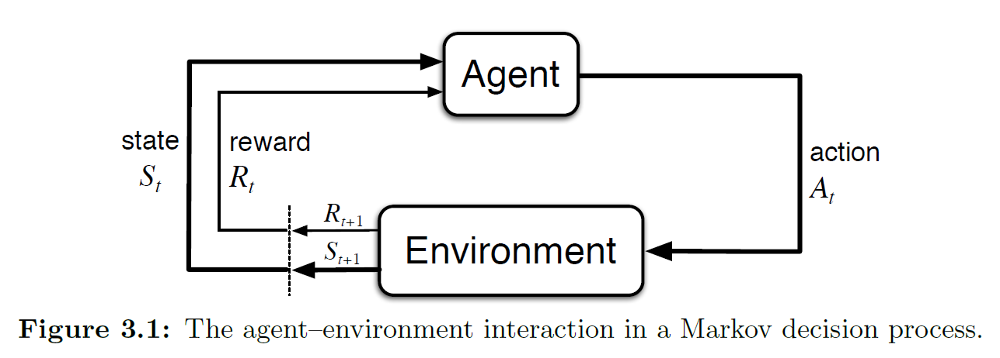
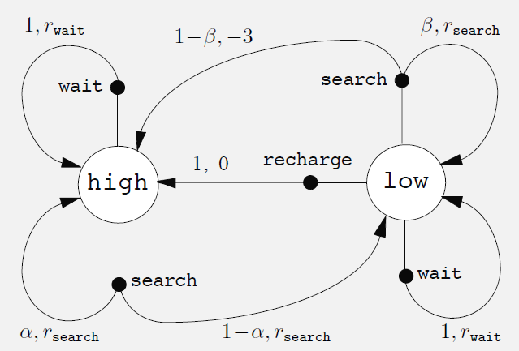
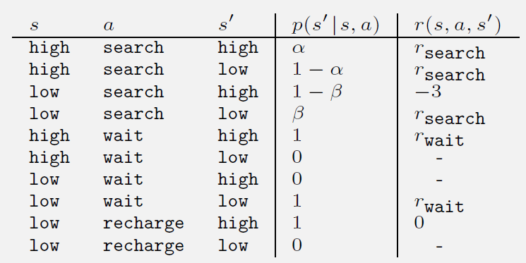

# 有限马尔可夫决策过程

本章我们将学习**有限马尔可夫决策过程（finite Markov decision processes, 简称有限MDPs）**的**形式化问题（classical formalization）**。我们将在本书的其余部分尝试解决该问题。

MDPs是对**序列决策制定（sequential decision making）**的一种经典形式化方法，其中的动作不仅影响即时的奖励，还会影响后续的情境或状态，并通过这些未来的奖励产生影响。因此，MDPs涉及延迟奖励，并且需要在即时奖励与延迟奖励之间进行权衡。

在赌博机问题中，我们估计每个动作$a$的值$q_*(a)$；而在MDPs中，我们估计在每个状态$s$下每个动作$a$的值$q_*(s,a)$，或者在给定最优动作选择的情况下的值$v_*(s)$。**这些与状态相关的量对于准确地将长期后果归因于个体动作选择是至关重要的。**

值得注意的是，**MDPs是强化学习问题的一种数学理想化形式**。在本章中，我们将学习一些可以被建模为有限MDPs的广泛应用种类。**在人工智能领域，广泛适用性和数学可处理性之间存在一种张力（tension）**，我们将在本章了解这种张力，并讨论它所带来的权衡与挑战。

---

## 3.1 智能体-环境接口

MDPs旨在构建一个框架，用于解决通过交互学习来实现目标的问题（learning from interaction to achieve a goal）。本节标题“The Agent-Environment Interface”（智能体-环境接口）就是描述智能体和环境之间如何交互的标准方式。Interface在这里指的是该框架定义了：谁负责什么、信息流的走向、如何正式建模强化学习等，是一套规范。

学习者（learner）和决策者（decision maker）被称为**智能体（agent）**；智能体所交互的对象，包括除了智能体之外的一切，被称为**环境（environment）**。

{style="display:block; margin:auto; width:400px;"}

如上图所示，智能体和环境持续交互：智能体选择动作（action），环境对这些动作作出反应并向智能体呈现新的情境（即状态 state）。环境还会产生奖励（reward），即一些特殊的数值，这些数值是智能体希望随着时间的推移通过其动作选择来最大化的。

我们把这个过程复述一遍：在每个时间步t，agent接收到环境状态St的某种表示，基于这种状态，agent选择了动作At。接着，在时间步t之后，agent完成了这个动作，时间步进入t+1，而环境会根据t的动作返回一个奖励$R_{t+_1}$，并将其写入新的状态$S_{t+1}$。该轨迹（trajectory）如下：

$$
S_0, A_0, R_1, S_1, A_1, R_2, S_2, A_2, R_3, \dots 
\\
\tag{3.1 交互序列}
$$

---

在有限MDP中，状态集合 $\mathcal{S}$、动作集合 $\mathcal{A}$、奖励集合 $\mathcal{R}$都是有限的元素集合。在这种情况下，随机变量Rt和St的分布是离散的，且仅依赖于前一个动作和状态，因此可以得到四参数的$p$函数：

$$
\underbrace{p(s', r \mid s, a)}_{\text{四参数函数}} 
\overset{\text{定义}}{\doteq} 
\underbrace{\Pr\{S_t = s', R_t = r \mid S_{t-1} = s, A_{t-1} = a\}}_{\text{条件概率表示}}
$$

$$
\underbrace{p : \mathcal{S} \times \mathcal{R} \times \mathcal{S} \times \mathcal{A} \to [0, 1]}_{\text{函数类型：输入四个变量，输出概率值}}
$$

$$
\tag{3.2 MDP的动态函数 / 四参数p函数}
$$

该函数即**MDP的动态函数（dynamics of the MDP），一般简称为$p$函数或四参数形式的$p$函数，是本书中使用较多的形式。**

---

由于上述所示的四参数函数$p(s',r|s,a)$是一个联合概率分布，因此对于每一对状态-动作对$(s,a)$，其对应的所有可能的下一状态$s'$和奖励$r$的联合概率之和必须等于1：

$$
\sum_{s' \in \mathcal{S}} \sum_{r \in \mathcal{R}} p(s', r \mid s, a) = 1 
\quad \forall s \in \mathcal{S},\ a \in \mathcal{A}(s) 
\\
\tag{3.3 MDP动态函数的规范性条件}
$$

对于忘记概率论知识点的同学，这里回顾一下联合概率分布：联合概率分布（joint probability distribution）描述的是两个或多个随机变量同时取某些值得概率，比如如果你同时投硬币和掷骰子，那么P(正面, 结果=3)就是一个联合概率。所以对于上面的3.3式，就是在给定状态s和a后，即智能体针对状态s做出动作a后，环境反馈的新的状态s'和反馈的奖励r的联合出现的概率。至于为什么等于1，这就像你投骰子和掷硬币的时候，两面的情况和6种骰子结果全部组合起来，一定代表了全部的情况，即总概率100%。

同时，我们也能看出，在马尔可夫决策过程中，系统的未来状态只取决于当前的状态和动作，而不依赖于更早之前的状态或动作，这种特性叫做**马尔可夫性质（Markov property）**。这个性质非常重要，因为它反映了一种对“状态”的限制条件：状态必须包含所有能影响未来结果的信息。在本书的大部分内容中，特别是在涉及近似方法（approximation methods）之前，将默认状态具有马尔可夫性质。

我们必须重视马尔可夫性质，因为如果马尔科夫性质不成立，那么基于马尔可夫决策过程设计的算法（比如Q-learning, Policy Gradient, DQN）对当前状态的估计就会出错，学到的策略就会失效，后果就会非常严重。这里我们来举例说明一下：

| 序号 | 状态描述                                      | 是否满足马尔可夫性 | 理由简述                                                 |
| ---- | --------------------------------------------- | ------------------ | -------------------------------------------------------- |
| 1    | 棋盘当前局面（如围棋、国际象棋）              | ✅ 是              | 当前局面已包含所有对胜负有用的信息，无需过去记录         |
| 2    | 迷宫中当前坐标位置                            | ✅ 是              | 坐标已足够描述位置决策所需信息                           |
| 3    | 当前帧图像（无历史）                          | ❌ 否              | 缺少速度、方向等信息，不能判断动态行为                   |
| 4    | 当前帧图像 + 上一帧图像                       | ✅（近似）         | 差分图像可估计速度，能较好近似马尔可夫性                 |
| 5    | 股票当前价格                                  | ❌ 否              | 价格序列中趋势依赖过去信息，当前价格不足以判断未来走势   |
| 6    | 最近 10 天的股票价格序列                      | ✅（近似）         | 包含了一定的历史上下文，可近似地作为马尔可夫状态         |
| 7    | 游戏角色的血量 + 位置 + 敌人状态              | ✅ 是              | 包含全部决策相关的当前信息                               |
| 8    | 仅玩家血量（无位置、敌人信息）                | ❌ 否              | 状态信息不全，未来不确定                                 |
| 9    | 智能体上一步的观察和动作（无当前观察）        | ❌ 否              | 没有当前状态，无法准确预测下一步                         |
| 10   | 当前传感器读数 + 内部隐状态（如LSTM的隐藏层） | ✅（近似）         | 包含一定记忆能力，适用于部分可观察环境，增强了马尔可夫性 |

了解了马尔可夫性质后，如果我们想只关注联合概率中的一个变量，那么我们就可以关注其边缘概率（marginal probability）。

如果我们对奖励$r$进行边缘化，只保留状态转移$s'$的概率，则可以得到**状态转移概率函数（state-transition probabilities）**：

$$
\underbrace{p(s' \mid s, a)}_{\text{状态转移概率函数}} 
\doteq 
\Pr\{S_t = s' \mid S_{t-1} = s, A_{t-1} = a\} 
= 
\underbrace{\sum_{r \in \mathcal{R}} p(s', r \mid s, a)}_{\text{边缘化联合概率，消去奖励}} 
$$

$$
\underbrace{p : \mathcal{S} \times \mathcal{S} \times \mathcal{A} \to [0, 1]}_{\text{函数类型：输入三个变量，输出概率值}}
$$

$$
\tag{3.4 MDP的状态转移概率函数}
$$

---

接着，我们需要关注，当agent在状态s下选择动作a后，期望获得的奖励是多少。这个值并非实际奖励，而是长期来看执行该动作后会获得的期望值。一般我们使用状态-动作对（state-action pairs）的期望奖励函数$r : \mathcal{S} \times \mathcal{A} \rightarrow \mathbb{R}$

$$
r(s, a) \doteq \mathbb{E}[R_t \mid S_{t-1} = s, A_{t-1} = a] 
= \sum_{r \in \mathcal{R}} \sum_{s' \in \mathcal{S}} r \cdot p(s', r \mid s, a) 
$$

$$
\tag{3.5 “状态-动作”对的期望奖励函数}
$$

这个公式非常重要，是策略评估中的核心组成部分。由于很多时候我们只关心期望奖励而非奖励的具体分布，此时这个公式就提供了一个非常便捷的计算。比如在值函数中，我们常常需要使用这个期望奖励：（这个公式之后会讲到，这里只是提前拿出来说明一下期望奖励函数的重要性）

$$
V(s) = \sum_a \pi(a \mid s) 
\left[
\underbrace{r(s, a)}_{\text{就是这个！}} 
+ \gamma \sum_{s'} p(s' \mid s, a) V(s')
\right]
$$

---

同理，也可以计算“状态-动作-下一个状态”三元组的期望奖励（expected rewards for state-action-next_state triples as a three-argument function）$r : \mathcal{S} \times \mathcal{A} \times \mathcal{S} \rightarrow \mathbb{R}$：

$$
r(s, a, s') \doteq \mathbb{E}[R_t \mid S_{t-1} = s, A_{t-1} = a, S_t = s'] 
= \sum_{r \in \mathcal{R}} r \cdot \frac{p(s', r \mid s, a)}{p(s' \mid s, a)} 
$$

$$
\tag{3.6 “状态-动作-下一个状态”三元组的期望奖励函数}
$$

---

以上即是MDP框架的主要的几个公式，其中3.2的四参数p函数在本书中出现较多，其他公式也都有涉及。

MDP框架的优点在于其灵活性，比如说：时间步不一定必须是真实的时间变化，也可以是决策过程中的任意连续阶段；动作可以是低层次的电压控制，也可以是高层次的决策比如是否去读研究生；状态可以是低层次的传感器，也可以是高层次的比如说房间中的物体的符号性描述，甚至还可以是完全主观的或者心理的内容。一些动作可能完全是心理上的，也可能控制智能体选择去思考什么。

通常来说，动作可以是我们想要学习如何做出的任何决策，而状态可以是我们已知的、在做出决策时可能有用的任何信息。特别值得注意的是，智能体与环境之间的边界通常不是机器人或动物体的物理边界，而是一个更加靠近智能体自身的边界。比如说，机器人的马达、机械部分、传感器等硬件，通常应被视为环境的一部分。类似的，人类的骨骼、肌肉、感官器官等也应被视为是环境的一部分。奖励也是这样的，在MDP中被视为环境的组成部分，即使直观上来看似乎并不是环境的一部分。

**我们一般遵从这样一个原则：任何智能体不能任意改变的东西，都应该被认为在它之外，是环境的一部分。**（anything that cannot be changed arbitrarily by the agent is considered to be outside of it and thus part of its environment）

我们并不假设环境中的一切对智能体而言都是未知的。智能体知道奖励及奖励相关的计算过程，但我们必须将奖励计算看作智能体之外的内容，因为奖励定义了智能体所面临的任务，必须超出智能体随意改变的能力范围。

这里看起来很绕，举个例子就是：假设智能体要去解决魔方问题，而魔方怎么运作显然是一目了然的，但是这却是一个困难的强化学习任务。因此，**智能体-环境边界（agent-environment boundary）代表的不是其知识（knowledge）的边界，而是智能体绝对控制（absolute control）的边界。**

智能体-环境边界可以根据具体的问题具体分析设置，在复杂的问题中，多个智能体同时操作并保有自己的边界。例如，一个智能体可以做出高层次的决策，而这些决策所对应的状态是由另一个低层次的智能体感知并提供的。在实际操作中，智能体-环境边界是根据我们选定的状态、动作和奖励来确定的，从而定义了一个具体的决策学习任务（a specific decision-making task）。

MDP框架是对通过交互实现目标导向的学习问题的一种高度抽象表达。它提出：不论感知、记忆和控制机制的具体细节如何，也不论目标是什么，任何目标导向的学习行为都可以被简化为三类信号在智能体和环境之间来回传递：

* 一个信号表示智能体做出的选择，即动作 action
* 一个信号表示智能体做选择的依据，即状态 state
* 一个信号定义智能体的目标，即奖励 reward

这个框架可能不足以表示所有的决策学习问题，但已被证明是广泛实用和适用的。在强化学习中，不同任务中的具体状态和动作差异巨大，它们的表示方式会极大地影响学习效果，因此有时候这些表示选择（representational choices）更像是一门艺术而不是一门科学。

下面给出一些例子：

| 任务/目标          | 动作                         | 状态                                   | 奖励                             |
| ------------------ | ---------------------------- | -------------------------------------- | -------------------------------- |
| 自动驾驶安全抵达   | 转向、加速、刹车             | 当前位置、速度、前方障碍物、红绿灯状态 | 是否避障、安全驾驶、是否到达终点 |
| 玩超级马里奥游戏   | 向左/右移动、跳跃、攻击      | 当前画面信息、角色位置、敌人位置       | 得分、击败敌人、通过关卡         |
| 股票自动交易       | 买入、卖出、持有             | 历史价格趋势、技术指标、账户余额       | 投资收益（利润或亏损）           |
| 聊天机器人持续对话 | 回复一句话                   | 上下文、当前输入、情感状态             | 用户满意度、保持对话             |
| 机械臂抓取物体     | 旋转关节、闭合夹爪           | 摄像头画面、目标位置、夹爪位置         | 成功抓起物体                     |
| 清洁机器人覆盖房间 | 前进、转向、启动吸尘         | 当前地图位置、剩余电量、周围障碍物     | 每覆盖新区域得分                 |
| 推荐系统提高点击率 | 推荐一个视频/商品            | 用户画像、历史行为、当前时间           | 用户是否点击或购买               |
| 无人机自主导航     | 上升、下降、向前、转向       | 当前高度、障碍位置、目标坐标           | 是否靠近目标、是否避开障碍       |
| 教育平台个性化教学 | 推送题目、提供提示、切换难度 | 学生答题记录、当前知识点、时间投入     | 学生成绩提升、持续学习时长       |
| 医疗诊断建议优化   | 推荐检查、建议治疗           | 患者病史、症状、检验结果               | 治疗效果提升、减少误诊           |

在本书中，我们会提供一些关于如何良好表示状态和动作的建议和示例，但我们的主要关注点在于：在状态与动作的表示方式已经确定之后，如何学习正确的行为策略。

书中还给出了三个较为详细的例子，分别是Example 3.1 生物反应器，Example 3.2 抓取-放置机器人，Example 3.3 回收机器人。例3.3比较长，详细介绍说明了如何将一个真实问题建模为一个有限MDP。

{style="display:block; margin:auto; width:200px;"}

在例3.3中，作者展示了一种叫做transition graph（转移图）的结构，这种结构在离散数学和图论中有所涉及，感兴趣的同学可以自行查阅图论中的有向图、状态转移图等内容。图论可以帮助建模，但是没学过的话对学习强化学习也没有大的影响，毕竟CS科目那么多，能学精一个方向就算有很大的收获了。

***Exercise 3.1 - 3.4见附录部分。***

---

## 3.2 目标和奖励

在强化学习中，智能体的目标（goal）是通过奖励（reward）来形式化的。奖励是一个特殊信号，从环境传递给智能体。在每一个时间步，奖励是一个简单的数字，记为$R_t \in \mathbb{R}$。这个概念是强化学习的一个标志性特色。

非正式地说，智能体的目标是最大化其获得的总奖励。换句话说，智能体想要最大化的是长期的累积奖励而非即时奖励。这就是**奖励假设（reward hypothesis）**：

> That all of what we mean by goals and purposes can be well thought of as the maximization of the expected value of the cumulative sum of a received scalar signal (called reward).

> 我们所说的所有目标与意图，都可以很好地被理解为最大化某个接收的标量信号（即奖励）累积和的期望值。

在实践中，这种方式非常适用且普遍。书中举了一些已经或可能被使用的例子：

- 为了让机器人学会行走，研究人员会在每一个时间步根据机器人的前进速度给予奖励。
- 为了让机器人学会如何从迷宫中逃脱，奖励通常是每经过一个时间步就给予 -1；这促使机器人尽可能快地逃脱。
- 为了让机器人学会寻找并收集空的易拉罐进行回收，可以大部分时间给予 0 的奖励，只有在收集到一个易拉罐时给予 +1 的奖励。
- 我们还可以为机器人设计负面奖励，比如当它撞到东西或者被人责骂时扣分。
- 对于学习玩跳棋或国际象棋的智能体，自然的奖励方式是：胜利得 +1，失败得 -1，平局和非终止状态得 0。

在这些例子中，智能体总是学会了最大化它的奖励。如果我们想让智能体为我们做某些事情，我们必须以某种方式设置奖励，使得在智能体最大化奖励的过程中，也实现了我们的目标。

**因此，关键在于如何设置奖励，如何让奖励准确反映我们的目标。值得注意的是，奖励信号不是用来向智能体传达关于如何实现我们目标的先验知识（prior knowledge）的。**例如，对于一个下棋的智能体，我们应当只在其实际获胜时给予奖励，而不是在它实现某些子目标时（比如吃子）就给予奖励。如果这些子目标被奖励，那么智能体可能会招到一些方法去实现这些子目标，而忽视了真正的目标。比如，它会找到能快速吃子的方法，但却导致输掉比赛。

所以，奖励信号是你用来告诉智能体“你希望它实现什么”的，而不是告诉它“你应该怎么做”。**在设置奖励信号时，你应该关注于你想要实现什么目标，而不是纠结于如何让智能体去实现那个目标。**

---

## 3.3 Returns and Episodes

3.3结束的时候的案例要做个编程题练练手

---

## 附：Exercise

### Exercise 3.1 设计任务

**问：**请你自己设计三个符合MDP框架的示例任务，并为每个示例明确指出他的状态、动作、奖励。让这三个示例尽可能彼此不同。尝试挑战一下框架的极限，拓展应用边界。

**答：**

（1）用强化学习算法让机器人学会走迷宫

* 目标：走出迷宫
* 状态：机器人所处环境的情况，比如是否旁边有墙壁
* 动作：前进、后退、左拐、右拐
* 奖励：每过1s奖励-1

（2）用强化学习算法炒股

* 目标：获得更高的收益
* 状态：股市大盘情况
* 动作：购买股票、卖出股票
* 奖励：月均收益率越高奖励越高

（3）让机械臂学会抓取物品

* 目标：让机械臂抓取物品并放到指定位置（固定）
* 状态：机械臂的姿态、物品的位置、机械手的姿态
* 动作：机械臂的移动、机械手的抓取动作
* 奖励：成功抓取、成功放到指定位置可以获得奖励

我写的是比较normal的，然后ChatGPT设计了一些大胆的创意，可以参考一下：

（1）AI写诗的风格控制器

* 目标：生成具有高度情感共鸣和美感的诗
* 状态：当前诗的风格向量（情绪色彩、押韵结构、当前节数、上一行语义嵌入）
* 动作：调节风格参数、切换主题、引入象征手法
* 奖励：+10 情感真挚；+5 押韵自然； +20 被收藏； -10 风格突兀

（2）DNA序列设计优化器

* 目标：设计出稳定且表达良好的DNA序列片段，用于制造蛋白质
* 状态：当前序列片段的碱基组成、生物功能预测分值、结构稳定性评分
* 动作：插入、删除或替换要给碱基对
* 奖励：+50 达到目标蛋白表达水平；+20 结构稳定； -30 有毒或不表达

（3）即兴舞台剧演员策略学习

* 目标：作为AI演员参与即兴表演，提升观众反应和剧情推进效果
* 状态：剧情当前情节节点、其他角色的行为、观众情绪指标
* 动作：即兴加入角色设定、提出新剧情冲突、模仿其他演员风格
* 奖励：+15 观众笑/鼓掌；+10 推动剧情发展； -10 打断节奏或冷场

（4）冥想引导系统中的意识调节代理

* 目标：通过动态语音或提示，引导用户进入更深层次的冥想状态，实现情绪平稳和脑波放松
* 状态：用户的生理状态和环境状态，比如脑波、引导强度、环境音强度等
* 动作：调整语速、插入自然音效、沉默片段等
* 奖励：+20 脑波进入深度冥想状态；-10 用户走神或烦躁

读者的题外话：没想到ChatGPT的答案比读者的更具想象力、创造力。这几个AI举的例子让读者突然意识到，如果能把人类生物体整体搬迁到虚拟世界中，那么强化学习将迎来爆发式的发展，因为可以根据虚拟人体来进行大规模的试验。但是这个想法又觉得有点黑暗了，比如舞台策略那个，假设把跟人一样的假人造出来了，那么那个假人具备意识吗？那么如果进行个500万次模拟，岂不是让一个假人死亡了500万次吗？这个角度是我从来没有想过的，而ChatGPT的例子让我突然意识到AI的道德观、伦理观终将和人类截然不同。Sutton的苦涩教训证明了人类经验在AI发展中的副作用，反过来讲，如果AI的发展将独立于人类意识，仅依赖于算力、算法等，那么最终如果我们真的创造出了AGI，那AGI的道德伦理观也一定不会等同于人类。

这道题引入了更多的话题：模拟人类的伦理边界在哪里？人类主观体验能否被编码？道德输入是否要作为奖励之一？AGI的价值体系真的是从人类经验中学来的吗？

读者最喜欢Sutton的一点就是，他一直在思考人类智能和人工智能在哲学意义上的问题。Hinton也是一样的，现在在各处游走宣扬人工智能的潜在危害性。他们作为人工智能界的祖师爷当之无愧，希望更多的从业者能多关注一下伦理上的问题。我们都知道AGI是必不可免的一定会被创造出来的东西，那么在创造出来之前，还是要更多地去关注其安全性和伦理性的问题。以及，这个东西一定不能只被一个组织实体所掌握，也难怪Hinton对中国大力发展AI表示“希望能看到中美的相互制衡”了。

---

### Exercise 3.2-3.4

**Exercise 3.2 MDP的适用范围**

问：MDP框架足够表示所有的目标导向学习任务吗？你能想到任何清晰的解释吗？（Is the MDP framework adequate to usefully represent all goal-directed learning tasks? Can you think of any clear exceptions?）

答：

首先，MDP框架只适用于满足马尔可夫性质的任务：未来状态仅依赖于当前状态、离散时间步、环境可以被完全观测、固定的转移和奖励规则。

MDP框架不适用的情况举例：

1. 在雾中导航，无法完全观测环境状态
2. 只有执行特定动作序列才能获得奖励
3. 异步事件，比如自动驾驶中可能会发生其他车辆突然变道的情况
4. 多个智能体的环境，每个智能体的角度环境都是非平稳的（比如星际争霸游戏）
5. 分层目标，比如炖红烧肉包括切肉、煮饭等多个子任务

---

**Exercise 3.3 智能体与环境的界限**

问：考虑最常见的驾驶问题。你可以把“动作”定义为加速、改变方向、踩刹车等，这个时候动作就是你的身体与机器交互的地方。你也可以认为轮胎和地面处的产生动力的扭矩是动作。又或者说，动作可以被认为是你的身体中对肌肉的控制。甚至我们还可以说，动作是选择在哪里开车。可以看到，区分动作和环境是非常主观的，那么怎样才能找到一个合适的层次、更合适的地方来进行区分呢？（What is the right level, the right place to draw the line between agent and environment?）有没有某种基础来进行设定？（On what basis is one location of the line to be preferred over another?）有没有根本性的理由来进行确定？（Is there any fundamental reason for preferring onte location over another, or is it a free choice?）

答：这道题是一个开放性思考题，这也是Sutton经常考虑的问题。这道题并没有一个正确的答案，不同的动作设置取决于我们要解决的任务目标。这也是强化学习不同于如今大火的LLM的一个重要原因。在强化学习中，任务的目标本身会限制这一条界限，而建模的复杂度和可行性又会影响你如何去设置动作。还有，数据是否能获得，也将影响动作的设置。

---

**Exercise 3.4 Trace Table**

这道题要求你给出一个类似例3.3中的表格，针对四参数状态转移函数。

{style="display:block; margin:auto; width:200px;"}

原表格如图所示。这道题可以在第一次解决实际问题的时候自己做一个试试。

---

### Exercise 3.5

aaa
